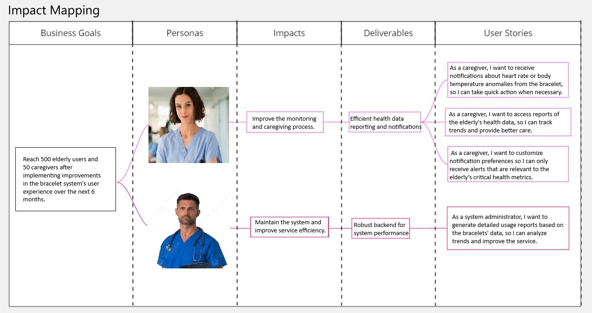
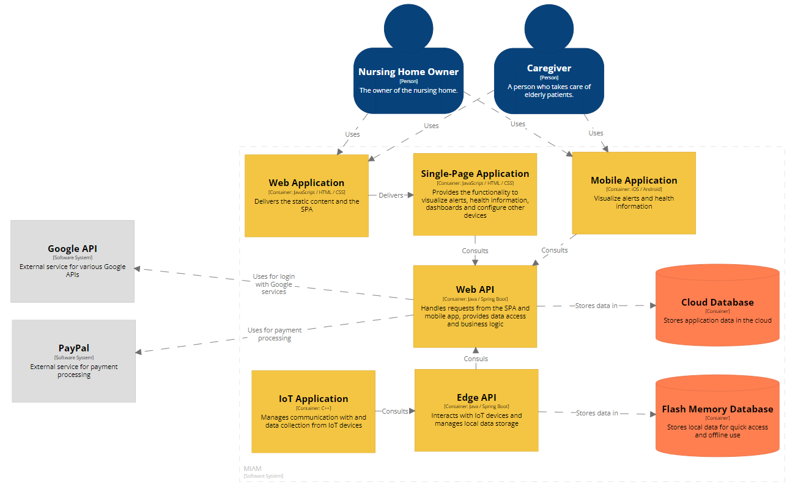
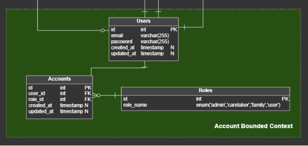
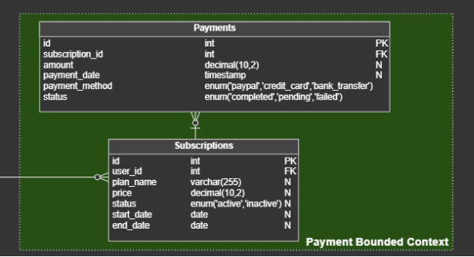
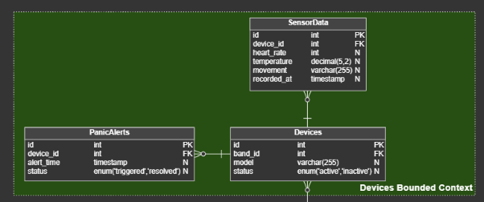
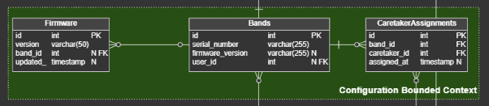
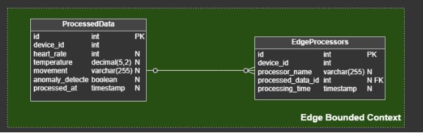
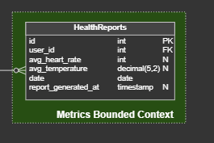

**Universidad Peruana de Ciencias Aplicadas**  
**Ingeniería de Software**  
**Ciclo 2024-2**  

<h4>Desarrollo de Soluciones IoT</h4>

**Sección:** WS71
**Profesor:** Angel Augusto Velasquez Nuñez

<h3>INFORME DEL TRABAJO FINAL</h3>

**Startup:** SocialTech

**Producto:** MIAM (Monitoreo Inteligente para Adultos Mayores)

**Integrantes:**

Achamizo Huamani, Jean Carlos  
Aliaga Trevejo, Lucía Guadalupe  
Raymundo Guevara, Rodrigo Alejandro  
Siancas Reategui, Luis Alberto  
Trujillo Lopez, Luis Alberto  

**Setiembre, 2024**

---

# Registro de Versiones del Informe

| Versión | Fecha | Autor | Descripción de la modificación |
| ------- | ----- | ----- | ------------------------------ |
|   1.0     |   06/09/2024   |  Achamizo Huamani Jean Carlos,  Aliaga Trevejo Lucía Guadalupe, Raymundo Guevara Rodrigo Alejandro, Siancas Reategui Luis Alberto, Trujillo Lopez Luis Alberto  |   Se añadieron los elementos correspondientes al entregable de la TB1 (capítulos 1 al 4)|

---

# Project Report Collaboration Insights

URL del repositorio: https://github.com/IoT-SocialTech/iot-report

---

# Contenido

## Tabla de Contenidos

- [Registro de Versiones del Informe](#registro-de-versiones-del-informe)
- [Project Report Collaboration Insights](#project-report-collaboration-insights)
- [Contenido](#contenido)
  - [Tabla de Contenidos](#tabla-de-contenidos)
- [Student Outcome](#student-outcome)
- [Capítulo I: Introducción](#capítulo-i-introducción)
  - [1.1. Startup Profile](#11-startup-profile)
    - [1.1.1. Descripción de la Startup](#111-descripción-de-la-startup)
    - [1.1.2. Perfiles de integrantes del equipo](#112-perfiles-de-integrantes-del-equipo)
  - [1.2. Solution Profile](#12-solution-profile)
    - [1.2.1 Antecedentes y problemática](#121-antecedentes-y-problemática)
    - [1.2.2 Lean UX Process](#122-lean-ux-process)
      - [1.2.2.1. Lean UX Problem Statements](#1221-lean-ux-problem-statements)
      - [1.2.2.2. Lean UX Assumptions](#1222-lean-ux-assumptions)
      - [1.2.2.3. Lean UX Hypothesis Statements](#1223-lean-ux-hypothesis-statements)
      - [1.2.2.4. Lean UX Canvas](#1224-lean-ux-canvas)
  - [1.3. Segmentos objetivo](#13-segmentos-objetivo)
- [Capítulo II: Requirements Elicitation \& Analysis](#capítulo-ii-requirements-elicitation--analysis)
  - [2.1. Competidores](#21-competidores)
    - [2.1.1. Análisis competitivo](#211-análisis-competitivo)
    - [2.1.2. Estrategias y tácticas frente a competidores](#212-estrategias-y-tácticas-frente-a-competidores)
  - [2.2. Entrevistas](#22-entrevistas)
    - [2.2.1. Diseño de entrevistas](#221-diseño-de-entrevistas)
    - [2.2.2. Registro de entrevistas](#222-registro-de-entrevistas)
    - [2.2.3. Análisis de entrevistas](#223-análisis-de-entrevistas)
  - [2.3. Needfinding](#23-needfinding)
    - [2.3.1. User Personas](#231-user-personas)
    - [2.3.2. User Task Matrix](#232-user-task-matrix)
    - [2.3.3. User Journey Mapping](#233-user-journey-mapping)
    - [2.3.4. Empathy Mapping](#234-empathy-mapping)
    - [2.3.5. As-is Scenario Mapping](#235-as-is-scenario-mapping)
  - [2.4. Ubiquitous Language](#24-ubiquitous-language)
- [Capítulo III: Requirements Specification](#capítulo-iii-requirements-specification)
  - [3.1. To-Be Scenario Mapping](#31-to-be-scenario-mapping)
  - [3.2. User Stories](#32-user-stories)
  - [3.3. Impact Mapping](#33-impact-mapping)
  - [3.4. Product Backlog](#34-product-backlog)
- [Product Backlog](#product-backlog)
  - [Tabla de Product Backlog](#tabla-de-product-backlog)
- [Capítulo IV: Strategic-Level Software Design](#capítulo-iv-strategic-level-software-design)
  - [4.1. Strategic-Level Attribute-Driven Design](#41-strategic-level-attribute-driven-design)
    - [4.1.1. Event Storming](#411-event-storming)
      - [4.1.1.1. Candidate Context Discovery](#4111-candidate-context-discovery)
      - [4.1.1.2 Domain Message Flows Modeling](#4112-domain-message-flows-modeling)
      - [4.1.1.3 Bounded Context Canvases](#4113-bounded-context-canvases)
    - [4.1.2. Context Mapping](#412-context-mapping)
    - [4.1.3. Software Architecture](#413-software-architecture)
      - [4.1.3.1. Software Architecture System Landscape Diagram](#4131-software-architecture-system-landscape-diagram)
      - [4.1.3.2. Software Architecture Context Level Diagrams](#4132-software-architecture-context-level-diagrams)
      - [4.1.3.3. Software Architecture Container Level Diagrams](#4133-software-architecture-container-level-diagrams)
      - [4.1.3..4. Software Architecture Deployment Diagrams](#4134-software-architecture-deployment-diagrams)
  - [4.2. Tactical-Level Domain-Driven Design](#42-tactical-level-domain-driven-design)
      - [4.2.1. Bounded Context: ](#421-bounded-context-)
        - [4.2.1.1. Domain Layer](#4211-domain-layer)
        - [4.2.1.2. Interface Layer](#4212-interface-layer)
        - [4.2.1.3. Application Layer](#4213-application-layer)
        - [4.2.1.4. Infrastructure Layer](#4214-infrastructure-layer)
        - [4.2.1.6. Bounded Context Software Architecture Component Level Diagrams](#4216-bounded-context-software-architecture-component-level-diagrams)
        - [4.2.1.7. Bounded Context Software Architecture Code Level Diagrams](#4217-bounded-context-software-architecture-code-level-diagrams)
          - [4.2.1.7.1. Bounded Context Domain Layer Class Diagrams](#42171-bounded-context-domain-layer-class-diagrams)
          - [4.2.1.7.2. Bounded Context Database Design Diagram](#42172-bounded-context-database-design-diagram)
      - [4.2.2. Bounded Context: ](#422-bounded-context-)
        - [4.2.2.1. Domain Layer](#4221-domain-layer)
        - [4.2.2.2. Interface Layer](#4222-interface-layer)
        - [4.2.2.3. Application Layer](#4223-application-layer)
        - [4.2.2.4. Infrastructure Layer](#4224-infrastructure-layer)
        - [4.2.2.6. Bounded Context Software Architecture Component Level Diagrams](#4226-bounded-context-software-architecture-component-level-diagrams)
        - [4.2.2.7. Bounded Context Software Architecture Code Level Diagrams](#4227-bounded-context-software-architecture-code-level-diagrams)
          - [4.2.2.7.1. Bounded Context Domain Layer Class Diagrams](#42271-bounded-context-domain-layer-class-diagrams)
          - [4.2.2.7.2. Bounded Context Database Design Diagram](#42272-bounded-context-database-design-diagram)
      - [4.2.3. Bounded Context: ](#423-bounded-context-)
        - [4.2.3.1. Domain Layer](#4231-domain-layer)
        - [4.2.3.2. Interface Layer](#4232-interface-layer)
        - [4.2.3.3. Application Layer](#4233-application-layer)
        - [4.2.3.4. Infrastructure Layer](#4234-infrastructure-layer)
        - [4.2.3.6. Bounded Context Software Architecture Component Level Diagrams](#4236-bounded-context-software-architecture-component-level-diagrams)
        - [4.2.3.7. Bounded Context Software Architecture Code Level Diagrams](#4237-bounded-context-software-architecture-code-level-diagrams)
          - [4.2.3.7.1. Bounded Context Domain Layer Class Diagrams](#42371-bounded-context-domain-layer-class-diagrams)
          - [4.2.3.7.2. Bounded Context Database Design Diagram](#42372-bounded-context-database-design-diagram)
      - [4.2.4. Bounded Context: ](#424-bounded-context-)
        - [4.2.4.1. Domain Layer](#4241-domain-layer)
        - [4.2.4.2. Interface Layer](#4242-interface-layer)
        - [4.2.4.3. Application Layer](#4243-application-layer)
        - [4.2.4.4. Infrastructure Layer](#4244-infrastructure-layer)
        - [4.2.4.6. Bounded Context Software Architecture Component Level Diagrams](#4246-bounded-context-software-architecture-component-level-diagrams)
        - [4.2.4.7. Bounded Context Software Architecture Code Level Diagrams](#4247-bounded-context-software-architecture-code-level-diagrams)
          - [4.2.4.7.1. Bounded Context Domain Layer Class Diagrams](#42471-bounded-context-domain-layer-class-diagrams)
          - [4.2.4.7.2. Bounded Context Database Design Diagram](#42472-bounded-context-database-design-diagram)
- [Conclusiones](#conclusiones)
- [Bibliografía](#bibliografía)
- [Anexos](#anexos)

  
---

# Student Outcome

| Criterio específico                                              | Acciones realizadas                                                                 | Conclusiones |
|------------------------------------------------------------------|-------------------------------------------------------------------------------------|--------------|
| Trabaja en equipo para proporcionar liderazgo en forma conjunta | *Achamizo Huamani Jean Carlos*   TB1:   Participó activamente en la planificación y ejecución de las actividades del equipo. Coordinó las reuniones para discutir el progreso del proyecto y tomó la iniciativa en la resolución de conflictos.    *Aliaga Trevejo Lucía Guadalupe*   TB1:   Facilitó las discusiones del equipo, asegurando que todos los miembros pudieran expresar sus opiniones. Tomó la responsabilidad de consolidar la información y presentar el avance del proyecto a los stakeholders.    *Raymundo Guevara Rodrigo Alejandro*   TB1:   Contribuyó al liderazgo del equipo al proporcionar soporte técnico y orientación durante la implementación de las tareas. Coordinó con otros miembros del equipo para asegurar la alineación de los objetivos del proyecto.    *Siancas Reategui Luis Alberto*   TB1:   Asumió un rol activo en la definición de metas y en la planificación de tareas, manteniendo a todos los miembros del equipo enfocados en los objetivos comunes.    *Trujillo Lopez Luis Alberto*   TB1:   Lideró la revisión de las tareas y ayudó a motivar al equipo a cumplir con los plazos establecidos. Estableció un entorno de trabajo colaborativo que facilitó la cooperación entre todos los miembros del equipo.   |  *TB1*   El trabajo en equipo fue efectivo en proporcionar un liderazgo colaborativo, facilitando una comunicación abierta y un enfoque compartido hacia la consecución de objetivos. Cada miembro del equipo contribuyó significativamente a la planificación y ejecución del proyecto, mejorando la dinámica y eficiencia del grupo. |
| Crea un entorno colaborativo e inclusivo, establece metas, planifica tareas y cumple objetivos | *Achamizo Huamani Jean Carlos*   TB1:   Facilitó la creación de un entorno inclusivo al asegurar que todas las voces fueran escuchadas durante las discusiones del equipo. Colaboró en la definición de metas claras y en la planificación de tareas para alcanzar los objetivos del proyecto.    *Aliaga Trevejo Lucía Guadalupe*   TB1:   Promovió la inclusión en el equipo al garantizar que las tareas y objetivos fueran distribuidos equitativamente. Ayudó a planificar y asignar tareas de manera que se maximizara el potencial de cada miembro del equipo.    *Raymundo Guevara Rodrigo Alejandro*   TB1:   Colaboró en la creación de un ambiente de trabajo abierto y respetuoso, donde cada miembro del equipo pudo contribuir con sus ideas. Participó activamente en la planificación y en el establecimiento de objetivos alcanzables.    *Siancas Reategui Luis Alberto*   TB1:   Se encargó de supervisar el progreso del equipo en relación con las metas establecidas, asegurando que todos los miembros estuvieran alineados con los objetivos del proyecto. Facilitó la planificación de tareas y la resolución de problemas para mantener el proyecto en camino.    *Trujillo Lopez Luis Alberto*   TB1:   Implementó prácticas para fomentar un entorno colaborativo y inclusivo, realizando sesiones de planificación y seguimiento para asegurar el cumplimiento de los objetivos. Supervisó el progreso y la realización de tareas, ayudando al equipo a mantenerse enfocado.   |   *TB1*   Se logró establecer un entorno de trabajo colaborativo e inclusivo, con una planificación efectiva y cumplimiento de metas. La distribución equitativa de tareas y la supervisión continua ayudaron a mantener al equipo alineado y motivado para alcanzar los objetivos del proyecto. |

---

# Capítulo I: Introducción

## 1.1. Startup Profile

### 1.1.1. Descripción de la Startup

### 1.1.2. Perfiles de integrantes del equipo

<table>
    <tr>
        <td>Perfil</td>
        <td>Foto</td>
    </tr>
    <tr>
        <td><b>Nombre:</b> Achamizo Huamani, Jean Carlos 
            <b>Carrera:</b> Ingenieria de Software  
        <b>Descripcion:</b> Como estudiante de Ingeniería de Software en la Universidad UPC, mi entusiasmo por el aprendizaje constante me impulsa a buscar siempre nuevas maneras de perfeccionar mis habilidades académicas y aplicarlas en situaciones prácticas, también poseo aptitudes en comunicación asertiva y escucha activa. Reconozco la importancia de una comunicación clara y efectiva en cualquier proyecto de software, y cuento con la capacidad de escuchar de manera atenta para comprender las necesidades y expectativas de los clientes y colegas de equipo.  
        <td></td>
    </tr>
    <tr>
        <td><b>Nombre:</b> Aliaga Trevejo, Lucía Guadalupe  
            <b>Carrera:</b> Ingenieria de Software  
        <b>Descripcion:</b> Soy una estudiante de Ingeniería de Software, actualmente interesada en el desarrollo web front y back end. Me gusta crear interfaces intuitivas y llamativas para mejorar la experiencia de usuario. Me considero una persona responsable y centrada. Mis habilidades blandas incluyen comunicación efectiva, trabajo en equipo, liderazgo y adaptabilidad. Aspiro a contribuir de manera significativa en proyectos innovadores para seguir expandiendo mis conocimientos técnicos y capacidades. 
        <td></td>
    </tr>
    <tr>
        <td><b>Nombre:</b> Raymundo Guevara, Rodrigo Alejandro  
            <b>Carrera:</b> Ingenieria de Software  
        <b>Descripcion:</b> Soy estudiante de la carrera de Ingeniería de Software y un apasionado de la tecnología. Me gusta descubrir nuevas formas de solucionar problemas con diversos frameworks y algoritmos. Me considero una persona responsable y empática. Me gusta mucho trabajar en equipo y ayudar a mis compañeros 
        <td></td>
    </tr>
    <tr>
        <td><b>Nombre:</b> Siancas Reategui, Luis Alberto 
            <b>Carrera:</b> Ingenieria de Software  
        <b>Descripcion:</b> Soy estudiante de la carrera de Ingeniería de Software enfocado en el desarrollo backend. Me gusta crear API’s las cuales uso para mis proyectos, por otro lado, me gusta realizar el despliegue de mis aplicaciones así como también usar diferentes diseños de arquitectura para que mi aplicación tenga un funcionamiento estable y tenga alta disponibilidad. En cuanto a mis habilidades blandas, soy empático y tengo escucha activa, esto me ayuda en gran parte a la hora de trabajar en equipos ya que facilita la comunicación y por ende los resultados son mejores. 
        <td></td>
    </tr>
    <tr>
        <td><b>Nombre:</b> Trujillo Lopez, Luis Alberto 
            <b>Carrera:</b> Ingenieria de Software  
        <b>Descripcion:</b> Soy un estudiante de Ingeniería de Software interesado en las tecnologías de aprendizaje autónomo. Me gusta desarrollar en un entorno web páginas que se vean llamativas y que tengan múltiples funcionalidades enfocándome en la experiencia del usuario y en la creación de API’s. Poseo algunas habilidades que me permiten relacionarme en equipo, soy una persona responsable, con un enfoque centrado, comunicación asertiva, liderazgo y adaptabilidad. Mi meta es contribuir en el desarrollo de proyectos que me permitan mejorar y encontrar nuevas habilidades para adquirir mayores conocimientos laboral y profesionalmente.
        <td></td>
    </tr>
   <table>

## 1.2. Solution Profile

### 1.2.1 Antecedentes y problemática

Los adultos mayores representan una población vulnerable no solo a enfermedades relacionadas con el envejecimiento, sino también a lesiones que pueden deteriorar significativamente su calidad de vida (Dorri, Zabolinezhad, & Sattari, 2023). De acuerdo con la Organización Mundial de la Salud, las caídas son la principal causa de lesiones y mortalidad en personas mayores de 75 años (Giulianelli et al., 2017). Ante este panorama, es esencial proporcionarles un entorno seguro que contribuya a prevenir discapacidades y complicaciones en su salud (Dorri, Zabolinezhad, & Sattari, 2023).

A continuación, se presenta un análisis detallado de esta problemática empleando la metodología ‘5W2H’.

**Who**  
Los adultos mayores en Perú, especialmente aquellos que viven en casas de reposo o en sus propios domicilios, representan una población vulnerable debido a las limitaciones propias del envejecimiento, como la pérdida de reflejos y del equilibrio (Suárez et al., 2020). Por otro lado, los cuidadores, tanto formales (como enfermeros y técnicos) como informales (familiares), son los responsables de brindar atención diaria. Estos cuidadores a menudo enfrentan desafíos adicionales como las exigencias de su trabajo y los recursos limitados. Esta situación puede dificultar la supervisión y la atención constante que los adultos mayores necesitan.

**What**  
La principal problemática es la alta incidencia de caídas entre los adultos mayores, que no solo provoca lesiones físicas como fracturas y traumatismos, sino que también tiene consecuencias psicológicas como el miedo a caer de nuevo, lo cual reduce aún más su movilidad e independencia. Para los cuidadores, cada caída significa un aumento significativo en la carga de trabajo, implicando cuidados adicionales.

**Where**  
Las caídas ocurren principalmente en las casas de reposo y domicilios de los adultos mayores. En las casas de reposo, la falta de personal y la infraestructura deficiente pueden contribuir al riesgo de caídas. En los domicilios, los adultos mayores a menudo se enfrentan a condiciones peligrosas como escaleras sin barandas, pisos resbaladizos, y la ausencia de dispositivos de asistencia como andadores o bastones.

**When**  
Las caídas pueden suceder en cualquier momento del día, pero son más comunes durante actividades cotidianas como levantarse de la cama, caminar al baño, o asearse. Las noches y madrugadas son momentos críticos debido a la disminución de la visibilidad y la menor capacidad de reacción tanto de los adultos mayores como de los cuidadores.

**Why**  
Las caídas suelen suceder por una combinación de factores, como la fragilidad del adulto mayor y una supervisión insuficiente. 

**How**  
Los adultos mayores pueden perder el equilibrio al realizar actividades diarias sin la asistencia adecuada. Los cuidadores no son capaces de realizar supervisión constante debido a que tienen varios pacientes a cargo, en especial en las casas de reposo, lo que puede llevar a descuidos involuntarios, aumentando el riesgo de caídas.

**How Much**  
Uno de cada tres adultos mayores de 65 años sufre caídas, de las cuales el 68% resultan en lesiones, incluyendo fracturas. Además, el 60% de las caídas ocurren en el hogar, 30% en sitios públicos y 10% en instituciones de salud, teniendo consecuencias físicas y psicológicas para el adulto mayor (Ministerio de Salud, 2018). 

### 1.2.2 Lean UX Process

#### 1.2.2.1. Lean UX Problem Statements

El estado actual de la seguridad para adultos mayores se ha centrado principalmente en productos como botones de emergencia y sensores de movimiento básicos. Sin embargo, estos productos no logran ofrecer una supervisión continua ni adaptarse a los entornos específicos en los que viven los adultos mayores. Esto deja una brecha crítica en la prevención de caídas, lo que resulta en lesiones físicas y una reducción en la calidad de vida de los adultos mayores. Los cuidadores se enfrentan a la dificultad de supervisar constantemente y gestionar los riesgos sin herramientas adecuadas para ser más proactivos.

Nuestro producto abordará esta brecha mediante el desarrollo de un sistema innovador de monitoreo basado en IoT, diseñado para ofrecer una supervisión continua y alertas en tiempo real adaptadas a los entornos específicos de cada adulto mayor. Nuestro enfoque inicial serán los cuidadores y dueños de casas de reposo, con el objetivo de mejorar la seguridad y la calidad de vida de los adultos mayores.

Sabremos que tenemos éxito cuando veamos una reducción en los incidentes de caídas, una mayor satisfacción de los cuidadores y una mejora significativa en la calidad de vida de los adultos mayores.

#### 1.2.2.2. Lean UX Assumptions
#### Assumptions worksheet

**¿Quién es el usuario?**
El usuario principal son los dueños de casas de reposo y cuidadores de adultos mayores que buscan mejorar la seguridad y bienestar de los residentes.

**¿Qué problemas tiene nuestro producto? ¿Resolver?**
MIAM resuelve la necesidad de un monitoreo constante y efectivo de los adultos mayores, ayudando a prevenir caídas, detectar cambios en signos vitales y garantizar que los residentes estén en áreas seguras y obtengan un mejor cuidado.

**¿Qué características son importantes?**
Monitoreo en tiempo real de movimientos y signos vitales.
Alertas instantáneas en caso de caídas o presencia en zonas riesgosas.
Interfaz fácil de usar en la plataforma web y aplicación móvil.
Botón de alerta para solicitar asistencia

**¿Dónde encaja nuestro producto en su trabajo o vida?**
MIAM se integra en el trabajo diario de los administradores y cuidadores como una herramienta de software esencial para supervisar la salud y en los adultos se presentarán pulseras para su monitoreo de estado, minimizando riesgos y mejorando la calidad del cuidado.
**¿Cuándo y cómo es nuestro producto? ¿Usado?**
El producto es utilizado como una pulsera continuamente a lo largo del día para monitorear en tiempo real la ubicación y salud de los residentes. Los cuidadores y administradores lo  administran tanto desde dispositivos móviles como desde la plataforma web.
**¿Cómo debe verse nuestro producto y cómo comportarse?**
El producto software debe tener una interfaz intuitiva y accesible, con gráficos claros que muestren el estado de los residentes y notificaciones visibles para alertas urgentes. Debe ser confiable, fácil de usar y responder rápidamente a cualquier evento crítico y en los residentes la pulsera debe ser ligera y de un diseño simple que no incomode a los residentes.

**Creo que mis clientes necesitan** un sistema fiable y fácil de usar para monitorear la seguridad y salud de los adultos mayores.
**Estas necesidades se pueden resolver con** una combinación de tecnología de sensores, monitoreo de signos vitales y una plataforma accesible para la gestión de datos y alertas.
**Mis clientes iniciales son (o serán)** dueños de casas de reposo y cuidadores de adultos mayores que valoran la seguridad y calidad de vida de sus residentes.
**El valor #1**que un cliente quiere de mi servicio es la capacidad de prevenir accidentes y responder rápidamente a emergencias, garantizando la seguridad de los residentes.
**El cliente también puede obtener estos beneficios adicionales** como la tranquilidad de los familiares, una mayor eficiencia en la gestión del cuidado y una reducción en los incidentes graves.
**Voy a adquirir la mayoría de mis clientes a través de** estrategias de marketing directo a casas de reposo y promociones en eventos de la industria geriátrica.
**Haré dinero a través de** la venta de los equipos  de pulsera y la suscripción al sistema de monitoreo.
**Mi competencia principal en el mercado serán** otros proveedores de sistemas de monitoreo para adultos mayores, así como dispositivos de salud y seguridad específicos.
Los venceremos debido a nuestra integración completa de sensores de movimiento, monitoreo de signos vitales y una plataforma fácil de usar que ofrece alertas en tiempo real.
**Mi mayor riesgo de producto es** la posibilidad de que los sensores o la plataforma no funcionen correctamente en situaciones críticas.
Resolveremos esto a través de pruebas exhaustivas, mantenimiento regular y la implementación de redundancias en el sistema para asegurar su fiabilidad.
**¿Qué otras suposiciones tenemos? ¿Eso, si se prueba que es falso, causará que nuestro negocio/proyecto no funcione?**
Asumimos que los clientes estarán dispuestos a pagar una suscripción mensual para mantener el servicio. Si no es así, podríamos enfrentar dificultades financieras.

#### 1.2.2.3. Lean UX Hypothesis Statements
#### Features Hypothesis

**Statement 1:**
Creemos que la incorporación de un botón de alerta en la banda de monitoreo que los residentes puedan activar manualmente reducirá el tiempo de reacción en situaciones de emergencia.
Sabremos que hemos tenido éxito cuando el 90% de las alertas manuales se respondan en menos de 2 minutos durante los primeros 6 meses de uso.
**Statement 2:** 											Creemos que el incluir alertas instantáneas en la aplicación móvil para notificar a los cuidadores sobre caídas o cambios anómalos en signos vitales mejorará la respuesta a emergencias.
Sabremos que hemos tenido éxito cuando veamos una reducción del 30% en el tiempo de respuesta ante emergencias registradas en los primeros 3 meses de uso.
**Statement 3:**
Creemos que la integración de un historial de salud y actividad en la plataforma web permitirá a los cuidadores tomar decisiones más informadas sobre el bienestar de los residentes.
Sabremos que hemos tenido éxito cuando el 80% de los usuarios informen que revisan el historial de salud al menos una vez por semana para ajustar el plan de cuidado.

#### Business Hypothesis

**Statement 1:**
Creemos que el alquiler de equipos junto con la suscripción al sistema de monitoreo MIAM será la mejor estrategia para obtener ingresos sostenibles.
Sabremos que esto es cierto cuando el 70% de las casas de reposo que prueben el sistema opten por continuar con la suscripción después del periodo de prueba inicial.
**Statement 2:**
Creemos que ofrecer un periodo de prueba gratuito de 30 días aumentará la tasa de adopción inicial de nuestro sistema entre nuevas casas de reposo.
Sabremos que esto es cierto cuando al menos el 60% de los usuarios que completen el periodo de prueba decidan suscribirse al servicio.
**Statement 3:**
Creemos que al asociarnos con organizaciones de cuidado geriátrico y hospitales locales podremos ampliar nuestro mercado objetivo y generar más leads calificados.
Sabremos que esto es cierto cuando el 50% de las nuevas suscripciones provengan de referencias o asociaciones con estas instituciones dentro de los primeros 6 meses

#### 1.2.2.4. Lean UX Canvas

<table>
    <tr>
        <th colspan="1" valign="top">
            
<b>Business Problem</b>

            
Los cuidadores de personas mayores enfrentan dificultades para monitorear el estado de salud de sus pacientes en tiempo real. Los familiares y cuidadores necesitan una forma eficiente de ser notificados sobre emergencias, como caídas o problemas de salud, para brindar atención inmediata y prevenir complicaciones graves.

        </th>
        <th colspan="1" rowspan="2" valign="top">
            
<b>Solution Ideas</b>

            
Monitorear la temperatura y el ritmo cardíaco de las personas mayores en tiempo real.

            
Recibir notificaciones inmediatas en caso de emergencias o valores fuera de rango.

            
Permitir a los usuarios solicitar ayuda a través de un botón en el brazalete.

            
Generar reportes automáticos con datos de salud y patrones a lo largo del tiempo.

            
Acceso al sistema desde dispositivos móviles y web para cuidadores y familiares.

        </th>
        <th colspan="1" valign="top">
            
<b>Business Outcomes</b>

            
Mejorar la capacidad de respuesta ante emergencias en un 25%.

            
Reducir el tiempo de respuesta a incidentes de salud en personas mayores en un 20%.

            
Incrementar la satisfacción de los clientes mediante la integración de reportes y notificaciones automatizadas.

        </th>
    </tr>
    <tr>
        <td colspan="1" valign="top">
            
<b>User & Customers</b>

            
<b>Usuarios</b>: Cuidadores y familiares de personas mayores que necesitan monitoreo constante.

            
<b>Clientes</b>: Clínicas geriátricas, residencias de ancianos, y familias con personas mayores que requieren monitoreo continuo.

        </td>
        <td colspan="1" valign="top">
            
<b>User Benefits</b>

            
<b>Cuidadores:</b> Mayor visibilidad en tiempo real del estado de salud de las personas mayores, mejor toma de decisiones basadas en datos y reducción en la necesidad de monitoreo físico constante.

            
<b>Personas Mayores:</b> Mayor seguridad y tranquilidad al saber que están siendo monitoreados de manera constante, y facilidad para solicitar ayuda en caso de emergencia.

        </td>
    </tr>
    <tr>
        <td colspan="1" valign="top">
            
<b>Hypotheses</b>

            
<b>Monitoreo en Tiempo Real:</b> Implementar un sistema de monitoreo en tiempo real reducirá los incidentes de salud no detectados en un 25% y mejorará la capacidad de respuesta de los cuidadores en un 20%.

            
<b>Notificaciones Instantáneas:</b> Las notificaciones instantáneas mejorarán la capacidad de los cuidadores para actuar rápidamente, reduciendo los riesgos de complicaciones.

            
<b>Reportes Automáticos:</b> La generación de reportes automáticos ayudará a los cuidadores y familiares a tomar decisiones mejor informadas sobre el estado de salud de las personas mayores.

        </td>
        <td colspan="1" valign="top">
            
<b>What’s the most important thing we need to learn first?</b>

            
Lo más importante que necesitamos aprender primero es: La efectividad del sistema de monitoreo en tiempo real para detectar y notificar problemas de salud en personas mayores.

        </td>
        <td colspan="1" valign="top">
            
<b>What’s the least amount of work we need to do to learn the most important thing?</b>

            
<b>Mínimo trabajo necesario:</b> Desarrollar un prototipo básico del sistema de monitoreo que incluya monitoreo de temperatura, ritmo cardíaco y un botón de solicitud de ayuda. Realizar pruebas piloto en un entorno controlado para validar la efectividad del sistema y recopilar retroalimentación de los usuarios antes del lanzamiento completo.

        </td>
    </tr>
</table>

## 1.3. Segmentos objetivo

---

# Capítulo II: Requirements Elicitation & Analysis

## 2.1. Competidores

| Nombre del Competidor | Descripción |
| :-------------------: | :---------- |
| Life Alert | Life Alert es una de las marcas más reconocidas en sistemas de alerta médica, famosa por su eslogan “¡He caído y no puedo levantarme!”. Ofrece sistemas de emergencia diseñados para ayudar a personas mayores a solicitar asistencia rápidamente. Su principal dispositivo es un botón de emergencia que puede usarse en el hogar o fuera de él, enviando alertas a un centro de monitoreo disponible las 24 horas del día. |
| MobileHelp | MobileHelp es un proveedor líder de sistemas de alerta médica que ofrece dispositivos portátiles y basados en el hogar para personas mayores. Sus dispositivos están diseñados para alertar a los servicios de emergencia en caso de una caída u otro incidente. Además de las soluciones de emergencia en el hogar, MobileHelp destaca por su cobertura fuera de casa gracias a su integración con redes móviles, lo que ofrece a los usuarios mayor independencia y movilidad. |
| CarePredict | CarePredict es una empresa tecnológica que se enfoca en el monitoreo preventivo para adultos mayores. Utiliza dispositivos portátiles equipados con sensores para rastrear patrones de comportamiento y signos vitales. A través de la inteligencia artificial, CarePredict predice posibles problemas de salud antes de que ocurran, como caídas o infecciones, y permite la intervención proactiva de cuidadores y familiares. |

### 2.1.1. Análisis competitivo

<table>
  <tr>
    <th colspan="7" valign="top"><b>Competitive Analysis Landscape</b></th>
  </tr>
  <tr>
    <td colspan="2" rowspan="2">¿Por qué llevar a cabo este análisis?</td>
  </tr>
  <tr>
    <td colspan="5">Comparar las características y funcionalidades clave de nuestra solución con las de la competencia para identificar ventajas competitivas y posibles áreas de mejora.</td>
  </tr>
  <tr>
    <td colspan="3">Competidores</td>
    <td colspan="1" valign="top" style="font-weight: bold;text-align: center">
        MIAM
        

        

    <td colspan="1" valign="top" style="font-weight: bold;text-align: center">
        Life Alert
        

        

    </td>
    <td colspan="1" valign="top" style="font-weight: bold;text-align: center" >
        Carepredict
        

        

      </td>
    <td colspan="1" valign="top" style="font-weight: bold;text-align: center" >
        MobileHelp
        

        

    </td>
  </tr>
  <tr>
    <td colspan="1" rowspan="2">
Perfil
</td>
    <td colspan="2">Overview</td>
    <td colspan="1" valign="top">MIAM ofrece un avanzado sistema de monitoreo inteligente para la prevención de accidentes en adultos mayores, a través del seguimiento de su movimiento y signos vitales de manera rápida y precisa, genera  reportes de los datos del adulto mayor y proporciona un fácil monitoreo por su interfaz.
    </td>
    <td colspan="1" valign="top">Life Alert es un sistema de alerta médica diseñado para proteger a las personas mayores en caso de emergencia sanitaria en el hogar, les permite ser independientes y enviar ayuda rápidamente en caso de una emergencia médica.
    </td>
    <td colspan="1" valign="top">CarePredict es una empresa de tecnología que ofrece soluciones de monitoreo para el cuidado de adultos mayores, usando inteligencia artificial y sensores. Su sistema predice cambios en el comportamiento para prevenir problemas de salud como caídas o infecciones.
    </td>
    <td colspan="1" valign="top">MobileHelp ofrece dispositivos médicos que permiten a los adultos mayores vivir de forma independiente mientras brindan tranquilidad a sus familiares, incluyen sistemas de alerta de emergencia médica que funcionan en el hogar y en exteriores.
    </td>
  </tr>
  <tr>
    <td colspan="2">Ventaja competitiva</td>
    <td colspan="1" valign="top">Ofrece un enfoque detallado e íntegro para el monitoreo completo del adulto mayor evitando posibles accidentes.
    </td>
    <td colspan="1" valign="top">Envía la ayuda que necesita rápidamente, las 24 horas del día, los 7 días de la semana.
    </td>
    <td colspan="1" valign="top">Tecnología avanzada de sensores portátiles y el uso de inteligencia artificial que predice problemas de salud antes de que ocurran.
    </td>
    <td colspan="1" valign="top">Combinación de dispositivos médicos avanzados con opciones de movilidad, es decir, sus sistemas no están limitados al hogar y ofrecen cobertura en cualquier lugar donde haya señal celular.
    </td>
  </tr>
  <tr>
    <td colspan="1" rowspan="2">
Perfil de Marketing
</td>
    <td colspan="2">Mercado objetivo</td>
    <td colspan="1" valign="top"> MIAM ofrece una solución completa para ayudar en el cuidado del adulto mayor, dirigidas a aquellos familiares que poseen familia con una edad avanzada y deseen un cuidado especializado para sus seres queridos.
    </td>
    <td colspan="1" valign="top">Ofrece una solución especializada en la respuesta rápida ante los distintos accidentes que pueda sufrir un adulto mayor que se encuentre solo.
    </td>
    <td colspan="1" valign="top">CarePredict se posiciona como una solución innovadora en el sector de salud para personas mayores, enfocándose en la prevención de problemas de salud a través de tecnología avanzada.
    </td>
    <td colspan="1" valign="top">MobileHelp se posiciona como una solución accesible y fiable en el mercado de dispositivos de seguridad para personas mayores, suelen centrarse en la seguridad y tranquilidad que brindan a los usuarios.
    </td>
  </tr>
  <tr>
    <td colspan="2">Estrategias de marketing</td>
    <td colspan="1" valign="top">Usará el marketing digital, realizará posts, campañas publicitarias y colaboración con influences en internet para atraer a familiares que quieran un aparato que ayude en el cuidado de su adulto mayor.
    </td>
    <td colspan="1" valign="top">Campañas publicitarias en televisión y videos con testimonios de los adultos mayores a los que le ayudó el producto ante una emergencia.
    </td>
    <td colspan="1" valign="top">Utilizan contenido educativo y testimonios de clientes para atraer a los usuarios. Además, aprovechan redes sociales y asociaciones con organizaciones de atención médica para ampliar su alcance.
    </td>
    <td colspan="1" valign="top">Utilizan una estrategia multicanal, que incluye anuncios en televisión, redes sociales y asociaciones con proveedores de atención médica..
    </td>
  </tr>
  <tr>
    <td colspan="1" rowspan="3">
Perfil de Producto
</td>
    <td colspan="2">Productos & Servicios</td>
    <td colspan="1" valign="top">Ofrecemos un plan de suscripción mensual de bajo costo para el plan básico o un plan de suscripción personalizado para el plan empresarial
    </td>
    <td colspan="1" valign="top">Ofrece 3 productos para la respuesta rápida ante una emergencia, "help button", "micro voice pendant system" y "on-the-go + GPS".
    </td>
    <td colspan="1" valign="top">Ofrecen sensores portátiles que monitorean las actividades diarias y detectan cambios en los patrones de comportamiento.
    </td>
    <td colspan="1" valign="top">MobileHelp ofrece sistemas de alerta médica, monitores de salud, y accesorios como sensores de caídas y relojes inteligentes con capacidades de monitoreo.
    </td>
  </tr>
  <tr>
    <td colspan="2">Precios y Costos</td>
    <td colspan="1" valign="top">Ofrecemos un plan de suscripción mensual de bajo costo para el plan básico o un plan de suscripción personalizado para el plan empresarial.
    </td>
    <td colspan="1" valign="top">Entregan el producto después de realizar una llamada al número proporcionado en su página web.
    </td>
    <td colspan="1" valign="top">El modelo de precios se basa en suscripciones mensuales por el uso de los dispositivos y el acceso a la plataforma de monitoreo.
    </td>
    <td colspan="1" valign="top">Sus precios varían según el tipo de dispositivo y plan de servicio, generalmente en formato de suscripción mensual.
    </td>
  </tr>
  <tr>
    <td colspan="2">Canales de distribución</td>
    <td colspan="1" valign="top">Ventas directas a partir de los canales de la aplicación web y móvil.
    </td>
    <td colspan="1" valign="top">Ventas directas y personalizadas para cada llamada al número proporcionado por la página web.
    </td>
    <td colspan="1" valign="top">Acceso a través de una plataforma web y aplicaciones móviles que permiten a los cuidadores y familiares monitorear la salud de los adultos mayores en tiempo real.
    </td>
    <td colspan="1" valign="top">MobileHelp distribuye sus productos principalmente a través de su sitio web y socios minoristas.
    </td>
  </tr>
  <tr>
    <td colspan="1" rowspan="5">
Análisis SWOT
</td>
    
  </tr>
  <tr>
    <td colspan="2">Fortalezas</td>
    <td colspan="1" valign="top">Tecnología IoT avanzada para un monitoreo preciso del adulto mayor, acompañado de aplicativo móvil y web intuitivo con una gran personalización y proporciona información recolectada.
    </td>
    <td colspan="1" valign="top">Enfoque centrado en la respuesta rápida ante los accidentes del adulto mayor, solución sencilla y simple pero eficiente.
    </td>
    <td colspan="1" valign="top">Tecnología avanzada, predicción proactiva de problemas de salud.
    </td>
    <td colspan="1" valign="top">Amplia cobertura fuera del hogar, sistemas fáciles de usar y monitoreo 24/7.
    </td>
  </tr>
  <tr>
    <td colspan="2">Debilidades</td>
    <td colspan="1" valign="top">Posible alta inversión en el área de investigación y desarrollo, necesidad de establecerse en un mercado altamente competitivo.
    </td>
    <td colspan="1" valign="top">Limitación en solo enviar alertas cuando el botón sea presionado, posible dependencia de su reputación.
    </td>
    <td colspan="1" valign="top">Dependencia de la tecnología, lo que puede limitar la adopción por parte de usuarios menos tecnológicos.
    </td>
    <td colspan="1" valign="top">Dependencia de las redes celulares para algunas funciones, lo que puede limitar la cobertura en áreas rurales.
    </td>
  </tr>
  <tr>
    <td colspan="2">Oportunidades</td>
    <td colspan="1" valign="top">Creciente población de adultos mayores en el mundo, promedio de vida en alsa, mejoras en la respuesta de salud, demanda de soluciones tecnológicas en el área y expansión a mercados globales.
    </td>
    <td colspan="1" valign="top">Expansión del área de salud y cuidado de adultos mayores, promedio de vida de las personas más alta, expansión en mercados globales
    </td>
    <td colspan="1" valign="top">Creciente demanda de soluciones de cuidado para personas mayores.
    </td>
    <td colspan="1" valign="top">Creciente demanda de soluciones de salud para la población envejecida.
    </td>
  </tr>
  <tr>
    <td colspan="2">Amenazas</td>
    <td colspan="1" valign="top">Competencia fuerte de empresas ya establecidas y consolidadas en el campo, cambios en las tendencias tecnológicas que puedan cambiar o afectar a la demanda del servicio.
    </td>
    <td colspan="1" valign="top">Competencia de otras soluciones más completas en el mercado, creciente avance de la tecnología puede dejar anticuado el simple sistema.
    </td>
    <td colspan="1" valign="top">Competencia de otros dispositivos de monitoreo y avances en tecnología​.
    </td>
    <td colspan="1" valign="top">Competencia creciente de dispositivos de alerta médica portátiles y cambios en las regulaciones del sector.
    </td>
  </tr>
</table>

### 2.1.2. Estrategias y tácticas frente a competidores

<table>
  <tr>
    <th colspan="3" valign="top"></th>
    <th colspan="4" valign="top"><b>OPORTUNIDADES</b></th>
    <th colspan="4" valign="top"><b>AMENAZAS</b></th>
  </tr>
  <tr>
    <th colspan="3" valign="top"></th>
    <td colspan="4" valign="top">
      <li> Creciente población de adultos mayores a nivel mundial.
      <li> Aumento en la demanda de soluciones tecnológicas para el cuidado de la salud.
      <li> Expansión global hacia mercados con alta demanda de productos de salud y monitoreo.
      <li> Mejoras en la expectativa de vida y respuesta de salud preventiva.
    </td>
    <td colspan="4" valign="top">
      <li> Competencia fuerte de empresas establecidas en el mercado.
      <li> Rápido cambio tecnológico, lo que puede requerir actualizaciones constantes.
      <li> Baja barrera de entrada para nuevos competidores en el sector de monitoreo.
      <li> Cambios en las tendencias de salud y políticas que afecten la demanda del servicio.
    </td>
  </tr>

  <tr>
    <th colspan="3" valign="top"><b>FORTALEZAS</b></th>
    <th colspan="4" valign="top"><b>ESTRATEGIAS FO (Ofensivas)</b></th>
    <th colspan="4" valign="top"><b>ESTRATEGIAS FA (Defensiva)</b></th>
  </tr>
  <tr>
    <td colspan="3" valign="top">
      <li> Tecnología IoT avanzada para el monitoreo preciso de adultos mayores.
      <li> Aplicación web y móvil intuitiva con gran personalización.
      <li> Capacidad de monitoreo en tiempo real de signos vitales y movimiento.
      <li> Generación de reportes detallados para cuidadores y familiares.
    </td>
    <td colspan="4" valign="top">
      <li> F1 + O1/O2: Aprovechar la avanzada tecnología IoT para expandirse en el mercado global de cuidado de adultos mayores, resaltando las capacidades de monitoreo proactivo en campañas dirigidas a mercados en crecimiento.
      <li> F3 + O3: Utilizar el monitoreo en tiempo real y los reportes personalizados para formar alianzas estratégicas con hospitales y centros de salud, ingresando a nuevos mercados internacionales donde la demanda de tecnología de salud está en aumento.
    </td>
    <td colspan="4" valign="top">
      <li> F2 + A1: Usar la ventaja de la interfaz intuitiva para diferenciarse de competidores más tradicionales, enfocando las campañas de marketing en la facilidad de uso y el soporte continuo que MIAM ofrece a las familias.
      <li> F4 + A3: Generar innovaciones en los reportes y análisis de datos para mantenerse a la vanguardia frente a nuevos competidores que puedan entrar al mercado. Añadir funcionalidades basadas en inteligencia artificial para mejorar la calidad del servicio.
    </td>
  </tr>

  <tr>
    <th colspan="3" valign="top"><b>DEBILIDADES</b></th>
    <th colspan="4" valign="top"><b>ESTRATEGIAS DO (Reorientación)</b></th>
    <th colspan="4" valign="top"><b>ESTRATEGIAS DA (Supervivencia)</b></th>
  </tr>
  <tr>
    <td colspan="3" valign="top">
      <li> Alta inversión en I+D para mantenerse competitivos.
      <li> Falta de reconocimiento frente a competidores ya establecidos.
      <li> Necesidad de una estrategia sólida de penetración de mercado.
      <li> Dependencia de la tecnología y conectividad para un monitoreo eficiente.
    </td>
    <td colspan="4" valign="top">
      <li> D1 + O2: Invertir en investigación y desarrollo de manera escalonada, comenzando con mejoras en los productos más demandados, para capitalizar el aumento en la demanda de soluciones tecnológicas para adultos mayores.
      <li> D3 + O3: Desarrollar una estrategia de marketing digital sólida para aumentar la penetración en el mercado, aprovechando la tendencia creciente de la atención a adultos mayores para ganar visibilidad frente a competidores más grandes.
    </td>
    <td colspan="4" valign="top">
      <li> D2 + A1/A2: Trabajar en la mejora del reconocimiento de marca a través de colaboraciones con influencers y campañas publicitarias que resalten las características distintivas de MIAM, mitigando la fuerte competencia y la posible obsolescencia tecnológica.
      <li> D4 + A4: Implementar sistemas de monitoreo basados en la nube que puedan adaptarse fácilmente a cambios tecnológicos y políticas, reduciendo la dependencia de la infraestructura tecnológica y asegurando una respuesta ágil a cualquier cambio en las tendencias de salud.
    </td>

  </tr>

</table>

## 2.2. Entrevistas

### 2.2.1. Diseño de entrevistas

**Segmento 1:** Cuidadores de adultos mayores (Caregivers)

- ¿Cuál es su nombre?
- ¿Cuántos años tiene y cuál es su estado civil?
- ¿En qué distrito vive?
- ¿Cuál es su profesión?
- ¿Qué dispositivos tecnológicos utiliza regularmente? 
- ¿Hay alguna marca de dispositivos que prefiera o utilice más? ¿Por qué?
- ¿Usa alguno para el monitoreo de los adultos mayores? (Ej. pulseras inteligentes, cámaras de vigilancia, etc.)
- ¿Qué medios o redes sociales utiliza para informarse sobre temas relacionados a su trabajo o comunicarse? (Ej. WhatsApp, Facebook, foros especializados, etc.)
- ¿Se considera una persona que se adapta fácilmente a las nuevas tecnologías?
- ¿En su labor, prefiere seguir procedimientos establecidos o es más de buscar soluciones tecnológicas?
- ¿Cuáles son los principales desafíos que enfrenta al monitorear y cuidar a un adulto mayor?
- ¿Qué aspectos de su trabajo le generan más satisfacción o facilitan su labor?
- ¿Podría describir cómo es un día típico cuidando a un adulto mayor, en particular en relación con la prevención de caídas?
- ¿Qué pasos sigue o qué herramientas utiliza para asegurarse de que el adulto mayor esté seguro en todo momento?
- Si pudiera diseñar una herramienta para ayudarle en el monitoreo de adultos mayores, ¿qué características considera que serían imprescindibles?
- ¿Qué funciones adicionales le gustaría que tuviera esta herramienta?

**Segmento 2:** Dueños de casas de reposo (Nursing Home Owners)

- ¿Cuál es su nombre?
- ¿Cuántos años tiene y cuál es su estado civil?
- ¿En qué distrito vive?
- ¿Cuál es su profesión y su rol dentro de la casa de reposo?
- ¿Qué dispositivos tecnológicos utiliza regularmente?
- ¿Hay alguna marca de dispositivos que prefiera o utilice más? ¿Por qué?
- ¿Utiliza actualmente alguna herramienta para el monitoreo de los adultos mayores residentes? (Ej. sistemas de alarma, sensores, cámaras, etc.)
- ¿Qué medios o redes sociales utiliza para estar al tanto de información y comunicarse? (Ej. LinkedIn, WhatsApp , etc.)
- ¿Cómo se describe en cuanto a la adopción de nuevas tecnologías en su establecimiento? 
- ¿Estaría interesado en invertir en tecnología de punta para el monitoreo de los residentes? ¿Por qué?
- ¿Cuáles son los principales desafíos que enfrenta al gestionar la seguridad y bienestar de los residentes?
- ¿Qué mejoras o innovaciones le han resultado más útiles en la gestión de la casa de reposo?
- ¿Podría describir el proceso que sigue en un día típico de trabajo?
- ¿Qué protocolos o herramientas son esenciales en su día a día para garantizar la seguridad y prevenir caídas de los residentes?
- Si pudiera integrar un nuevo sistema de monitoreo en su casa de reposo, ¿qué características serían imprescindibles para usted?
- ¿Qué otras funciones le gustaría que tuviera este sistema para mejorar la seguridad y de los residentes?

### 2.2.2. Registro de entrevistas

**Segmento 1:** Cuidadores de adultos mayores (Caregivers)

<table border=1>
  <tr>
    <td>
      <b>Nombres y  apellidos:</b> Katty Salgado  
      <b>Edad: </b> 29 años  
      <b>Distrito:</b> Los Olivos  
      <b>Timing:</b> 0:00 - 0:00 minutos
      <b>Duración:</b> 10:06 minutos
    </td>
    <td align=center>
      
    </td>
  </tr>
  <tr>
    <td colspan=2>
      <b>Enlace:</b> 
       
      <b>Resumen:</b> Katty es una enfermera que se dedica al cuidado de los adultos mayores. En la entrevista comenta que sus dispositivos más usados son su celular (Xiaomi), su tablet y laptop (Apple), los cuales utiliza para comunicarse y gestionar sus horarios de trabajo. No utiliza dispositivos tecnológicos para el cuidado de los adultos mayores, pero ha identificado que en algunos hogares las familias utilizan cámaras para monitorearlos. Las redes sociales que más usa son Whatsapp, Facebook e Instagram y considera que se adapta a las nuevas tecnologías fácilmente. Dentro de su rutina de trabajo realiza funciones como la toma de signos vitales, aseo del adulto mayor, tendido de cama y apoyo con la alimentación. Katty considera que uno de los desafíos en su trabajo es evitar las caídas de los adultos mayores, por lo cual tiene que ayudarlos constantemente a movilizarse. Por otra parte, lo que le causa más satisfacción es el agradecimiento del paciente y su familia. Considera que un sistema de monitoreo debería ayudarle a monitorear los signos vitales (pulso, temperatura, saturación de oxígeno, etc.) y prevenir las caídas. También considera útil el envío de notificaciones cuando alguno de los signos vitales esté alterado y recordatorios del tratamiento (medicación) del paciente.
    </td>
  </tr>
</table>

<table border=1>
  <tr>
    <td>
      <b>Nombres y  apellidos:</b> Sara Villanueva  
      <b>Edad: </b> 39 años  
      <b>Distrito:</b> Callao  
      <b>Timing:</b> 0:00 - 0:00 minutos
      <b>Duración:</b> 3:36 minutos
    </td>
    <td align=center>
      
    </td>
  </tr>
  <tr>
    <td colspan=2>
      <b>Enlace:</b> 
       
      <b>Resumen:</b> Sara es una enfermera que trabaja cuidando adultos mayores. El dispositivo que más utiliza en su día a día es su celular (Motorola), el cual utiliza para crear alarmas y así dar a tiempo el tratamiento a sus pacientes. Sara considera que se adapta a la tecnología y le gusta incorporar soluciones tecnológicas en su labor. Su medio de comunicación más frecuente es a través de Whatsapp y también utiliza Instagram y TikTok. Uno de los principales desafíos que enfrenta al cuidar a los adultos mayores son las caídas, en especial en aquellos que no son independientes, y algo que le causa satisfacción es el agradecimiento y cariño que le dan sus pacientes. Con el fin de evitar caídas realiza procedimientos como colocar almohadas y ubicarlos en una posición adecuada, además de estar siempre pendiente todo el tiempo de ellos. Ella considera que un sistema de monitoreo del adulto mayor debe incluir cámaras para supervisarlos y el envío de alertas al cuidador.
    </td>
  </tr>
</table>

<table border=1>
  <tr>
    <td>
      <b>Nombres y  apellidos:</b> William Ramos 
      <b>Edad: </b> 22 años  
      <b>Distrito:</b> Jesus Maria  
      <b>Timing:</b> 0:00 - 0:00 minutos
      <b>Duración:</b> 8:21 minutos
    </td>
    <td align=center>
      
    </td>
  </tr>
  <tr>
    <td colspan=2>
      <b>Enlace:</b> 
       
      <b>Resumen:</b> William Ramos es una persona que terminó su carrera profesional y se dedica a trabajar de forma parcial en el cuidado de su vecina que es una adulta mayor. Menciona que es una persona que se relaciona mucho con la tecnología a diferencia del adulto mayor al que se encarga de cuidar. Comenta que es una tarea un tanto complicada el hecho de cuidar al adulto mayor por la constante supervisión que se debe hacer y la preocupación de que pueda pasar algo. Menciona que en ocasiones el adulto mayor que cuida le gusta ser independiente y hacer varias acciones por su cuenta, le parece llamativo una solución que le permita monitorear si la persona que cuida se encuentra en perfecto estado y en qué ubicación está, ya que de esa manera podría darle autonomía sin descuidar el correcto cuidado que debe realizar. Comenta que le interesa una aplicación que permita saber el estado del adulto mayor y que permita al adulto mayor dar mensajes ante cualquier emergencia.
    </td>
  </tr>
</table>

**Segmento 2:** Dueños de casas de reposo (Nursing Home Owners)

<table border="1">
  <tr>
    <td>
      <b>Nombres y  apellidos:</b> Gabriel Hachamizo 
      <b>Edad:</b> 27 años  
      <b>Distrito:</b> Los Aquijes - Ica  
      <b>Timing:</b> 0:00 - 0:00 minutos 
      <b>Duración:</b> minutos
    </td>
    <td align="center">
      
    </td>
  </tr>
  <tr>
    <td colspan="2">
      <b>Enlace:</b> 
       
      <b>Resumen:</b> Gabriel es un licenciado en enfermería que trabaja en una casa de reposo para adultos mayores, desempeñando un rol administrativo. En la entrevista, comentó que los dispositivos más utilizados son celulares y laptops. Para el monitoreo de los pacientes, se utilizan cámaras de seguridad, mientras que la comunicación con los familiares se realiza principalmente a través de WhatsApp. Facebook se emplea para promocionar los servicios de la casa de reposo. Gabriel considera que la adopción de nuevas tecnologías es positiva y puede mejorar el cuidado de los pacientes. Sin embargo, enfrenta desafíos como el manejo de una gran cantidad de pacientes y la insuficiencia del protocolo de atención para garantizar una atención adecuada. También describe su rol en la empresa, incluyendo la priorización de actividades según su importancia. Además, Gabriel sugiere el desarrollo de un software para optimizar la administración y el registro de pacientes, así como para recopilar datos que contribuyan a una mejor atención.
    </td>
  </tr>
</table>

<table border=1>
  <tr>
    <td>
      <b>Nombres y  apellidos:</b> Miriam Guevara 
      <b>Edad: </b> 54  
      <b>Distrito:</b> Trujillo  
      <b>Timing:</b> 0:00 - 0:00 minutos
      <b>Duración:</b>  minutos
    </td>
    <td align=center>
      
    </td>
  </tr>
  <tr>
    <td colspan=2>
      <b>Enlace:</b> 
       
      <b>Resumen:</b> Miriam es una enfermera que actualmente tiene una casa de reposo. En la entrevista menciona que tienen celular y tablet marca Apple y una laptop Lenovo. La única red social que utiliza es whatsapp, considera que se adapta bien a las nuevas tecnologías. Dentro de su rutina de trabajo está preparar el desayuno de los adultos mayores y preparar diversas actividades para todos ellos. Miriam considera que lo más desafiante es tratar a todos los adultos mayores por la mañana. Le causa satisfacción apoyar a los adultos mayores y que se sientan seguros en la casa de reposo. Considera que un sistema como el que ofrecemos tiene que tener una opción para ver si los adultos mayores salen a la calle. También debería tener notificación para los cuidadores. 
    </td>
  </tr>
</table>

### 2.2.3. Análisis de entrevistas

**Segmento Objetivo -> Cuidadores:**

- Características Objetivas: 

- Características Subjetivas: 

**Segmento Objetivo -> Dueños de casas de reposo:**

- Características Objetivas: 

- Características Subjetivas: 

## 2.3. Needfinding

### 2.3.1. User Personas

**Segmento 1:** Cuidadores de adultos mayores (Caregivers)

**Segmento 2:** Dueños de casas de reposo (Nursing Home Owners)

### 2.3.2. User Task Matrix

**Segmento 1:** Cuidadores de adultos mayores (Caregivers)

<table>
  <tr>
    <th>User Task</th>
    <th>Frequency</th>
    <th>Importance</th>
  </tr>
  <tr>
    <td>Monitoreo de signos vitales</td>
    <td>SIEMPRE</td>
    <td>ALTA</td>
  </tr>
  <tr>
    <td>Prevención de caídas</td>
    <td>SIEMPRE</td>
    <td>ALTA</td>
  </tr>
  <tr>
    <td>Comunicación con familias</td>
    <td>USUALMENTE</td>
    <td>MEDIA</td>
  </tr>
  <tr>
    <td>Gestión de medicación del paciente</td>
    <td>USUALMENTE</td>
    <td>ALTA</td>
  </tr>
  <tr>
    <td>Aseo y cuidado del paciente</td>
    <td>SIEMPRE</td>
    <td>ALTA</td>
  </tr>
</table>

**Segmento 2:** Dueños de casas de reposo (Nursing Home Owners)

<table>
  <tr>
    <th>User Task</th>
    <th colspan="2">Gabriel Lopez</th>
  </tr>
  <tr>
    <th></th>
    <th>Frequency</th>
    <th>Importance</th>
  </tr>
  <tr>
    <td>Administrar y coordinar al personal de la casa de reposo</td>
    <td>SIEMPRE</td>
    <td>ALTA</td>
  </tr>
  <tr>
    <td>Revisar y priorizar actividades diarias según su importancia</td>
    <td>SIEMPRE</td>
    <td>ALTA</td>
  </tr>
  <tr>
    <td>Implementar y evaluar protocolos de atención</td>
    <td>A VECES</td>
    <td>MEDIA</td>
  </tr>
  <tr>
    <td>Comunicar información a los familiares</td>
    <td>SIEMPRE</td>
    <td>ALTA</td>
  </tr>
  <tr>
    <td>Monitorear el estado de los pacientes mediante cámaras de seguridad</td>
    <td>SIEMPRE</td>
    <td>ALTA</td>
  </tr>
</table>

### 2.3.3. User Journey Mapping

**Segmento 1:** Cuidadores de adultos mayores (Caregivers)

**Segmento 2:** Dueños de casas de reposo (Nursing Home Owners)

### 2.3.4. Empathy Mapping

**Segmento 1:** Cuidadores de adultos mayores (Caregivers)

**Segmento 2:** Dueños de casas de reposo (Nursing Home Owners)

### 2.3.5. As-is Scenario Mapping

**Segmento 1:** Cuidadores de adultos mayores (Caregivers)

**Áreas Positivas**
- Comunicación con las familias
- Stasifacción por hacer bien su trabajo
- Responsabilidad y compromiso con su labor

**Áreas Negativas**
- Información dispersa en diferentes dispositivos
- El monitoreo constante del adulto mayor es desafiante

**Blank Areas**
- Qué tecnologías se pueden emplear para mejorar su trabajo

**Segmento 2:** Dueños de casas de reposo (Nursing Home Owners)

**Áreas Positivas**
- Apertura a la implementación de tecnología
- Compromiso con el bienestar de los pacientes
- Evaluación de oportunidades de mejora

**Áreas Negativas**
- El monitoreo constante del adulto mayor es desafiante
- Las herramientas actuales no son muy eficientes

**Blank Areas**
- Con qué frecuencia presenta problemas con los dispositivos que usa actualmente

## 2.4. Ubiquitous Language

| **Término**      | **Definición**                                           |
|----------------------------|---------------------------------------------------------------------|
| **Elderly**                | Personas mayores que son el objetivo principal del sistema.         |
| **Vital Signs**            | Indicadores de salud como la frecuencia cardíaca y la temperatura. |
| **Caregiver**              | Persona encargada de cuidar y asistir al adulto mayor.               |
| **Health Data**            | Información sobre el estado de salud del adulto mayor. |
| **Emergency Response**     | Acciones tomadas en caso de una situación urgente, como una caída o un cambio en los signos vitales. |
| **Activity Tracking**      | Seguimiento de las actividades del adulto mayor para detectar patrones inusuales. |
| **Safety Protocol**        | Conjunto de reglas y procedimientos para asegurar la seguridad del adulto mayor. |
| **Wellness**               | Estado general de salud y bienestar del adulto mayor.                |
| **Medication Reminders**   | Notificaciones para recordar al adulto mayor que tome sus medicamentos. |

---

# Capítulo III: Requirements Specification

## 3.1. To-Be Scenario Mapping

**Segmento 1:** Cuidadores de adultos mayores (Caregivers)

**Segmento 2:** Dueños de casas de reposo (Nursing Home Owners)

## 3.2. User Stories

| Epic ID | Título                | Descripción                                                                                                                                                |
|---------|-----------------------|------------------------------------------------------------------------------------------------------------------------------------------------------------|
| EP001 | Health Monitoring| As an app user, I want the bracelet to monitor my temperature and heart rate in real time so that I can receive alerts if abnormal values ​​are detected and keep my health under control.|
| EP002 | Help Request | As a bracelet user, I want to have an emergency button that notifies caregivers so that I can quickly call for help if needed, and caregivers receive an immediate notification on their mobile devices. |
| EP003 | Bracelet Management | As a system administrator, I want to manage rented wristbands so that I can update rental information, track available wristbands, and generate usage reports for billing. |
| EP004 | User Interface | As a mobile or web app user, I want an easy-to-use interface so that I can easily view and understand bracelet data, access reports, and manage notifications intuitively. |
| EP005 | Report Generation | As a system administrator, I want to generate detailed reports with the bracelet data so that I can analyze the health of the users, generate usage reports and make recommendations based on the collected data. |
| EP006 | API Development | As an integrative developer, I want a well-documented API with key functionalities so that I can integrate the application with other systems, manage bracelet data, receive notifications and access reports efficiently. |

| Story ID | Título                                    | Descripción                                                                                                                                                            | Criterios de Aceptación                                                                                                                                                                                                                                                                                                                                                                                                                                                                                                        | Relacionado con Epic ID |
|----------|-------------------------------------------|------------------------------------------------------------------------------------------------------------------------------------------------------------------------|----------------------------------------------------------------------------------------------------------------------------------------------------------------------------------------------------------------------------------------------------------------------------------------------------------------------------------------------------------------------------------------------------------------------------------------------------------------------------------------------------------------------------------|-------------------------|
| US001 | Real Time Temperature Monitoring | As for the bracelet I want to monitor my user temperature in real time To receive alerts if the temperature is outside the healthy range.                 | --- Scenario: Check Temperature Since the user is wearing the bracelet, When the temperature is measured, Then the system should display the current temperature and send an alert if it is outside the predefined range. < br> --- Scenario: Setting the temperature range Since the user is in the bracelet setting, When the user sets the temperature range, Then the system should save Range and usage for alerts.                                                                                                  | EP001 |
| US002 | Real-Time Heart Rate Monitoring | Like the bracelet I want to monitor my user's heart rate in real time To receive alerts if the heart rate is outside the healthy range.           | --- Scenario: Check heart rate Since the user is wearing the bracelet, When the heart rate is measured, Then the system should display the current heart rate and send an alert if it is out of range preset range.  --- Scenario: Heart rate range setting Since the user is in the bracelet setting, When the user sets the heart rate range, Then the system should save the range and use it for alerts.                                                                                                  | EP001                   |
| US003 | Health Alerts | As a user of the bracelet I want to receive alerts in case of abnormal temperature or heart rate values To take action quickly if a health problem is detected. | --- Scenario: Receive temperature alert Given the system detects an abnormal temperature, When the alert is activated, Then the user receives a notification on his mobile device.  - -- Scenario: Receive heart rate alert Given the system detects an abnormal heart rate, When the alert is activated, Then the user receives a notification on their mobile device.                                                                                                                  | EP001 |
| US004 | Health Data History | As a bracelet user I want to see the history of my health data To have a complete record of my temperature and heart rate over time. | --- Scenario: Display temperature history Given the user is in the history section, When he selects the temperature option, Then the system displays a graph or table with the temperature history.  br> --- Scenario: Display heart rate history Given the user is in the history section, When he selects the heart rate option, Then the system displays a graph or table with history of heart rhythms.                                                                                       | EP001                   |
| US005 | Custom Alert Settings | As a bracelet user I want to set up custom alerts for temperature and heart rate To tailor notifications to my specific needs. | --- Scenario: Configure Temperature Alerts Given the user is in the alert configuration section, When he sets the temperature thresholds, Then the system should save these thresholds and use them for alerts.   --- Scenario: Configure heart rate alerts Given the user is in the alert configuration section, When you set the heart rate thresholds, Then the system should save these thresholds and use them for alerts.                                                                          | EP001 |
| US006 | Send Emergency Notification | As a bracelet user I want a notification to be sent to caregivers when pressing the emergency button So that I can receive quick help if necessary. | --- Scenario: Press the emergency button Given the user is wearing the bracelet, When the user presses the emergency button, Then the system sends a notification to the caregivers with the current location of the user and an emergency message.  --- Scenario: Confirm receipt of notification Given the emergency notification has been sent, When the caregiver receives the notification, Then the caregiver you should see the user's emergency information and location.                               | EP002 |
| US007 | Help Notification | As a caregiver I want to receive notifications on my mobile device when the user presses the emergency button So I can act quickly and assist the user. | --- Scenario: Receive emergency notification Given the caregiver is waiting for notifications, When the user presses the emergency button, Then the caregiver receives a notification on his mobile device with the location and emergency details.  --- Scenario: View emergency details Given the caregiver receives the notification, When you select the notification, Then the caregiver should see the location and the details of the emergency message.                                         | EP002 |
| US008 | Notification Management | As a caregiver I want to manage notifications received To review and follow up on emergency alerts received.                             | --- Scenario: View notification history Given the caregiver is in the notification section, When you check the history, Then you should see a list of all the emergency notifications received with their details.  br> --- Scenario: Filter notifications Given the caregiver is in the notifications section, When you filter the notifications by date or type, Then the system displays the notifications that match the selected filters.                                                                                                     | EP002 |
| US009 | Emergency Setting Alerts | As a user of the bracelet I want to configure emergency alerts To adjust the parameters according to my needs and preferences.                          | --- Scenario: Set up emergency notifications Given the user is in the emergency settings section, When he sets his notification preferences, Then the system saves these preferences and applies them to future emergencies.   --- Scenario: Adjust notification parameters Given the user has configured the alerts, When you want to modify the parameters, Then the system allows you to adjust the parameters and save the changes.                                                                                           | EP002 |
| US010 | Access to User Data | As an administrator I want to access user data To generate reports and track bracelet usage.                       | --- Scenario: Access to temperature data Given the administrator is in the user data section, When he selects the temperature option, Then he should see the user's historical temperature data.< br> --- Scenario: Access to heart rate data Given the administrator is in the user data section, When he selects the heart rate option, Then he should see the data user's heart rate history.                                                                                      | EP003                   |
| US011 | Management of Rented Bracelets | As an administrator I want to manage rented bracelets To update information, track and issue invoices.                                | --- Scenario: Update rental status Given the administrator is in the bracelet management section, When he updates the status of a bracelet, Then the system should reflect the change in inventory and in billing.  --- Scenario: Generate invoice Given the manager has updated the rental status, When you request an invoice, Then the system should generate an invoice with the details of rent and cost.                                                                                                                                           | EP003 |
| US012 | Viewing Available Bracelets | As an administrator I want to see a list of available bracelets To know which ones are for rent and which ones are available for new users.             | --- Scenario: View Bracelet List Given the administrator is in the bracelets section, When he selects the available bracelets option, Then the system displays a list of available bracelets with their current status.   --- Scenario: Update availability Given the administrator is in the bracelets section, When he updates the availability of a bracelet, Then the system reflects the changes in the list of bracelets available.                                                                                              | EP003 |
| US013 | Generate Usage Reports | As an administrator I want to generate reports on the use of the bracelets To analyze their use and performance.                                              | --- Scenario: Generate usage report Given the administrator is in the reports section, When he selects to generate a usage report, Then the system displays a detailed report with the usage information of the bracelets, including the time in use, the number of users and the status of the devices.  --- Scenario: Export report Given the administrator has generated a usage report, When you select export the report, Then the system allows you to export the report in PDF or Excel format.                                           | EP003 |
| US014 | Bracelet Sensor Monitoring | As an administrator I want to monitor the status of the bracelets' sensors To make sure they are working correctly at all times.           | --- Scenario: Monitor sensors Given the administrator is in the bracelet monitoring section, When you select a bracelet, Then the system shows the status of its sensors, including battery, connectivity and accuracy data.  --- Scenario: Receive sensor failure alerts Given a bracelet sensor is failing, When the system detects the failure, Then the administrator receives a alert notifying the problem with the sensor.                                                                                               | EP003 |
| US015 | Assign Bracelet to a User | As an administrator I want to assign a bracelet to a new user So that they can start using the health monitoring system immediately.                 | --- Scenario: Assign bracelet to user Given the administrator is in the bracelet assignment section, When he selects a new user and an available bracelet, Then the system assigns the bracelet to the user and updates the status of the device in the inventory.  --- Scenario: Verify assignment Given the administrator has assigned a bracelet to a user, When checking the status of the bracelets, Then the system correctly reflects the new allocation in inventory and user data.                                      | EP003 |
| US016 | Generate Financial Reports | As an administrator I want to generate financial reports To analyze the income generated by the rental of bracelets.                   | --- Scenario: Generate financial report Given the administrator is in the financial reports section, When he requests a report, Then the system generates a detailed report with rental income and payments received. --- Scenario: Filter report by dates Given the administrator is in the financial reports section, When he applies date filters, Then the system displays the financial data filtered by range of dates selected. | EP003 |
| US017 | Setting up Automated Payments | As an administrator I want to set up automated payments To facilitate the management of bracelet rental charges.          | --- Scenario: Set up automatic payments Given the administrator is in the configuration section, When you set up automatic payments, Then the system should process the payments automatically according to the configured interval.  --- Scenario: Update automatic payments Given the administrator has an automatic payment configured, When you modify the settings, Then the system should save the changes and adjust future payments. | EP003 |
| US018 | Cancel Bracelet Rental | As an administrator I want to cancel the rental of a bracelet To release the bracelet and update the status in the inventory.             | --- Scenario: Cancel rental Given the manager is in the bracelet management section, When you select cancel a rental, Then the system should release the bracelet in the inventory and update the rental status .  --- Scenario: Generate Cancellation Report Given the manager has canceled a rental, When you request a cancellation report, Then the system should generate a detailed report with the Canceled rental details. | EP003 |
| US019 | Update Rental Rates | As an administrator I want to update the rental rates for wristbands To reflect changes in current rental costs. | --- Scenario: Edit Rental Rates Given the manager is in the rates section, When he updates a rate, Then the system should apply the new rate to future rentals.  --- Scenario: Apply rates retroactively Given the administrator has updated a rate, When you want to apply the rate retroactively, Then the system should apply the new rate to ongoing contracts if allowed the configuration. | EP003               |
| US020 | Quick Access to Bracelet Data | As a user I want to quickly access the current bracelet data from the main screen To view health information without browsing multiple pages. | --- Scenario: Quick access from home screen Given the user is in the app, When they open the home screen, Then they can see the current temperature and heart rate without searching between different menus .  --- Scenario: Updated information Given the bracelet is connected, When the health data is updated, Then the main screen should reflect the changes in real time. | EP004 |
| US021 | Intuitive Navigation | As a user I want intuitive navigation in the application To easily access the different functionalities without confusion.                             | --- Scenario: Clear Navigation Given the user is in the application, When they want to switch from one section to another, Then they should be able to do so without complications through a navigation bar or accessible buttons.   --- Scenario: Consistent navigation elements Given the user is browsing, When accessing different parts of the application, Then the navigation elements should be consistent throughout the application application. | EP004 |
| US022 | Clear Alert Display | As a user I want important alerts to stand out visually So that I can quickly identify critical notifications.                      | --- Scenario: Featured Alerts Given the user receives a critical alert, When they are browsing the application, Then the alert should be highlighted visually, using colors and text size that make it stand out.   --- Scenario: Differentiation of Alerts Given there are different types of alerts, When the system sends a critical alert, Then this must be clearly differentiated from the less important alerts. | EP004 |
| US023 | Interface Customization | As a user I want to be able to customize some aspects of the interface To adapt it to my viewing preferences.                                        | --- Scenario: Basic Customization Given the user is in the settings, When he selects the customization options, Then he can change the color scheme and text size according to his preferences.   --- Scenario: Saving Preferences Given the user has customized the interface, When they return to the application in the future, Then the application should remember the saved preferences. | EP004 |
| US024 | Real Time Notifications | As a user I want to receive real-time notifications about changes in health So I can react quickly in case of emergencies.                    | --- Scenario: Real-time notification Given the user is monitoring the senior's health, When there is a significant change, Then they receive an instant notification on their mobile device or web application. --- Scenario: Accurate information Given the system has sent a notification, When the user receives it, Then the information must be accurate and clear for quick interpretation. | EP004 |
| US025 | Daily Health Summary | As a user I want to receive a daily summary of the senior's health To be informed about general well-being without constantly reviewing the data.  | --- Scenario: Automated Daily Summary Given the system is recording health data, When the day ends, Then the system generates and sends a daily summary with key health data to the user.   --- Scenario: Clear and simple summary Given the user receives the daily summary, When they review it, Then it should be structured in a clear and easy to understand way, highlighting any anomaly. | EP005 |
| US026 | Generation of Health Reports | As an administrator I want to generate detailed reports on users' health To analyze patterns and trends over time.                  | --- Scenario: Report Generation Given the administrator needs a report, When he selects a time period, Then the system generates a report with graphs and analysis of the collected health data.  --- Scenario: Exporting reports Given the administrator reviews a report, When he decides to share it, Then he can export it in PDF or Excel formats. | EP005 |
| US027 | Advanced Filters in Reports | As an administrator I want to be able to apply advanced filters when generating reports To obtain the most relevant information quickly and effectively.            | --- Scenario: Apply filters Given the administrator is generating a report, When he selects the filters (date, alert type, etc.), Then the system must adjust the report to show only the filtered relevant data.  --- Scenario: Combining filters Given the administrator is applying multiple filters, When you select the advanced options, Then the system must correctly combine the selected filters to generate the appropriate report. | EP005 |
| US028 | Health Trend Analysis | As an administrator I want to see a trend analysis based on the data collected To identify possible long-term health problems.            | --- Scenario: Analyze trends Given the administrator has access to the health reports, When he requests a trend analysis, Then the system generates graphs that show patterns and possible health risks. --- Scenario: Automatic anomaly detection Given the health data is consistent, When the system detects a significant deviation, Then the system alerts about possible future health problems. | EP005 |
| US029 | Comparison of Data between Users | As an administrator I want to compare the health data of multiple users To identify common patterns or important differences in their health conditions. | --- Scenario: Compare health data Given the administrator has multiple users in the system, When he selects the users, Then he can generate a report that compares their health data in an easy-to-interpret format .  --- Scenario: Differentiation by user type Given the users have different characteristics, When the administrator compares them, Then the system should highlight the most relevant differences based on the selected parameters. | EP005 |
| US030 | Data Export for External Analysis | As an administrator I want to export all health data in raw format For further analysis with external tools.                  | --- Scenario: Export data in raw format Given the administrator needs to perform external analysis, When you select the export option, Then you can download all the health data in CSV or JSON formats.< br> --- Scenario: Export Confirmation Given the data has been exported, When the administrator reviews the files, Then they should be able to confirm that all the data has been exported successfully. | EP005 |
| TS031 | API implementation for integration with external systems | As a developer I want to implement an API to integrate the bracelet data with other monitoring systems To ensure that the data is accessible from other platforms. | --- Scenario: Develop API Given the developer is creating the API, When other systems request data from the bracelet, Then the API should return the temperature and heart rate data in real time.  br> --- Scenario: Document API Given the API is implemented, When the developer consults the documentation, Then the documentation should be clear and show examples of use of the endpoints. | EP006 |
| TS032 | Creating notification endpoints | As a developer I want to create endpoints to manage notifications in the API So that health alerts are configured and sent correctly. | --- Scenario: Create notification endpoints Given the developer is implementing the functionality, When an alert is configured, Then the endpoints must allow creating, editing and deleting notifications.   --- Scenario: Notification management Given the notifications are active, When the system detects an anomaly, Then a notification should be sent to the caregiver application. | EP006 |
| TS033 | API Security | As a developer I want to ensure that the API has proper authentication and authorization To protect the sensitive data of the bracelet users. | --- Scenario: Implement OAuth authentication Given the developer is integrating security into the API, When a user tries to access the data, Then the API should require a valid authentication token.   --- Scenario: Data Protection Given the API has sensitive data, When an unauthorized user tries to access it, Then the API must block the unauthorized access. | EP006 |
| TS034 | API Documentation | As a developer I want the API to be documented clearly and completely So that other developers can integrate easily. | --- Scenario: Document all endpoints Given that the API is ready, When a developer needs information, Then the documentation should include examples of all the functionalities and parameters.   --- Scenario: Access to documentation Given that other developers need to use the API, When they consult the documentation, Then they should find it accessible and well structured. | EP006 |
| TS035 | API performance optimization | As a developer I want to optimize the API so that responses are fast and efficient To improve the end-user experience. | --- Scenario: Measure response times Given that the API is in production, When queries are made, Then response times should be less than 200ms.  -- - Scenario: Implement caching Given that the data is queried frequently, When the system receives the same request multiple times, Then the API should use caching techniques to improve performance. | EP006 |
## 3.3. Impact Mapping

## 3.4. Product Backlog

| **Orden** | **User Story Id** | **Título**                                    | **Descripción**                                                                                                                                                                                                                             | **Story Points(1 / 2 / 3 / 5 / 8)** |
|-----------|-------------------|-----------------------------------------------|---------------------------------------------------------------------------------------------------------------------------------------------------------------------------------------------------------------------------------------------|------------------------------------|
| 1 | US020 | Quick Access to Bracelet Data | As a user, I want to quickly access the current bracelet data from the main screen, to view health information without browsing multiple pages.                                                                    | 3 |
| 2 | US021 | Intuitive Navigation | As a user, I want intuitive navigation in the app, to easily access the different functionalities without confusion.                                                                                                      | 3 |
| 3 | US022 | Clear Alert Display | As a user, I want important alerts to stand out visually, so I can quickly identify critical notifications.                                                                                              | 2                                  |
| 4 | US023 | Interface Customization | As a user, I want to be able to customize some aspects of the interface, to adapt it to my viewing preferences.                                                                                                                | 3 |
| 5 | US024 | Real Time Notifications | As a user, I want to receive real-time notifications about changes in health, so I can react quickly in case of emergencies.                                                                                              | 5 |
| 6 | US025 | Daily Health Summary | As a user, I want to receive a daily summary of the senior's health, to be informed about general well-being without constantly reviewing the data.                                                                           | 3                                  |
| 7 | US026 | Generation of Health Reports | As an administrator, I want to generate detailed reports on users' health, to analyze patterns and trends over time.                                                                                           | 5 |
| 8 | US027 | Advanced Filters in Reports | As an administrator, I want to be able to apply advanced filters when generating reports, to obtain the most relevant information quickly and effectively.                                                                                       | 5 |
| 9 | US028 | Health Trend Analysis | As an administrator, I want to see a trend analysis based on the data collected, to identify potential long-term health problems.                                                                                      | 5 |
| 10 | US029 | Comparison of Data between Users | As an administrator, I want to compare the health data of multiple users, to identify common patterns or important differences in their health conditions.                                                                          | 5 |
| 11 | US030 | Data Export for External Analysis | As an administrator, I want to export all health data in raw format, for further analysis with external tools.                                                                                           | 3 |
| 12 | US015 | Automatic Emergency Notifications | As a user, I want the system to send automatic emergency notifications to registered contacts when a fall or critical condition is detected, so they can act quickly.                                        | 5                                  |
| 13 | US016 | Personalized Emergency Alerts | As a user, I want to customize emergency alerts, so that push notifications reach the right people in case of critical situations.                                                                       | 3 |
| 14 | US017 | Schedule Medication Reminders | As a user, I want to schedule medication reminders in the app, to make sure the senior takes their medications on time.                                                                                            | 5 |
| 15 | US018 | Confirmation of Medication Taking | As a user, I want to receive confirmation when the older adult has taken their medication, so I can rest assured that they are continuing their treatment.                                                                                            | 3                                  |
| 16 | US019 | Send Automatic Reports to Family Members | As a user, I want to send automatic health reports to authorized family members, so that they are informed of the senior's status without having to constantly request it.                                                           | 3 |
| 17 | US006 | Critical Alert Notifications | As an administrator, I want to receive immediate notifications when anomalies are detected in the senior's health, so I can react quickly.                                                                                   | 5 |
| 18 | US004 | Login | As a user, I want to log in with my registered account, to access my data and personalized functionalities.                                                                                                                     | 3                                  |
| 19 | US003 | New User Registration | As a user, I want to register in the application with my personal data, to be able to use all the features.                                                                                                                      | 3 |
| 20 | US005 | Reset Password | As a user, I want to reset my password if I forget it, so I can regain access to my account.                                                                                                                            | 3 |
| 21 | US007 | Update Profile | As a user, I want to update my personal data in my profile, to keep my information up to date.                                                                                                                                    | 2                                  |
| 22 | US009 | Confirm Identity with SMS Code | As a user, I want to confirm my identity with a code sent by SMS when registering or changing important data, to protect my account.                                                                                            | 5 |
| 23        | US010 | Connect Bracelet with the Application | As a user, I want to connect the bracelet to the system through the mobile application, to start monitoring my health.                                                                                                                    | 5 |
| 24 | US011 | View Historical Data in Charts | As a user, I want to see historical health data presented in graphs, to analyze trends in my fitness over time.                                                                                      | 3                                  |
| 25 | US008 | Logout | As a user, I want to log out easily, to protect my account after using the app.                                                                                                                                       | 1 |
| 26 | US012 | Send Health Reports to the Doctor | As a user, I want to send the complete health report for a period of time to my doctor, to receive a professional opinion based on the data recorded by the bracelet.                                                           | 5 |
| 27 | US002 | See General Information Pages | As a user, I want to be able to access general information pages about the app and its benefits, to understand how to use it correctly.                                                                                           | 2                                  |
| 28 | US001 | See Home Page | As a visitor, I want to see a home page with relevant information about the service the application offers, to learn how it can help me.                                                                                      | 2 |
| 29 | US013 | Low Battery Notifications | As a user, I want to receive notifications when the bracelet's battery is low, to avoid interruptions in health monitoring.                                                                                              | 2 |
| 30 | US014 | Lost Connection Notifications | As a user, I want to receive notifications when the connection between the bracelet and the app is lost, to ensure that health data is always being monitored.                                                          | 3                                 |
| 31 | TS031 | API implementation for integration | Implementation of API for integration with external systems, allowing efficient communication between applications.                                                                                                                 | 5 |
| 32 | TS032 | Creation of Notification Endpoints | Creation of the necessary endpoints to handle notifications in the API, ensuring proper delivery of alerts and messages.                                                                                                 | 3 |
| 33 | TS033 | API Security | Implementation of security measures in the API, ensuring that only authorized users can access sensitive data.                                                                                                           | 8                                  |
| 34 | TS034 | API Documentation | Create API documentation, ensuring that developers can understand and use integration functionalities with ease.                                                                                            | 2 |
| 35 | TS035 | API Performance Optimization | Improve API performance to ensure a fast and efficient response, optimizing queries and resource usage.                                                                                                                   | 5                                  |

# Capítulo IV: Strategic-Level Software Design

## 4.1. Strategic-Level Attribute-Driven Design

### 4.1.1. Event Storming

EventStorming es una técnica colaborativa e iterativa de modelado que permite explorar en profundidad una problemática compleja y de gran escala, facilitando la identificación de la mayor cantidad de detalles y desafíos posibles.

Enlace del Miroo para verlo completo:
https://miro.com/app/board/uXjVKldWbQI=/?share_link_id=811519345320

#### 4.1.1.1. Candidate Context Discovery

**Step 1: Unstructured Exploration**

En el primer paso del EventStorming, se inicia con una sesión de lluvia de ideas enfocada en identificar los eventos del dominio relacionados con el negocio en estudio. Es fundamental formular estos eventos en tiempo pasado, describiendo lo que ha ocurrido en el sistema o proceso.

**Step 2: Timelines**

En este segundo paso, se revisan los eventos de dominio generados y se organizan en el orden en que ocurren dentro del dominio. Primero, se debe construir un happy path, es decir, un escenario en el que todo funciona correctamente y el proceso comercial es exitoso. Una vez que se ha completado este camino ideal, se pueden agregar escenarios alternativos que contemplen variaciones, fallos, o situaciones excepcionales.

**Step 3: Paint Points**

Después de organizar los eventos en una línea de tiempo, aprovechamos esta vista general para identificar puntos de interés a lo largo del proceso. Estos puntos de interés pueden incluir cuellos de botella, pasos manuales que podrían ser automatizados, falta de documentación o carencias de conocimiento del dominio.

**Step 4: Pivotal Points**

Una vez que tenemos nuestra línea de eventos completa, incluyendo los pain points, buscamos eventos comerciales clave que marquen un cambio en el contexto o en la fase del proceso. Estos se denominan eventos principales y los señalamos con una barra vertical que separa los eventos anteriores de los posteriores a dicho evento.

**Step 5: Commands**

En este paso también introducimos los comandos, los cuales describen la causa de un evento o el flujo de eventos. A diferencia de los eventos de dominio, los comandos son expresados en modo imperativo, describiendo las operaciones que deben ejecutarse en el sistema.

**Step 6: Policies**

En este punto, buscamos automation policies (políticas de automatización) que puedan ejecutar estos comandos. Esto significa que un evento específico del dominio desencadena automáticamente la ejecución de un comando. En otras palabras, cuando ocurre un evento determinado, el comando correspondiente se ejecuta de manera automática.

**Step 7: Read Models**

En este paso, introducimos el modelo de lectura, que es la representación de datos del dominio que un agente utiliza para decidir si debe ejecutar o no un comando. Por esta razón, definimos una vista de datos para cada comando, como monitores del sistema, informes, notificaciones, entre otros.

**Step 8: External Systems**

A continuación, completamos el modelo incluyendo los sistemas externos. Un sistema externo es cualquier sistema que no pertenece al dominio en el que estamos trabajando. Estos sistemas pueden ejecutar comandos (entrada) o recibir notificaciones sobre eventos (salida).

**Step 9: Aggregates**

Luego de presentar todos los eventos y comandos, comenzamos a agrupar los conceptos relacionados en agregados, que son las unidades que reciben comandos y generan eventos.

**Step 10: Bounded Contexts**

Finalmente, identificamos los agregados que están relacionados entre sí y que son relevantes por representar funciones estrechamente vinculadas o porque están conectados según ciertas políticas. Estos grupos de agregados sirven como candidatos naturales para definir los Bounded Contexts (contextos delimitados) dentro del sistema.

#### 4.1.1.2 Domain Message Flows Modeling

**Scenario: Detection of Heart Rhythm Abnormality**

**Scenario: Activating the Panic Button**

**Scenario: Setting up an IoT Band**

**Scenario: Daily Health Report Generation**

**Scenario: Subscription and Payment Update**

Enlace del Miroo para verlo completo:
https://miro.com/app/board/uXjVKhkf7G8=/?share_link_id=819060613108 

#### 4.1.1.3 Bounded Context Canvases

Enlace del Miroo para verlo completo:
https://miro.com/app/board/uXjVKhkFAVo=/?share_link_id=337128963652  

### 4.1.2. Context Mapping

### 4.1.3. Software Architecture

#### 4.1.3.1. Software Architecture System Landscape Diagram

#### 4.1.3.2. Software Architecture Context Level Diagrams

#### 4.1.3.3. Software Architecture Container Level Diagrams

#### 4.1.3..4. Software Architecture Deployment Diagrams

## 4.2. Tactical-Level Domain-Driven Design

#### 4.2.1. Bounded Context: <Bounded Context Name>

##### 4.2.1.1. Domain Layer

##### 4.2.1.2. Interface Layer

##### 4.2.1.3. Application Layer

##### 4.2.1.4. Infrastructure Layer

##### 4.2.1.6. Bounded Context Software Architecture Component Level Diagrams

##### 4.2.1.7. Bounded Context Software Architecture Code Level Diagrams

###### 4.2.1.7.1. Bounded Context Domain Layer Class Diagrams

###### 4.2.1.7.2. Bounded Context Database Design Diagram

#### 4.2.2. Bounded Context: <Bounded Context Name>

##### 4.2.2.1. Domain Layer

##### 4.2.2.2. Interface Layer

##### 4.2.2.3. Application Layer

##### 4.2.2.4. Infrastructure Layer

##### 4.2.2.6. Bounded Context Software Architecture Component Level Diagrams

##### 4.2.2.7. Bounded Context Software Architecture Code Level Diagrams

###### 4.2.2.7.1. Bounded Context Domain Layer Class Diagrams

###### 4.2.2.7.2. Bounded Context Database Design Diagram

#### 4.2.3. Bounded Context: <Bounded Context Name>

##### 4.2.3.1. Domain Layer

##### 4.2.3.2. Interface Layer

##### 4.2.3.3. Application Layer

##### 4.2.3.4. Infrastructure Layer

##### 4.2.3.6. Bounded Context Software Architecture Component Level Diagrams

##### 4.2.3.7. Bounded Context Software Architecture Code Level Diagrams

###### 4.2.3.7.1. Bounded Context Domain Layer Class Diagrams

###### 4.2.3.7.2. Bounded Context Database Design Diagram

### 4.2.1. Bounded Context Account: 

El contexto Account se encarga de gestionar el acceso de los usuarios al sistema de monitoreo, incluyendo el registro, inicio de sesión, verificación de cuentas y la actualización de suscripciones. Además, permite la gestión de acceso para cuidadores y familiares con diferentes roles y permisos.

#### 4.2.1.1. Domain Layer. 

- **Entities:**
  - **User:** Representa a un usuario registrado en el sistema.
  - **Account:** Contiene la información de la cuenta, como el correo electrónico, nombre, y detalles de suscripción.
  - **Role:** Define los roles asociados a cada cuenta (cuidador, familiar, administrador).
- **Value Objects:**
  - **Email:** Dirección de correo del usuario.
  - **Password:** Contraseña cifrada del usuario.
  - **Subscription:** Detalles del plan de suscripción del usuario.
- **Aggregates:**
  - **AccountAggregate:** Encapsula las entidades User y Account, gestionando la lógica de acceso y actualización de cuentas.
- **Repositories:**
  - **UserRepository:** Almacena y recupera información de los usuarios.
  - **AccountRepository:** Almacena y recupera la información relacionada con las cuentas y sus suscripciones.
- **Domain Services:**
  - **AccountManagementService:** Gestiona la lógica de registro, autenticación y actualización de cuentas de usuario.
  - **RoleAssignmentService:** Gestiona la asignación de roles y permisos a los usuarios.

#### 4.2.1.2. Interface Layer. 

- **API Endpoints:**
  - **POST /accounts/register:** Registra un nuevo usuario.
  - **POST /accounts/login:** Autentica un usuario en el sistema.
  - **GET /accounts/{id}:** Obtiene la información de una cuenta específica.
- **DTOs:**
  - **UserDTO:** Contiene información del usuario (ID, nombre, correo electrónico).
  - **AccountDTO:** Incluye detalles sobre la cuenta, como suscripción y roles asignados.
- **Controllers:**
  - **AccountController:** Gestiona las solicitudes relacionadas con el acceso y actualización de cuentas.
  - **RoleController:** Gestiona las solicitudes relacionadas con la asignación de roles.

#### 4.2.1.3. Application Layer. 

- **Application Services:**
  - **AccountApplicationService:** Gestiona la lógica de negocio para el manejo de cuentas de usuario.
  - **RoleApplicationService:** Gestiona la lógica de roles y permisos.
- **Commands/Queries:**
  - **RegisterUserCommand:** Comando para registrar un nuevo usuario.
  - **LoginUserCommand:** Comando para autenticar un usuario.
  - **AssignRoleCommand:** Comando para asignar un rol a un usuario.
- **Command Handlers:**
  - **RegisterUserHandler:** Maneja el comando de registro de usuarios.
  - **LoginUserHandler:** Maneja el comando de autenticación.
  - **AssignRoleHandler:** Maneja el comando de asignación de roles.

#### 4.2.1.4. Infrastructure Layer. 

- **Repository Implementation:**
  - **UserSQLRepository:** Implementación de UserRepository usando SQL.
  - **AccountSQLRepository:** Implementación de AccountRepository en SQL.
- **External Services:**
  - Integración con servicios de autenticación y autorización externos.
- **Factories:**
  - **AccountFactory:** Crea instancias de la entidad Account y sus agregados.
- **ORM / Database Access:**
  - Utiliza un ORM como Hibernate para mapear las entidades a la base de datos.

#### 4.2.1.5. Bounded Context Software Architecture Component Level Diagrams. 

- **Componentes:**
  - User
  - Account
  - Role
  - Subscription

#### 4.2.1.6. Bounded Context Software Architecture Code Level Diagrams. 

#### 4.2.1.6.1. Bounded Context Domain Layer Class Diagrams. 

#### 4.2.1.6.2. Bounded Context Database Design Diagram

### 4.2.2. Bounded Context Payment: 

Este bounded context gestiona las suscripciones y los pagos de los usuarios para el servicio de monitoreo.

#### 4.2.2.1. Domain Layer. 

- **Entities**:
  - **Subscription**: Representa un plan de suscripción que un usuario ha adquirido.
  - **Payment**: Contiene la información de los pagos realizados por los usuarios.
- **Value Objects**:
  - **PaymentDetails**: Contiene los detalles del pago, como el monto, la fecha y el método.
  - **SubscriptionPlan**: Describe las características del plan de suscripción, como la duración y el costo.
- **Aggregates**:
  - **SubscriptionAggregate**: Encapsula la lógica relacionada con la suscripción y su renovación.
  - **PaymentAggregate**: Maneja la lógica relacionada con los pagos.
- **Repositories**:
  - **SubscriptionRepository**: Gestiona el acceso y almacenamiento de las suscripciones.
  - **PaymentRepository**: Gestiona los pagos realizados por los usuarios.
- **Domain Services**:
  - **PaymentService**: Servicio que coordina los pagos y actualiza las suscripciones según el estado del pago.

#### 4.2.2.2. Interface Layer. 

- **API Endpoints**:
  - POST /payment/process: Procesa un nuevo pago.
  - GET /subscription/{userId}: Consulta el estado de la suscripción del usuario.
- **DTOs**:
  - **SubscriptionDTO**: Estructura que contiene los detalles de la suscripción.
  - **PaymentDTO**: Estructura que contiene los detalles del pago.
- **Controllers**:
  - **PaymentController**: Controlador para gestionar las solicitudes de pago.

**SubscriptionController**: Controlador para manejar la información de suscripción.

#### 4.2.2.3. Application Layer. 

- **Application Services**:
  - **PaymentApplicationService**: Gestiona la lógica de negocio relacionada con los pagos.
  - **SubscriptionApplicationService**: Gestiona las operaciones relacionadas con las suscripciones.
- **Commands/Queries**:
  - **ProcessPaymentCommand**: Comando que procesa un nuevo pago.
  - **QuerySubscriptionStatus**: Consulta el estado de una suscripción específica.
- **Command Handlers**:
  - **ProcessPaymentHandler**: Maneja el comando de procesamiento de pagos.
  - **QuerySubscriptionHandler**: Maneja la consulta sobre el estado de suscripción.

#### 4.2.2.4. Infrastructure Layer. 

- **Repository Implementation**:
  - **SubscriptionSQLRepository**: Implementación concreta de SubscriptionRepository utilizando SQL.
  - **PaymentSQLRepository**: Implementación concreta de PaymentRepository utilizando SQL.
- **External Services**:

Integración con servicios de pago como Stripe o PayPal.

#### 4.2.2.5. Bounded Context Software Architecture Component Level Diagrams. 

Componentes clave:

- **Subscription**: Representa la suscripción del usuario al servicio.
- **Payment**: Representa los pagos realizados por los usuarios.

#### 4.2.2.6. Bounded Context Software Architecture Code Level Diagrams. 

#### 4.2.2.6.1. Bounded Context Domain Layer Class Diagrams. 

#### 4.2.2.6.2. Bounded Context Database Design Diagram. 

### 4.2.3. Bounded Context Device: 

Este bounded context es responsable de recopilar y procesar los datos obtenidos desde los sensores del dispositivo portátil que utiliza el adulto mayor. El dispositivo monitorea signos vitales (como frecuencia cardíaca y temperatura), movimiento, y también incluye un botón de pánico.

#### 4.2.3.1. Domain Layer. 

- **Entities**:
  - **Device**: Representa la pulsera inteligente que recopila los datos del adulto mayor.
  - **SensorData**: Almacena los datos de los diferentes sensores del dispositivo, como frecuencia cardíaca, temperatura, y movimiento.
  - **PanicAlert**: Representa la activación del botón de pánico en el dispositivo.
- **Value Objects**:
  - **HeartRate**: Valor que indica la frecuencia cardíaca medida por el dispositivo.
  - **Temperature**: Valor de la temperatura corporal medida.
  - **Movement**: Representa la cantidad o tipo de movimiento detectado.
- **Aggregates**:
  - **DeviceAggregate**: Encapsula las entidades Device y SensorData, y mantiene la lógica de negocio relacionada con el manejo de los datos del dispositivo.
- **Repositories**:
  - **DeviceRepository**: Acceso a los datos del dispositivo, incluido el estado de sus sensores.
  - **SensorDataRepository**: Almacena y accede a los datos de los sensores recopilados por el dispositivo.
  - **PanicAlertRepository**: Almacena las alertas generadas por la activación del botón de pánico.
- **Domain Services**:
  - **DeviceMonitoringService**: Gestiona la lógica de negocio relacionada con el monitoreo y la actualización de los datos del dispositivo.
  - **AlertService**: Gestiona la lógica para la creación de alertas cuando los valores del dispositivo están fuera de los rangos normales.

#### 4.2.3.2. Interface Layer. 

- **API Endpoints**:
  - POST /devices/{id}/sensor-data: Recibe los datos de los sensores y los almacena.
  - GET /devices/{id}/status: Obtiene el estado actual del dispositivo.
  - POST /devices/{id}/panic-alert: Activa una alerta de pánico en el sistema.
- **DTOs**:
  - **DeviceDTO**: Contiene información sobre el dispositivo (ID, tipo de dispositivo, usuario asignado, etc.).
  - **SensorDataDTO**: Contiene los datos de los sensores (frecuencia cardíaca, temperatura, movimiento, etc.).
  - **PanicAlertDTO**: Contiene los detalles de la alerta de pánico generada por el dispositivo.
- **Controllers**:
  - **DeviceController**: Controlador que gestiona las solicitudes relacionadas con el estado y los datos del dispositivo.
  - **SensorDataController**: Controlador que recibe y gestiona los datos de los sensores.
  - **PanicAlertController**: Controlador que gestiona las alertas de pánico generadas por el dispositivo.

#### 4.2.3.3. Application Layer. 

- **Application Services**:
  - **DeviceApplicationService**: Gestiona la lógica de negocio a nivel de aplicación para el manejo de dispositivos.
  - **SensorDataApplicationService**: Procesa los datos recibidos por los sensores y los pasa a la capa de dominio.
  - **PanicAlertApplicationService**: Gestiona la activación y el procesamiento de las alertas de pánico.
- **Commands/Queries**:
  - **RegisterSensorDataCommand**: Comando para registrar los datos de los sensores.
  - **TriggerPanicAlertCommand**: Comando para activar una alerta de pánico.
- **Command Handlers**:
  - **RegisterSensorDataHandler**: Maneja el comando para registrar los datos de los sensores.
  - **TriggerPanicAlertHandler**: Maneja el comando para activar una alerta de pánico.

#### 4.2.3.4. Infrastructure Layer. 

- **Repository Implementation**:
  - **DeviceSQLRepository**: Implementación concreta de la interfaz DeviceRepository usando SQL para almacenar y recuperar información sobre dispositivos.
  - **SensorDataSQLRepository**: Implementación de SensorDataRepository para manejar los datos de sensores en una base de datos SQL.
  - **PanicAlertSQLRepository**: Implementación de PanicAlertRepository que almacena las alertas en una base de datos relacional.
- **External Services**:
  - Integración con un servicio externo para almacenar los datos en la nube y analizar las alertas generadas por el dispositivo.
- **Factories**:
  - **DeviceFactory**: Crea instancias del agregado DeviceAggregate y las entidades relacionadas como SensorData.
- **ORM / Database Access**:
  - Utiliza un ORM como **Hibernate** o **JPA** para mapear las entidades a una base de datos SQL.

#### 4.2.3.5. Bounded Context Software Architecture Component Level Diagrams. 

El diagrama en el **Nivel de Componentes** de este bounded context incluiría los siguientes componentes:

- **Device**: Representando el dispositivo y sus atributos clave.
- **SensorData**: Representando los datos de los sensores (frecuencia cardíaca, temperatura, movimiento).
- **PanicAlert**: Representando las alertas de pánico.

(Usamos un enfoque C4 para modelar la relación entre estos componentes).

#### 4.2.3.6. Bounded Context Software Architecture Code Level Diagrams. 

#### 4.2.3.6.1. Bounded Context Domain Layer Class Diagrams. 

#### 4.2.3.6.2. Bounded Context Database Design Diagram

### 4.2.4. Bounded Context Configuration: 

Este bounded context permite la configuración de las bandas que se utilizan para el monitoreo de salud, gestionando la vinculación de cuidadores y familiares, la actualización de firmware y la sincronización con el sistema.

#### 4.2.4.1. Domain Layer. 

- **Entities:**
  - **Band:** Representa la pulsera vinculada a un usuario para el monitoreo de salud.
  - **Firmware:** Información relacionada con la versión de firmware instalada en la pulsera.
  - **CaretakerAssignment:** Asocia cuidadores o familiares con la banda del usuario.
- **Value Objects:**
  - **FirmwareVersion:** Número de versión del firmware.
  - **ConfigurationSettings:** Configuración específica del usuario para la banda.
- **Aggregates:**
  - **BandAggregate:** Encapsula las entidades Band, Firmware y CaretakerAssignment, gestionando la lógica de configuración.
- **Repositories:**
  - **BandRepository:** Almacena y recupera información sobre las bandas y su configuración.
  - **FirmwareRepository:** Gestiona las actualizaciones y versiones del firmware.
- **Domain Services:**
  - **BandConfigurationService:** Gestiona la lógica de configuración de la banda, como la asignación de cuidadores o la actualización de firmware.

#### 4.2.4.2. Interface Layer. 

- **API Endpoints:**
  - **POST /bands/{id}/configuration:** Configura una banda específica.
  - **POST /bands/{id}/firmware:** Actualiza el firmware de una banda.
  - **GET /bands/{id}/status:** Obtiene el estado de configuración y firmware de una banda.
- **DTOs:**
  - **BandDTO:** Contiene la información de la banda (ID, usuario asignado, versión de firmware).
  - **FirmwareDTO:** Detalles sobre la versión y estado del firmware.
- **Controllers:**
  - **BandController:** Gestiona las solicitudes relacionadas con la configuración de las bandas.
  - **FirmwareController:** Gestiona las solicitudes de actualización de firmware.

#### 4.2.4.3. Application Layer. 

- **Application Services:**
  - **BandApplicationService:** Gestiona la lógica de configuración de las bandas.
  - **FirmwareApplicationService:** Gestiona la lógica de actualización del firmware.
- **Commands/Queries:**
  - **ConfigureBandCommand:** Comando para configurar una banda.
  - **UpdateFirmwareCommand:** Comando para actualizar el firmware.
- **Command Handlers:**
  - **ConfigureBandHandler:** Maneja el comando de configuración de la banda.
  - **UpdateFirmwareHandler:** Maneja el comando de actualización de firmware.

#### 4.2.4.4. Infrastructure Layer. 

- **Repository Implementation:**
  - **BandSQLRepository:** Implementación de BandRepository en SQL.
  - **FirmwareSQLRepository:** Implementación de FirmwareRepository en SQL.
- **External Services:**
  - Servicios externos para actualizaciones de firmware y configuración remota.
- **Factories:**
  - **BandFactory:** Crea instancias del agregado BandAggregate y las entidades asociadas.
- **ORM / Database Access:**
  - Utiliza un ORM para mapear las entidades Band y Firmware a una base de datos SQL.

#### 4.2.4.5. Bounded Context Software Architecture Component Level Diagrams.

- **Componentes:**
  - Band
  - Firmware
  - CaretakerAssignment

#### 4.2.4.6. Bounded Context Software Architecture Code Level Diagrams. 

#### 4.2.4.6.1. Bounded Context Domain Layer Class Diagrams. 

#### 4.2.4.6.2. Bounded Context Database Design Diagram. 

### 4.2.5. Bounded Context Edge: 

Este bounded context gestiona el procesamiento de datos en tiempo real recibidos desde el dispositivo, permitiendo un análisis inicial a nivel local.

#### 4.2.5.1. Domain Layer. 

- **Entities**:
  - **EdgeProcessor**: Representa el nodo de procesamiento local que recibe los datos del dispositivo.
  - **ProcessedData**: Datos ya analizados por el nodo Edge, como patrones de movimiento y análisis de frecuencia cardíaca.
- **Value Objects**:
  - **RealTimeData**: Valor que encapsula los datos procesados en tiempo real.
  - **AlertThresholds**: Define los límites que, al ser superados, generan alertas.
- **Aggregates**:
  - **EdgeProcessingAggregate**: Agregado que gestiona el procesamiento y análisis de los datos recibidos del dispositivo.
- **Repositories**:
  - **EdgeProcessorRepository**: Accede y almacena el estado de los procesadores Edge.
  - **ProcessedDataRepository**: Gestiona el almacenamiento de los datos procesados localmente.
- **Domain Services**:
  - **EdgeProcessingService**: Gestiona la lógica de procesamiento local de los datos, generando alertas cuando se exceden ciertos umbrales.

#### 4.2.5.2. Interface Layer. 

- **API Endpoints**:
  - POST /edge/{id}/process: Recibe los datos del dispositivo y los procesa.
  - GET /edge/{id}/processed-data: Obtiene los datos procesados por el nodo Edge.
- **DTOs**:
  - **EdgeProcessorDTO**: Contiene información del nodo Edge.
  - **ProcessedDataDTO**: Contiene los datos procesados.
- **Controllers**:
  - **EdgeProcessorController**: Controlador que gestiona la interacción con el nodo Edge.
  - **ProcessedDataController**: Controlador que expone los datos ya procesados.

#### 4.2.5.3. Application Layer. 

- **Application Services**:
  - **EdgeProcessingApplicationService**: Gestiona la lógica de negocio relacionada con el procesamiento local de los datos.
- **Commands/Queries**:
  - **ProcessDataCommand**: Comando para procesar los datos en tiempo real.
  - **QueryProcessedData**: Consulta los datos ya procesados.
- **Command Handlers**:
  - **ProcessDataHandler**: Maneja el comando de procesamiento de datos.
  - **QueryProcessedDataHandler**: Maneja la consulta de datos procesados.

#### 4.2.5.4. Infrastructure Layer. 

- **Repository Implementation**:
  - **EdgeProcessorSQLRepository**: Implementación de EdgeProcessorRepository usando SQL.
  - **ProcessedDataSQLRepository**: Implementación de ProcessedDataRepository en SQL.
- **External Services**:
  - Integración con servicios en la nube para sincronizar los datos procesados.
- **Factories**:
  - **EdgeProcessorFactory**: Crea instancias de EdgeProcessingAggregate.

### 4.2.5.5. Bounded Context Software Architecture Component Level Diagrams. 

Este diagrama incluiría componentes como:

•	**EdgeProcessor**: Nodo de procesamiento de datos.

•	**ProcessedData**: Representando los datos procesados localmente.

#### 4.2.5.6. Bounded Context Software Architecture Code Level Diagrams. 

#### 4.2.5.6.1. Bounded Context Domain Layer Class Diagrams. 

#### 4.2.5.6.2. Bounded Context Database Design Diagram

#### 4.2.6. Bounded Context Metrics: 

Este contexto gestiona la generación de informes de datos de salud del usuario.

#### 4.2.6.1. Domain Layer. 

- **Entities**:
  - **HealthReport**: Representa un informe de los datos de salud del usuario.
- **Value Objects**:
  - **ReportPeriod**: Define el periodo del informe (diario, semanal, mensual).
  - **HealthMetrics**: Datos de salud como frecuencia cardíaca y temperatura.
- **Aggregates**:
  - **HealthReportAggregate**: Encapsula la lógica relacionada con la generación de informes.
- **Repositories**:
  - **HealthReportRepository**: Gestiona el acceso y almacenamiento de los informes generados.

#### 4.2.6.2. Interface Layer. 

- **API Endpoints**:
  - GET /metrics/{id}/report: Obtiene un informe de salud específico.
  - POST /metrics/generate: Genera un nuevo informe de salud.
- **DTOs**:
  - **HealthReportDTO**: Estructura del informe de salud.
- **Controllers**:
  - **MetricsController**: Controlador que maneja las solicitudes de generación de informes.

#### 4.2.6.3. Application Layer. 

- **Application Services**:
  - **MetricsApplicationService**: Gestiona la lógica para la generación de informes de salud.
- **Commands/Queries**:
  - **GenerateReportCommand**: Comando para generar un informe de salud.

#### 4.2.6.4. Infrastructure Layer. 

- **Repository Implementation**:
  - **HealthReportSQLRepository**: Implementación de HealthReportRepository en SQL.

### 4.2.6.5. Bounded Context Software Architecture Component Level Diagrams.

Componentes clave:

- **HealthReport**: Representando los informes de salud.

#### 4.2.6.6. Bounded Context Software Architecture Code Level Diagrams. 

#### 4.2.6.6.1. Bounded Context Domain Layer Class Diagrams. 

#### 4.2.6.6.2. Bounded Context Database Design Diagram. 

### 4.2.7. Bounded Context Notification: 

Este bounded context gestiona el envío de alertas y notificaciones a los cuidadores o familiares.

#### 4.2.7.1. Domain Layer. 

- **Entities**:
  - **Notification**: Representa una notificación o alerta enviada a los cuidadores o familiares.
- **Value Objects**:
  - **Recipient**: Define a quién va dirigida la notificación.
  - **NotificationType**: Tipo de notificación (por ejemplo, alerta crítica o actualización).
- **Aggregates**:
  - **NotificationAggregate**: Encapsula las entidades relacionadas con las notificaciones y la lógica de negocio asociada.
- **Repositories**:
  - **NotificationRepository**: Gestiona el almacenamiento y acceso a las notificaciones.
- **Domain Services**:
  - **NotificationService**: Gestiona la lógica de negocio para el envío y manejo de notificaciones.

#### 4.2.7.2. Interface Layer. 

- **API Endpoints**:
  - POST /notifications/send: Envía una notificación a los destinatarios.
  - GET /notifications/{id}: Obtiene el estado de una notificación específica.
- **DTOs**:
  - **NotificationDTO**: Estructura de la notificación a ser enviada.
- **Controllers**:
  - **NotificationController**: Controlador que maneja las solicitudes de notificación.

#### 4.2.7.3. Application Layer. 

- **Application Services**:
  - **NotificationApplicationService**: Gestiona la lógica de negocio para la gestión de notificaciones.
- **Commands/Queries**:
  - **SendNotificationCommand**: Comando para enviar una notificación.
- **Command Handlers**:
  - **SendNotificationHandler**: Maneja el comando de envío de notificaciones.

#### 4.2.7.4. Infrastructure Layer. 

- **Repository Implementation**:
  - **NotificationSQLRepository**: Implementación concreta de NotificationRepository usando SQL.
- **External Services**:
  - Integración con servicios externos como SMS o correo electrónico para el envío de notificaciones.

#### 4.2.7.5. Bounded Context Software Architecture Component Level Diagrams. 

Componentes clave:

- **Notification**: Representando las notificaciones y alertas.
- **Recipient**: Los destinatarios de las notificaciones.

#### 4.2.7.6. Bounded Context Software Architecture Code Level Diagrams. 

#### 4.2.7.6.1. Bounded Context Domain Layer Class Diagrams. 

#### 4.2.7.6.2. Bounded Context Database Design Diagram. 

---

# Conclusiones

--- 

# Bibliografía
 
 Dorri, S., Zabolinezhad, H., & Sattari, M. (2023). *The application of Internet of Things for the elderly health safety: A systematic review*. Advances in Biomedical Research, 12, 109. https://doi.org/10.4103/abr.abr_197_22 

Giulianelli, D., De Luca, G., De Luca, S., García, G., Carnuccio, E., Valiente, W., & Volker, M. (2017). *Diseño de sistema IoT de monitoreo y alarma para personas mayores*. Repositorio institucional de la UNLP, Universidad Nacional de La Plata.  https://sedici.unlp.edu.ar/handle/10915/62406 

Ministerio de Salud. (2018, 13 de diciembre). *Uno de cada tres adultos mayores de 65 años sufre una caída*. https://www.gob.pe/institucion/minsa/noticias/23629-uno-de-cada-tres-adultos-mayores-de-65-anos-sufre-una-caida

Suárez, G., Velasco, V., Limones, M. , Reyes, H., & Delgado, V. (2020). *Caídas en el adulto mayor y factores de riesgo*. European Journal of Child Development, Education and Psychopathology, 8(1), 47–56. https://doi.org/10.30552/ejpad.v8i1.130 

--- 

# Anexos