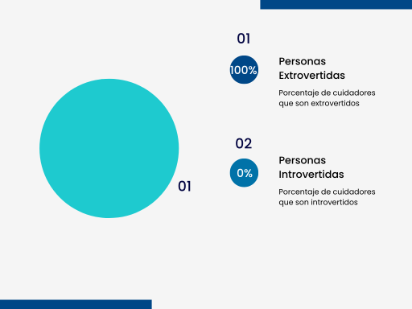

**Universidad Peruana de Ciencias Aplicadas**  
**Ingeniería de Software**  
**Ciclo 2024-2**  

<h4>Desarrollo de Soluciones IoT</h4>

**Sección:** WS71
**Profesor:** Angel Augusto Velasquez Nuñez

<h3>INFORME DEL TRABAJO FINAL</h3>

**Startup:** SocialTech

**Producto:** MIAM (Monitoreo Inteligente para Adultos Mayores)

**Integrantes:**

Achamizo Huamani, Jean Carlos  
Aliaga Trevejo, Lucía Guadalupe  
Raymundo Guevara, Rodrigo Alejandro  
Siancas Reategui, Luis Alberto  
Trujillo Lopez, Luis Alberto  

**Setiembre, 2024**

---

# Registro de Versiones del Informe

| Versión | Fecha | Autor | Descripción de la modificación |
| ------- | ----- | ----- | ------------------------------ |
|   1.0     |   06/09/2024   |  Achamizo Huamani Jean Carlos,  Aliaga Trevejo Lucía Guadalupe, Raymundo Guevara Rodrigo Alejandro, Siancas Reategui Luis Alberto, Trujillo Lopez Luis Alberto  |   Se añadieron los elementos correspondientes al entregable de la TB1 (capítulos 1 al 4)|
|   1.1   |   25/09/2024   |  Aliaga Trevejo Lucía Guadalupe |   Se añadieron y corrigieron los elementos correspondientes en el capítulo de Needfinding |
|   1.2     |   25/09/2024   |  Achamizo Huamani Jean Carlos, Siancas Reategui Luis Alberto |   Se añadieron y corrigieron los elementos correspondientes en el capítulo strategic level software design, como la descripcion y las imagenes de cada diagrama. |
|   1.3     |   26/09/2024   |  Achamizo Huamani Jean Carlos|   Se corrigieron los elementos correspondientes del Lean UX Process, los apartados de Lean UX Assumptions y Lean UX Hypothesis Statements |
---

# Project Report Collaboration Insights

URL del repositorio: 
<a href="https://github.com/IoT-SocialTech/iot-report"> https://github.com/IoT-SocialTech/iot-report </a>

**TB1**

El equipo colaboró activamente en el repositorio de GitHub para la elaboración del informe, realizando un total de 38 commits para el primer entregable.

El uso de ramas paralelas permitió a los miembros del equipo trabajar simultáneamente en diferentes secciones del informe, integrando cambios de manera eficiente y reduciendo conflictos. Este enfoque colaborativo garantizó que todos los miembros contribuyeran al desarrollo del informe de manera equilibrada.

---

# Contenido

## Tabla de Contenidos

- [Registro de Versiones del Informe](#registro-de-versiones-del-informe)
- [Project Report Collaboration Insights](#project-report-collaboration-insights)
- [Contenido](#contenido)
  - [Tabla de Contenidos](#tabla-de-contenidos)
- [Student Outcome](#student-outcome)
- [Capítulo I: Introducción](#capítulo-i-introducción)
  - [1.1. Startup Profile](#11-startup-profile)
    - [1.1.1. Descripción de la Startup](#111-descripción-de-la-startup)
    - [1.1.2. Perfiles de integrantes del equipo](#112-perfiles-de-integrantes-del-equipo)
  - [1.2. Solution Profile](#12-solution-profile)
    - [1.2.1 Antecedentes y problemática](#121-antecedentes-y-problemática)
    - [1.2.2 Lean UX Process](#122-lean-ux-process)
      - [1.2.2.1. Lean UX Problem Statements](#1221-lean-ux-problem-statements)
      - [1.2.2.2. Lean UX Assumptions](#1222-lean-ux-assumptions)
      - [Assumptions worksheet](#assumptions-worksheet)
      - [1.2.2.3. Lean UX Hypothesis Statements](#1223-lean-ux-hypothesis-statements)
      - [Features Hypothesis](#features-hypothesis)
      - [Business Hypothesis](#business-hypothesis)
      - [1.2.2.4. Lean UX Canvas](#1224-lean-ux-canvas)
  - [1.3. Segmentos objetivo](#13-segmentos-objetivo)
- [Capítulo II: Requirements Elicitation \& Analysis](#capítulo-ii-requirements-elicitation--analysis)
  - [2.1. Competidores](#21-competidores)
    - [2.1.1. Análisis competitivo](#211-análisis-competitivo)
    - [2.1.2. Estrategias y tácticas frente a competidores](#212-estrategias-y-tácticas-frente-a-competidores)
  - [2.2. Entrevistas](#22-entrevistas)
    - [2.2.1. Diseño de entrevistas](#221-diseño-de-entrevistas)
    - [2.2.2. Registro de entrevistas](#222-registro-de-entrevistas)
    - [2.2.3. Análisis de entrevistas](#223-análisis-de-entrevistas)
  - [2.3. Needfinding](#23-needfinding)
    - [2.3.1. User Personas](#231-user-personas)
    - [2.3.2. User Task Matrix](#232-user-task-matrix)
    - [2.3.3. User Journey Mapping](#233-user-journey-mapping)
    - [2.3.4. Empathy Mapping](#234-empathy-mapping)
    - [2.3.5. As-is Scenario Mapping](#235-as-is-scenario-mapping)
  - [2.4. Ubiquitous Language](#24-ubiquitous-language)
- [Capítulo III: Requirements Specification](#capítulo-iii-requirements-specification)
  - [3.1. To-Be Scenario Mapping](#31-to-be-scenario-mapping)
  - [3.2. User Stories](#32-user-stories)
  - [3.3. Impact Mapping](#33-impact-mapping)
  - [3.4. Product Backlog](#34-product-backlog)
- [Capítulo IV: Strategic-Level Software Design](#capítulo-iv-strategic-level-software-design)
  - [4.1. Strategic-Level Attribute-Driven Design](#41-strategic-level-attribute-driven-design)
    - [4.1.1. Event Storming](#411-event-storming)
      - [4.1.1.1. Candidate Context Discovery](#4111-candidate-context-discovery)
      - [4.1.1.2 Domain Message Flows Modeling](#4112-domain-message-flows-modeling)
      - [4.1.1.3 Bounded Context Canvases](#4113-bounded-context-canvases)
    - [4.1.2. Context Mapping](#412-context-mapping)
    - [4.1.3. Software Architecture](#413-software-architecture)
      - [4.1.3.1. Software Architecture System Landscape Diagram](#4131-software-architecture-system-landscape-diagram)
      - [4.1.3.2. Software Architecture Context Level Diagrams](#4132-software-architecture-context-level-diagrams)
      - [4.1.3.3. Software Architecture Container Level Diagrams](#4133-software-architecture-container-level-diagrams)
      - [4.1.3..4. Software Architecture Deployment Diagrams](#4134-software-architecture-deployment-diagrams)
  - [4.2. Tactical-Level Domain-Driven Design](#42-tactical-level-domain-driven-design)
  - [4.2.1. Bounded Context: Device Context](#421-bounded-context-device-context)
    - [4.2.1.1. Domain Layer](#4211-domain-layer)
      - [Entities](#entities)
      - [Value Objects](#value-objects)
      - [Domain Services](#domain-services)
      - [Aggregates y Aggregate Root](#aggregates-y-aggregate-root)
      - [Repositories (Interfaces)](#repositories-interfaces)
    - [4.2.1.2. Interface Layer](#4212-interface-layer)
      - [Controllers](#controllers)
    - [4.2.1.3. Application Layer](#4213-application-layer)
      - [Command Handlers](#command-handlers)
      - [Event Handlers](#event-handlers)
      - [Query Handlers](#query-handlers)
    - [4.2.1.4. Infrastructure Layer](#4214-infrastructure-layer)
      - [Repositories (Implementaciones)](#repositories-implementaciones)
    - [4.2.1.6. Bounded Context Software Architecture Component Level Diagrams](#4216-bounded-context-software-architecture-component-level-diagrams)
      - [Components (Edge API):](#components-edge-api)
    - [4.2.1.7. Bounded Context Software Architecture Code Level Diagrams](#4217-bounded-context-software-architecture-code-level-diagrams)
      - [4.2.1.7.1. Bounded Context Domain Layer Class Diagrams](#42171-bounded-context-domain-layer-class-diagrams)
      - [4.2.1.7.2. Bounded Context Database Design Diagram](#42172-bounded-context-database-design-diagram)
  - [4.2.2. Bounded Context: Edge Context](#422-bounded-context-edge-context)
    - [4.2.2.1. Domain Layer](#4221-domain-layer)
      - [Entities](#entities-1)
      - [Value Objects](#value-objects-1)
      - [Domain Services](#domain-services-1)
      - [Aggregates y Aggregate Root](#aggregates-y-aggregate-root-1)
      - [Repositories (Interfaces)](#repositories-interfaces-1)
    - [4.2.2.2. Interface Layer](#4222-interface-layer)
      - [Controllers](#controllers-1)
    - [4.2.2.3. Application Layer](#4223-application-layer)
      - [Command Handlers](#command-handlers-1)
      - [Event Handlers](#event-handlers-1)
      - [Query Handlers](#query-handlers-1)
    - [4.2.2.4. Infrastructure Layer](#4224-infrastructure-layer)
      - [Repositories (Implementaciones)](#repositories-implementaciones-1)
    - [4.2.2.6. Bounded Context Software Architecture Component Level Diagrams](#4226-bounded-context-software-architecture-component-level-diagrams)
      - [Components (Edge API):](#components-edge-api-1)
    - [4.2.2.7. Bounded Context Software Architecture Code Level Diagrams](#4227-bounded-context-software-architecture-code-level-diagrams)
      - [4.2.2.7.1. Bounded Context Domain Layer Class Diagrams](#42271-bounded-context-domain-layer-class-diagrams)
      - [4.2.2.7.2. Bounded Context Database Design Diagram](#42272-bounded-context-database-design-diagram)
  - 
  - [4.2.3. Bounded Context: Notification Context](#423-bounded-context-notification-context)
    - [4.2.3.1. Domain Layer](#4231-domain-layer)
      - [Entities](#entities-2)
      - [Value Objects](#value-objects-2)
      - [Domain Services](#domain-services-2)
      - [Aggregates y Aggregate Root](#aggregates-y-aggregate-root-2)
      - [Repositories (Interfaces)](#repositories-interfaces-2)
    - [4.2.3.2. Interface Layer](#4232-interface-layer)
      - [Controllers](#controllers-2)
    - [4.2.3.3. Application Layer](#4233-application-layer)
      - [Command Handlers](#command-handlers-2)
      - [Event Handlers](#event-handlers-2)
      - [Query Handlers](#query-handlers-2)
    - [4.2.3.4. Infrastructure Layer](#4234-infrastructure-layer)
      - [Repositories (Implementaciones)](#repositories-implementaciones-2)
    - [4.2.3.6. Bounded Context Software Architecture Component Level Diagrams](#4236-bounded-context-software-architecture-component-level-diagrams)
      - [Components (Web API):](#components-web-api)
    - [4.2.3.7. Bounded Context Software Architecture Code Level Diagrams](#4237-bounded-context-software-architecture-code-level-diagrams)
      - [4.2.3.7.1. Bounded Context Domain Layer Class Diagrams](#42371-bounded-context-domain-layer-class-diagrams)
      - [4.2.3.7.2. Bounded Context Database Design Diagram](#42372-bounded-context-database-design-diagram)
  - 
  - [4.2.4. Bounded Context: Metrics Context](#424-bounded-context-metrics-context)
    - [4.2.4.1. Domain Layer](#4241-domain-layer)
      - [Entities](#entities-3)
      - [Value Objects](#value-objects-3)
      - [Domain Services](#domain-services-3)
      - [Aggregates y Aggregate Root](#aggregates-y-aggregate-root-3)
      - [Repositories (Interfaces)](#repositories-interfaces-3)
    - [4.2.4.2. Interface Layer](#4242-interface-layer)
      - [Controllers](#controllers-3)
    - [4.2.4.3. Application Layer](#4243-application-layer)
      - [Command Handlers](#command-handlers-3)
      - [Event Handlers](#event-handlers-3)
      - [Query Handlers](#query-handlers-3)
    - [4.2.4.4. Infrastructure Layer](#4244-infrastructure-layer)
      - [Repositories (Implementaciones)](#repositories-implementaciones-3)
    - [4.2.4.6. Bounded Context Software Architecture Component Level Diagrams](#4246-bounded-context-software-architecture-component-level-diagrams)
      - [Components (Edge API):](#components-edge-api-2)
    - [4.2.4.7. Bounded Context Software Architecture Code Level Diagrams](#4247-bounded-context-software-architecture-code-level-diagrams)
      - [4.2.4.7.1. Bounded Context Domain Layer Class Diagrams](#42471-bounded-context-domain-layer-class-diagrams)
      - [4.2.4.7.2. Bounded Context Database Design Diagram](#42472-bounded-context-database-design-diagram)
  - [4.2.5. Bounded Context: Payment Context](#425-bounded-context-payment-context)
    - [4.2.5.1. Domain Layer](#4251-domain-layer)
      - [Entities](#entities-4)
      - [Value Objects](#value-objects-4)
      - [Domain Services](#domain-services-4)
      - [Aggregates y Aggregate Root](#aggregates-y-aggregate-root-4)
      - [Repositories (Interfaces)](#repositories-interfaces-4)
    - [4.2.5.2. Interface Layer](#4252-interface-layer)
      - [Controllers](#controllers-4)
    - [4.2.5.3. Application Layer](#4253-application-layer)
      - [Command Handlers](#command-handlers-4)
      - [Event Handlers](#event-handlers-4)
      - [Query Handlers](#query-handlers-4)
    - [4.2.5.4. Infrastructure Layer](#4254-infrastructure-layer)
      - [Repositories (Implementaciones)](#repositories-implementaciones-4)
    - [4.2.5.6. Bounded Context Software Architecture Component Level Diagrams](#4256-bounded-context-software-architecture-component-level-diagrams)
      - [Components (Web API):](#components-web-api-1)
    - [4.2.5.7. Bounded Context Software Architecture Code Level Diagrams](#4257-bounded-context-software-architecture-code-level-diagrams)
      - [4.2.5.7.1. Bounded Context Domain Layer Class Diagrams](#42571-bounded-context-domain-layer-class-diagrams)
      - [4.2.5.7.2. Bounded Context Database Design Diagram](#42572-bounded-context-database-design-diagram)
  - 
  - [4.2.6. Bounded Context: Configuration Context](#426-bounded-context-configuration-context)
    - [4.2.6.1. Domain Layer](#4261-domain-layer)
      - [Entities](#entities-5)
      - [Value Objects](#value-objects-5)
      - [Domain Services](#domain-services-5)
      - [Aggregates y Aggregate Root](#aggregates-y-aggregate-root-5)
      - [Repositories (Interfaces)](#repositories-interfaces-5)
    - [4.2.6.2. Interface Layer](#4262-interface-layer)
      - [Controllers](#controllers-5)
    - [4.2.6.3. Application Layer](#4263-application-layer)
      - [Command Handlers](#command-handlers-5)
      - [Event Handlers](#event-handlers-5)
      - [Query Handlers](#query-handlers-5)
    - [4.2.6.4. Infrastructure Layer](#4264-infrastructure-layer)
      - [Repositories (Implementaciones)](#repositories-implementaciones-5)
    - [4.2.6.6. Bounded Context Software Architecture Component Level Diagrams](#4266-bounded-context-software-architecture-component-level-diagrams)
      - [Components (Edge API):](#components-edge-api-3)
    - [4.2.6.7. Bounded Context Software Architecture Code Level Diagrams](#4267-bounded-context-software-architecture-code-level-diagrams)
      - [4.2.6.7.1. Bounded Context Domain Layer Class Diagrams](#42671-bounded-context-domain-layer-class-diagrams)
      - [4.2.6.7.2. Bounded Context Database Design Diagram](#42672-bounded-context-database-design-diagram)
  - [4.2.7. Bounded Context: Account Context](#427-bounded-context-account-context)
    - [4.2.7.1. Domain Layer](#4271-domain-layer)
      - [Entities](#entities-6)
      - [Value Objects](#value-objects-6)
      - [Domain Services](#domain-services-6)
      - [Aggregates y Aggregate Root](#aggregates-y-aggregate-root-6)
      - [Repositories (Interfaces)](#repositories-interfaces-6)
    - [4.2.7.2. Interface Layer](#4272-interface-layer)
      - [Controllers](#controllers-6)
    - [4.2.7.3. Application Layer](#4273-application-layer)
      - [Command Handlers](#command-handlers-6)
      - [Event Handlers](#event-handlers-6)
      - [Query Handlers](#query-handlers-6)
    - [4.2.7.4. Infrastructure Layer](#4274-infrastructure-layer)
      - [Repositories (Implementaciones)](#repositories-implementaciones-6)
    - [4.2.7.6. Bounded Context Software Architecture Component Level Diagrams](#4276-bounded-context-software-architecture-component-level-diagrams)
      - [Components (Web API):](#components-web-api-2)
    - [4.2.7.7. Bounded Context Software Architecture Code Level Diagrams](#4277-bounded-context-software-architecture-code-level-diagrams)
      - [4.2.7.7.1. Bounded Context Domain Layer Class Diagrams](#42771-bounded-context-domain-layer-class-diagrams)
      - [4.2.7.7.2. Bounded Context Database Design Diagram](#42772-bounded-context-database-design-diagram)
  - 
- [Conclusiones](#conclusiones)
- [Bibliografía](#bibliografía)
- [Anexos](#anexos)
  - [Videos de Exposición](#videos-de-exposición)
  - [Diagrama C4 MIAM](#diagrama-c4-miam)

  
---

# Student Outcome

| Criterio específico                                              | Acciones realizadas                                                                 | Conclusiones |
|------------------------------------------------------------------|-------------------------------------------------------------------------------------|--------------|
| Trabaja en equipo para proporcionar liderazgo en forma conjunta | *Achamizo Huamani Jean Carlos*   TB1:   Participó activamente en la planificación y ejecución de las actividades del equipo. Coordinó las reuniones para discutir el progreso del proyecto y tomó la iniciativa en la resolución de conflictos.    *Aliaga Trevejo Lucía Guadalupe*   TB1:   Facilitó las discusiones del equipo, asegurando que todos los miembros pudieran expresar sus opiniones. Tomó la responsabilidad de consolidar la información y presentar el avance del proyecto a los stakeholders.    *Raymundo Guevara Rodrigo Alejandro*   TB1:   Contribuyó al liderazgo del equipo al proporcionar soporte técnico y orientación durante la implementación de las tareas. Coordinó con otros miembros del equipo para asegurar la alineación de los objetivos del proyecto.    *Siancas Reategui Luis Alberto*   TB1:   Asumió un rol activo en la definición de metas y en la planificación de tareas, manteniendo a todos los miembros del equipo enfocados en los objetivos comunes.    *Trujillo Lopez Luis Alberto*   TB1:   Lideró la revisión de las tareas y ayudó a motivar al equipo a cumplir con los plazos establecidos. Estableció un entorno de trabajo colaborativo que facilitó la cooperación entre todos los miembros del equipo.   |  *TB1*   El trabajo en equipo fue efectivo en proporcionar un liderazgo colaborativo, facilitando una comunicación abierta y un enfoque compartido hacia la consecución de objetivos. Cada miembro del equipo contribuyó significativamente a la planificación y ejecución del proyecto, mejorando la dinámica y eficiencia del grupo. |
| Crea un entorno colaborativo e inclusivo, establece metas, planifica tareas y cumple objetivos | *Achamizo Huamani Jean Carlos*   TB1:   Facilitó la creación de un entorno inclusivo al asegurar que todas las voces fueran escuchadas durante las discusiones del equipo. Colaboró en la definición de metas claras y en la planificación de tareas para alcanzar los objetivos del proyecto.    *Aliaga Trevejo Lucía Guadalupe*   TB1:   Promovió la inclusión en el equipo al garantizar que las tareas y objetivos fueran distribuidos equitativamente. Ayudó a planificar y asignar tareas de manera que se maximizara el potencial de cada miembro del equipo.    *Raymundo Guevara Rodrigo Alejandro*   TB1:   Colaboró en la creación de un ambiente de trabajo abierto y respetuoso, donde cada miembro del equipo pudo contribuir con sus ideas. Participó activamente en la planificación y en el establecimiento de objetivos alcanzables.    *Siancas Reategui Luis Alberto*   TB1:   Se encargó de supervisar el progreso del equipo en relación con las metas establecidas, asegurando que todos los miembros estuvieran alineados con los objetivos del proyecto. Facilitó la planificación de tareas y la resolución de problemas para mantener el proyecto en camino.    *Trujillo Lopez Luis Alberto*   TB1:   Implementó prácticas para fomentar un entorno colaborativo y inclusivo, realizando sesiones de planificación y seguimiento para asegurar el cumplimiento de los objetivos. Supervisó el progreso y la realización de tareas, ayudando al equipo a mantenerse enfocado.   |   *TB1*   Se logró establecer un entorno de trabajo colaborativo e inclusivo, con una planificación efectiva y cumplimiento de metas. La distribución equitativa de tareas y la supervisión continua ayudaron a mantener al equipo alineado y motivado para alcanzar los objetivos del proyecto. |

---

# Capítulo I: Introducción

## 1.1. Startup Profile

### 1.1.1. Descripción de la Startup

### 1.1.2. Perfiles de integrantes del equipo

<table>
    <tr>
        <td>Perfil</td>
        <td>Foto</td>
    </tr>
    <tr>
        <td><b>Nombre:</b> Achamizo Huamani, Jean Carlos 
            <b>Carrera:</b> Ingenieria de Software  
        <b>Descripcion:</b> Como estudiante de Ingeniería de Software en la Universidad UPC, mi entusiasmo por el aprendizaje constante me impulsa a buscar siempre nuevas maneras de perfeccionar mis habilidades académicas y aplicarlas en situaciones prácticas, también poseo aptitudes en comunicación asertiva y escucha activa. Reconozco la importancia de una comunicación clara y efectiva en cualquier proyecto de software, y cuento con la capacidad de escuchar de manera atenta para comprender las necesidades y expectativas de los clientes y colegas de equipo.  
        <td></td>
    </tr>
    <tr>
        <td><b>Nombre:</b> Aliaga Trevejo, Lucía Guadalupe  
            <b>Carrera:</b> Ingenieria de Software  
        <b>Descripcion:</b> Soy una estudiante de Ingeniería de Software, actualmente interesada en el desarrollo web front y back end. Me gusta crear interfaces intuitivas y llamativas para mejorar la experiencia de usuario. Me considero una persona responsable y centrada. Mis habilidades blandas incluyen comunicación efectiva, trabajo en equipo, liderazgo y adaptabilidad. Aspiro a contribuir de manera significativa en proyectos innovadores para seguir expandiendo mis conocimientos técnicos y capacidades. 
        <td></td>
    </tr>
    <tr>
        <td><b>Nombre:</b> Raymundo Guevara, Rodrigo Alejandro  
            <b>Carrera:</b> Ingenieria de Software  
        <b>Descripcion:</b> Soy estudiante de la carrera de Ingeniería de Software y un apasionado de la tecnología. Me gusta descubrir nuevas formas de solucionar problemas con diversos frameworks y algoritmos. Me considero una persona responsable y empática. Me gusta mucho trabajar en equipo y ayudar a mis compañeros 
        <td></td>
    </tr>
    <tr>
        <td><b>Nombre:</b> Siancas Reategui, Luis Alberto 
            <b>Carrera:</b> Ingenieria de Software  
        <b>Descripcion:</b> Soy estudiante de la carrera de Ingeniería de Software enfocado en el desarrollo backend. Me gusta crear API’s las cuales uso para mis proyectos, por otro lado, me gusta realizar el despliegue de mis aplicaciones así como también usar diferentes diseños de arquitectura para que mi aplicación tenga un funcionamiento estable y tenga alta disponibilidad. En cuanto a mis habilidades blandas, soy empático y tengo escucha activa, esto me ayuda en gran parte a la hora de trabajar en equipos ya que facilita la comunicación y por ende los resultados son mejores. 
        <td></td>
    </tr>
    <tr>
        <td><b>Nombre:</b> Trujillo Lopez, Luis Alberto 
            <b>Carrera:</b> Ingenieria de Software  
        <b>Descripcion:</b> Soy un estudiante de Ingeniería de Software interesado en las tecnologías de aprendizaje autónomo. Me gusta desarrollar en un entorno web páginas que se vean llamativas y que tengan múltiples funcionalidades enfocándome en la experiencia del usuario y en la creación de API’s. Poseo algunas habilidades que me permiten relacionarme en equipo, soy una persona responsable, con un enfoque centrado, comunicación asertiva, liderazgo y adaptabilidad. Mi meta es contribuir en el desarrollo de proyectos que me permitan mejorar y encontrar nuevas habilidades para adquirir mayores conocimientos laboral y profesionalmente.
        <td></td>
    </tr>
    <tr>
        <td><b>Nombre:</b> Sagastegui Rodriguez, Luis Jesus 
            <b>Carrera:</b> Ingenieria de Software  
        <b>Descripcion:</b> Soy un estudiante de la carrera de ingenieria de Software y me apasiona mucho lo que hago. Siempre estoy interesado en aprender nuevas tecnologias y lenguajes de programacion. Me gusta ver proyectos de las demas personas y poder compartir ideas. Me considero una persona responsable y muy amable que siempre le gusta ayudar a las demas personas. Siempre trato de dar lo mejor de mi para poder destacar.
           <td></td>
    </tr>
   <table>

## 1.2. Solution Profile

### 1.2.1 Antecedentes y problemática

Los adultos mayores representan una población vulnerable no solo a enfermedades relacionadas con el envejecimiento, sino también a lesiones que pueden deteriorar significativamente su calidad de vida (Dorri, Zabolinezhad, & Sattari, 2023). De acuerdo con la Organización Mundial de la Salud, las caídas son la principal causa de lesiones y mortalidad en personas mayores de 75 años (Giulianelli et al., 2017). Ante este panorama, es esencial proporcionarles un entorno seguro que contribuya a prevenir discapacidades y complicaciones en su salud (Dorri, Zabolinezhad, & Sattari, 2023).

A continuación, se presenta un análisis detallado de esta problemática empleando la metodología ‘5W2H’.

**Who**  
Los adultos mayores en Perú, especialmente aquellos que viven en casas de reposo o en sus propios domicilios, representan una población vulnerable debido a las limitaciones propias del envejecimiento, como la pérdida de reflejos y del equilibrio (Suárez et al., 2020). Por otro lado, los cuidadores, tanto formales (como enfermeros y técnicos) como informales (familiares), son los responsables de brindar atención diaria. Estos cuidadores a menudo enfrentan desafíos adicionales como las exigencias de su trabajo y los recursos limitados. Esta situación puede dificultar la supervisión y la atención constante que los adultos mayores necesitan.

**What**  
La principal problemática es la alta incidencia de caídas entre los adultos mayores, que no solo provoca lesiones físicas como fracturas y traumatismos, sino que también tiene consecuencias psicológicas como el miedo a caer de nuevo, lo cual reduce aún más su movilidad e independencia. Para los cuidadores, cada caída significa un aumento significativo en la carga de trabajo, implicando cuidados adicionales.

**Where**  
Las caídas ocurren principalmente en las casas de reposo y domicilios de los adultos mayores. En las casas de reposo, la falta de personal y la infraestructura deficiente pueden contribuir al riesgo de caídas. En los domicilios, los adultos mayores a menudo se enfrentan a condiciones peligrosas como escaleras sin barandas, pisos resbaladizos, y la ausencia de dispositivos de asistencia como andadores o bastones.

**When**  
Las caídas pueden suceder en cualquier momento del día, pero son más comunes durante actividades cotidianas como levantarse de la cama, caminar al baño, o asearse. Las noches y madrugadas son momentos críticos debido a la disminución de la visibilidad y la menor capacidad de reacción tanto de los adultos mayores como de los cuidadores.

**Why**  
Las caídas suelen suceder por una combinación de factores, como la fragilidad del adulto mayor y una supervisión insuficiente. 

**How**  
Los adultos mayores pueden perder el equilibrio al realizar actividades diarias sin la asistencia adecuada. Los cuidadores no son capaces de realizar supervisión constante debido a que tienen varios pacientes a cargo, en especial en las casas de reposo, lo que puede llevar a descuidos involuntarios, aumentando el riesgo de caídas.

**How Much**  
Uno de cada tres adultos mayores de 65 años sufre caídas, de las cuales el 68% resultan en lesiones, incluyendo fracturas. Además, el 60% de las caídas ocurren en el hogar, 30% en sitios públicos y 10% en instituciones de salud, teniendo consecuencias físicas y psicológicas para el adulto mayor (Ministerio de Salud, 2018). 

### 1.2.2 Lean UX Process

#### 1.2.2.1. Lean UX Problem Statements

El estado actual de la seguridad para adultos mayores se ha centrado principalmente en productos como botones de emergencia y sensores de movimiento básicos. Sin embargo, estos productos no logran ofrecer una supervisión continua ni adaptarse a los entornos específicos en los que viven los adultos mayores. Esto deja una brecha crítica en la prevención de caídas, lo que resulta en lesiones físicas y una reducción en la calidad de vida de los adultos mayores. Los cuidadores se enfrentan a la dificultad de supervisar constantemente y gestionar los riesgos sin herramientas adecuadas para ser más proactivos.

Nuestro producto abordará esta brecha mediante el desarrollo de un sistema innovador de monitoreo basado en IoT, diseñado para ofrecer una supervisión continua y alertas en tiempo real adaptadas a los entornos específicos de cada adulto mayor. Nuestro enfoque inicial serán los cuidadores y dueños de casas de reposo, con el objetivo de mejorar la seguridad y la calidad de vida de los adultos mayores.

Sabremos que tenemos éxito cuando veamos una reducción en los incidentes de caídas, una mayor satisfacción de los cuidadores y una mejora significativa en la calidad de vida de los adultos mayores.

#### 1.2.2.2. Lean UX Assumptions
En esta sección se formulan las hipótesis basadas en las suposiciones previas, estableciendo relaciones claras entre las características del producto, los comportamientos esperados de los usuarios y los resultados de negocio deseados. Con puntos 

1. Business Assumptions:
Asumimos que los dueños de casas de reposo y cuidadores profesionales requieren una solución integrada y confiable para monitorear la salud y seguridad de los adultos mayores, reduciendo el riesgo de incidentes y mejorando la eficiencia en el cuidado diario.
2. Business Outcome Assumptions:
 Asumimos que los dueños de casas de reposo y cuidadores medirán el éxito de nuestro servicio por su capacidad para reducir en un 30% los incidentes de caídas y mejorar la respuesta a emergencias en un 50% durante el primer año de implementación.
3. User Assumptions:
 Asumimos que los cuidadores profesionales y los administradores de casas de reposo estarán dispuestos a adoptar nuevas tecnologías si estas les permiten monitorear de manera proactiva la salud de los residentes y reducir la carga laboral asociada a la supervisión manual.
4. User Outcome Assumptions:
 Asumimos que los cuidadores y administradores de casas de reposo experimentarán una mejora en la satisfacción laboral, una disminución del 20% en las tareas repetitivas de supervisión y un aumento del 40% en la percepción de seguridad por parte de los familiares de los residentes durante el primer semestre de uso del sistema.
5. Feature Assumptions:
 Asumimos que la combinación de sensores de movimiento y signos vitales, junto con alertas en tiempo real personalizables según el estado de salud de cada residente, será la característica clave que diferenciará nuestra solución de la competencia y captará al menos el 25% del mercado objetivo en el primer año.

#### 1.2.2.3. Lean UX Hypothesis Statements
En esta sección se presentan las suposiciones clave que sustentan el diseño y desarrollo del producto. Estas suposiciones se basan en el entendimiento actual de las necesidades y comportamientos de los usuarios, así como en las condiciones del mercado. Identificar y documentar estas suposiciones permite al equipo alinearse en torno a expectativas comunes y establecer una base sólida para el proceso de validación a través de pruebas e iteraciones futuras.

**Hypothesis Statements 1:**
Creemos que al implementar un sistema de monitoreo integrado, los dueños de casas de reposo y cuidadores verán una reducción del 30% en los incidentes de caídas y una mejora del 20% en la eficiencia operativa dentro de los primeros seis meses. Sabremos que esto es cierto cuando se observe una disminución documentada en los reportes de incidentes y una mejora en la satisfacción y eficiencia reportada por los usuarios.

**Hypothesis Statements 2:**
Creemos que al utilizar nuestro sistema, los dueños de casas de reposo y cuidadores notarán una disminución del 30% en los incidentes de caídas y un 50% de mejora en el tiempo de respuesta a emergencias dentro del primer año. Sabremos que hemos tenido éxito cuando se registren mejoras documentadas en los reportes de incidentes y tiempos de respuesta durante este período.

**Hypothesis Statements 3:**
Creemos que al ofrecer una solución tecnológica que facilite la supervisión proactiva, al menos el 70% de los cuidadores profesionales y administradores adoptarán nuestro sistema en los primeros seis meses. Sabremos que esto es cierto cuando el 70% de los usuarios registrados utilicen activamente la solución y reporten una disminución significativa en la carga laboral.

**Hypothesis Statements 4:**
Creemos que al usar nuestro sistema de monitoreo, los cuidadores y administradores de casas de reposo reportarán una mejora del 30% en su satisfacción laboral y una disminución del 20% en las tareas de supervisión repetitivas dentro del primer semestre. Sabremos que hemos tenido éxito cuando los resultados de encuestas de satisfacción y reportes de tiempo de trabajo lo reflejen, y al menos el 40% de los familiares indiquen una mayor percepción de seguridad.

**Hypothesis Statements 5:**
Creemos que la integración de sensores de movimiento y signos vitales con alertas personalizables en tiempo real aumentará la adopción de nuestro sistema en un 25% del mercado objetivo durante el primer año. Sabremos que hemos tenido éxito cuando el 25% del mercado potencial (casas de reposo y cuidadores profesionales) hayan adquirido y utilicen activamente nuestra solución, reportando mejoras en la seguridad y satisfacción del cuidado.

#### 1.2.2.4. Lean UX Canvas

<table>
    <tr>
        <th colspan="1" valign="top">
            
<b>Business Problem</b>

            
Los cuidadores de personas mayores enfrentan dificultades para monitorear el estado de salud de sus pacientes en tiempo real. Los familiares y cuidadores necesitan una forma eficiente de ser notificados sobre emergencias, como caídas o problemas de salud, para brindar atención inmediata y prevenir complicaciones graves.

        </th>
        <th colspan="1" rowspan="2" valign="top">
            
<b>Solution Ideas</b>

            
Monitorear la temperatura y el ritmo cardíaco de las personas mayores en tiempo real.

            
Recibir notificaciones inmediatas en caso de emergencias o valores fuera de rango.

            
Permitir a los usuarios solicitar ayuda a través de un botón en el brazalete.

            
Generar reportes automáticos con datos de salud y patrones a lo largo del tiempo.

            
Acceso al sistema desde dispositivos móviles y web para cuidadores y familiares.

        </th>
        <th colspan="1" valign="top">
            
<b>Business Outcomes</b>

            
Mejorar la capacidad de respuesta ante emergencias en un 25%.

            
Reducir el tiempo de respuesta a incidentes de salud en personas mayores en un 20%.

            
Incrementar la satisfacción de los clientes mediante la integración de reportes y notificaciones automatizadas.

        </th>
    </tr>
    <tr>
        <td colspan="1" valign="top">
            
<b>User & Customers</b>

            
<b>Usuarios</b>: Cuidadores y familiares de personas mayores que necesitan monitoreo constante.

            
<b>Clientes</b>: Clínicas geriátricas, residencias de ancianos, y familias con personas mayores que requieren monitoreo continuo.

        </td>
        <td colspan="1" valign="top">
            
<b>User Benefits</b>

            
<b>Cuidadores:</b> Mayor visibilidad en tiempo real del estado de salud de las personas mayores, mejor toma de decisiones basadas en datos y reducción en la necesidad de monitoreo físico constante.

            
<b>Personas Mayores:</b> Mayor seguridad y tranquilidad al saber que están siendo monitoreados de manera constante, y facilidad para solicitar ayuda en caso de emergencia.

        </td>
    </tr>
    <tr>
        <td colspan="1" valign="top">
            
<b>Hypotheses</b>

            
<b>Monitoreo en Tiempo Real:</b> Implementar un sistema de monitoreo en tiempo real reducirá los incidentes de salud no detectados en un 25% y mejorará la capacidad de respuesta de los cuidadores en un 20%.

            
<b>Notificaciones Instantáneas:</b> Las notificaciones instantáneas mejorarán la capacidad de los cuidadores para actuar rápidamente, reduciendo los riesgos de complicaciones.

            
<b>Reportes Automáticos:</b> La generación de reportes automáticos ayudará a los cuidadores y familiares a tomar decisiones mejor informadas sobre el estado de salud de las personas mayores.

        </td>
        <td colspan="1" valign="top">
            
<b>What’s the most important thing we need to learn first?</b>

            
Lo más importante que necesitamos aprender primero es: La efectividad del sistema de monitoreo en tiempo real para detectar y notificar problemas de salud en personas mayores.

        </td>
        <td colspan="1" valign="top">
            
<b>What’s the least amount of work we need to do to learn the most important thing?</b>

            
<b>Mínimo trabajo necesario:</b> Desarrollar un prototipo básico del sistema de monitoreo que incluya monitoreo de temperatura, ritmo cardíaco y un botón de solicitud de ayuda. Realizar pruebas piloto en un entorno controlado para validar la efectividad del sistema y recopilar retroalimentación de los usuarios antes del lanzamiento completo.

        </td>
    </tr>
</table>

## 1.3. Segmentos objetivo

---

# Capítulo II: Requirements Elicitation & Analysis

## 2.1. Competidores

| Nombre del Competidor | Descripción |
| :-------------------: | :---------- |
| Life Alert  https://www.lifealert.com/ | Life Alert es una de las marcas más reconocidas en sistemas de alerta médica, famosa por su eslogan “¡He caído y no puedo levantarme!”. Ofrece sistemas de emergencia diseñados para ayudar a personas mayores a solicitar asistencia rápidamente. Su principal dispositivo es un botón de emergencia que puede usarse en el hogar o fuera de él, enviando alertas a un centro de monitoreo disponible las 24 horas del día. |
| MobileHelp  https://www.mobilehelp.com/  | MobileHelp es un proveedor líder de sistemas de alerta médica que ofrece dispositivos portátiles y basados en el hogar para personas mayores. Sus dispositivos están diseñados para alertar a los servicios de emergencia en caso de una caída u otro incidente. Además de las soluciones de emergencia en el hogar, MobileHelp destaca por su cobertura fuera de casa gracias a su integración con redes móviles, lo que ofrece a los usuarios mayor independencia y movilidad. |
| CarePredict  https://www.carepredict.com/  | CarePredict es una empresa tecnológica que se enfoca en el monitoreo preventivo para adultos mayores. Utiliza dispositivos portátiles equipados con sensores para rastrear patrones de comportamiento y signos vitales. A través de la inteligencia artificial, CarePredict predice posibles problemas de salud antes de que ocurran, como caídas o infecciones, y permite la intervención proactiva de cuidadores y familiares. |

### 2.1.1. Análisis competitivo

<table>
  <tr>
    <th colspan="7" valign="top"><b>Competitive Analysis Landscape</b></th>
  </tr>
  <tr>
    <td colspan="2" rowspan="2">¿Por qué llevar a cabo este análisis?</td>
  </tr>
  <tr>
    <td colspan="5">Comparar las características y funcionalidades clave de nuestra solución con las de la competencia para identificar ventajas competitivas y posibles áreas de mejora.</td>
  </tr>
  <tr>
    <td colspan="3">Competidores</td>
    <td colspan="1" valign="top" style="font-weight: bold;text-align: center">
        MIAM 
        
        

        

    <td colspan="1" valign="top" style="font-weight: bold;text-align: center">
        Life Alert 
        
        https://www.lifealert.com/ 
        

        

    </td>
    <td colspan="1" valign="top" style="font-weight: bold;text-align: center" >
        Carepredict
        
        https://www.mobilehelp.com/
        

        

      </td>
    <td colspan="1" valign="top" style="font-weight: bold;text-align: center" >
        MobileHelp
        
        https://www.carepredict.com/ 
        

        

    </td>
  </tr>
  <tr>
    <td colspan="1" rowspan="2">
Perfil
</td>
    <td colspan="2">Overview</td>
    <td colspan="1" valign="top">MIAM ofrece un avanzado sistema de monitoreo inteligente para la prevención de accidentes en adultos mayores, a través del seguimiento de su movimiento y signos vitales de manera rápida y precisa, genera  reportes de los datos del adulto mayor y proporciona un fácil monitoreo por su interfaz.
    </td>
    <td colspan="1" valign="top">Life Alert es un sistema de alerta médica diseñado para proteger a las personas mayores en caso de emergencia sanitaria en el hogar, les permite ser independientes y enviar ayuda rápidamente en caso de una emergencia médica.
    </td>
    <td colspan="1" valign="top">CarePredict es una empresa de tecnología que ofrece soluciones de monitoreo para el cuidado de adultos mayores, usando inteligencia artificial y sensores. Su sistema predice cambios en el comportamiento para prevenir problemas de salud como caídas o infecciones.
    </td>
    <td colspan="1" valign="top">MobileHelp ofrece dispositivos médicos que permiten a los adultos mayores vivir de forma independiente mientras brindan tranquilidad a sus familiares, incluyen sistemas de alerta de emergencia médica que funcionan en el hogar y en exteriores.
    </td>
  </tr>
  <tr>
    <td colspan="2">Ventaja competitiva</td>
    <td colspan="1" valign="top">Ofrece un enfoque detallado e íntegro para el monitoreo completo del adulto mayor evitando posibles accidentes.
    </td>
    <td colspan="1" valign="top">Envía la ayuda que necesita rápidamente, las 24 horas del día, los 7 días de la semana.
    </td>
    <td colspan="1" valign="top">Tecnología avanzada de sensores portátiles y el uso de inteligencia artificial que predice problemas de salud antes de que ocurran.
    </td>
    <td colspan="1" valign="top">Combinación de dispositivos médicos avanzados con opciones de movilidad, es decir, sus sistemas no están limitados al hogar y ofrecen cobertura en cualquier lugar donde haya señal celular.
    </td>
  </tr>
  <tr>
    <td colspan="1" rowspan="2">
Perfil de Marketing
</td>
    <td colspan="2">Mercado objetivo</td>
    <td colspan="1" valign="top"> MIAM ofrece una solución completa para ayudar en el cuidado del adulto mayor, dirigidas a aquellos familiares que poseen familia con una edad avanzada y deseen un cuidado especializado para sus seres queridos.
    </td>
    <td colspan="1" valign="top">Ofrece una solución especializada en la respuesta rápida ante los distintos accidentes que pueda sufrir un adulto mayor que se encuentre solo.
    </td>
    <td colspan="1" valign="top">CarePredict se posiciona como una solución innovadora en el sector de salud para personas mayores, enfocándose en la prevención de problemas de salud a través de tecnología avanzada.
    </td>
    <td colspan="1" valign="top">MobileHelp se posiciona como una solución accesible y fiable en el mercado de dispositivos de seguridad para personas mayores, suelen centrarse en la seguridad y tranquilidad que brindan a los usuarios.
    </td>
  </tr>
  <tr>
    <td colspan="2">Estrategias de marketing</td>
    <td colspan="1" valign="top">Usará el marketing digital, realizará posts, campañas publicitarias y colaboración con influences en internet para atraer a familiares que quieran un aparato que ayude en el cuidado de su adulto mayor.
    </td>
    <td colspan="1" valign="top">Campañas publicitarias en televisión y videos con testimonios de los adultos mayores a los que le ayudó el producto ante una emergencia.
    </td>
    <td colspan="1" valign="top">Utilizan contenido educativo y testimonios de clientes para atraer a los usuarios. Además, aprovechan redes sociales y asociaciones con organizaciones de atención médica para ampliar su alcance.
    </td>
    <td colspan="1" valign="top">Utilizan una estrategia multicanal, que incluye anuncios en televisión, redes sociales y asociaciones con proveedores de atención médica..
    </td>
  </tr>
  <tr>
    <td colspan="1" rowspan="3">
Perfil de Producto
</td>
    <td colspan="2">Productos & Servicios</td>
    <td colspan="1" valign="top">Ofrecemos un plan de suscripción mensual de bajo costo para el plan básico o un plan de suscripción personalizado para el plan empresarial
    </td>
    <td colspan="1" valign="top">Ofrece 3 productos para la respuesta rápida ante una emergencia, "help button", "micro voice pendant system" y "on-the-go + GPS".
    </td>
    <td colspan="1" valign="top">Ofrecen sensores portátiles que monitorean las actividades diarias y detectan cambios en los patrones de comportamiento.
    </td>
    <td colspan="1" valign="top">MobileHelp ofrece sistemas de alerta médica, monitores de salud, y accesorios como sensores de caídas y relojes inteligentes con capacidades de monitoreo.
    </td>
  </tr>
  <tr>
    <td colspan="2">Precios y Costos</td>
    <td colspan="1" valign="top">Ofrecemos un plan de suscripción mensual de bajo costo para el plan básico o un plan de suscripción personalizado para el plan empresarial.
    </td>
    <td colspan="1" valign="top">Entregan el producto después de realizar una llamada al número proporcionado en su página web.
    </td>
    <td colspan="1" valign="top">El modelo de precios se basa en suscripciones mensuales por el uso de los dispositivos y el acceso a la plataforma de monitoreo.
    </td>
    <td colspan="1" valign="top">Sus precios varían según el tipo de dispositivo y plan de servicio, generalmente en formato de suscripción mensual.
    </td>
  </tr>
  <tr>
    <td colspan="2">Canales de distribución</td>
    <td colspan="1" valign="top">Ventas directas a partir de los canales de la aplicación web y móvil.
    </td>
    <td colspan="1" valign="top">Ventas directas y personalizadas para cada llamada al número proporcionado por la página web.
    </td>
    <td colspan="1" valign="top">Acceso a través de una plataforma web y aplicaciones móviles que permiten a los cuidadores y familiares monitorear la salud de los adultos mayores en tiempo real.
    </td>
    <td colspan="1" valign="top">MobileHelp distribuye sus productos principalmente a través de su sitio web y socios minoristas.
    </td>
  </tr>
  <tr>
    <td colspan="1" rowspan="5">
Análisis SWOT
</td>
    
  </tr>
  <tr>
    <td colspan="2">Fortalezas</td>
    <td colspan="1" valign="top">Tecnología IoT avanzada para un monitoreo preciso del adulto mayor, acompañado de aplicativo móvil y web intuitivo con una gran personalización y proporciona información recolectada.
    </td>
    <td colspan="1" valign="top">Enfoque centrado en la respuesta rápida ante los accidentes del adulto mayor, solución sencilla y simple pero eficiente.
    </td>
    <td colspan="1" valign="top">Tecnología avanzada, predicción proactiva de problemas de salud.
    </td>
    <td colspan="1" valign="top">Amplia cobertura fuera del hogar, sistemas fáciles de usar y monitoreo 24/7.
    </td>
  </tr>
  <tr>
    <td colspan="2">Debilidades</td>
    <td colspan="1" valign="top">Posible alta inversión en el área de investigación y desarrollo, necesidad de establecerse en un mercado altamente competitivo.
    </td>
    <td colspan="1" valign="top">Limitación en solo enviar alertas cuando el botón sea presionado, posible dependencia de su reputación.
    </td>
    <td colspan="1" valign="top">Dependencia de la tecnología, lo que puede limitar la adopción por parte de usuarios menos tecnológicos.
    </td>
    <td colspan="1" valign="top">Dependencia de las redes celulares para algunas funciones, lo que puede limitar la cobertura en áreas rurales.
    </td>
  </tr>
  <tr>
    <td colspan="2">Oportunidades</td>
    <td colspan="1" valign="top">Creciente población de adultos mayores en el mundo, promedio de vida en alsa, mejoras en la respuesta de salud, demanda de soluciones tecnológicas en el área y expansión a mercados globales.
    </td>
    <td colspan="1" valign="top">Expansión del área de salud y cuidado de adultos mayores, promedio de vida de las personas más alta, expansión en mercados globales
    </td>
    <td colspan="1" valign="top">Creciente demanda de soluciones de cuidado para personas mayores.
    </td>
    <td colspan="1" valign="top">Creciente demanda de soluciones de salud para la población envejecida.
    </td>
  </tr>
  <tr>
    <td colspan="2">Amenazas</td>
    <td colspan="1" valign="top">Competencia fuerte de empresas ya establecidas y consolidadas en el campo, cambios en las tendencias tecnológicas que puedan cambiar o afectar a la demanda del servicio.
    </td>
    <td colspan="1" valign="top">Competencia de otras soluciones más completas en el mercado, creciente avance de la tecnología puede dejar anticuado el simple sistema.
    </td>
    <td colspan="1" valign="top">Competencia de otros dispositivos de monitoreo y avances en tecnología​.
    </td>
    <td colspan="1" valign="top">Competencia creciente de dispositivos de alerta médica portátiles y cambios en las regulaciones del sector.
    </td>
  </tr>
</table>

### 2.1.2. Estrategias y tácticas frente a competidores

<table>
  <tr>
    <th colspan="3" valign="top"></th>
    <th colspan="4" valign="top"><b>OPORTUNIDADES</b></th>
    <th colspan="4" valign="top"><b>AMENAZAS</b></th>
  </tr>
  <tr>
    <th colspan="3" valign="top"></th>
    <td colspan="4" valign="top">
      <li> Creciente población de adultos mayores a nivel mundial.
      <li> Aumento en la demanda de soluciones tecnológicas para el cuidado de la salud.
      <li> Expansión global hacia mercados con alta demanda de productos de salud y monitoreo.
      <li> Mejoras en la expectativa de vida y respuesta de salud preventiva.
    </td>
    <td colspan="4" valign="top">
      <li> Competencia fuerte de empresas establecidas en el mercado.
      <li> Rápido cambio tecnológico, lo que puede requerir actualizaciones constantes.
      <li> Baja barrera de entrada para nuevos competidores en el sector de monitoreo.
      <li> Cambios en las tendencias de salud y políticas que afecten la demanda del servicio.
    </td>
  </tr>

  <tr>
    <th colspan="3" valign="top"><b>FORTALEZAS</b></th>
    <th colspan="4" valign="top"><b>ESTRATEGIAS FO (Ofensivas)</b></th>
    <th colspan="4" valign="top"><b>ESTRATEGIAS FA (Defensiva)</b></th>
  </tr>
  <tr>
    <td colspan="3" valign="top">
      <li> Tecnología IoT avanzada para el monitoreo preciso de adultos mayores.
      <li> Aplicación web y móvil intuitiva con gran personalización.
      <li> Capacidad de monitoreo en tiempo real de signos vitales y movimiento.
      <li> Generación de reportes detallados para cuidadores y familiares.
    </td>
    <td colspan="4" valign="top">
      <li> F1 + O1/O2: Aprovechar la avanzada tecnología IoT para expandirse en el mercado global de cuidado de adultos mayores, resaltando las capacidades de monitoreo proactivo en campañas dirigidas a mercados en crecimiento.
      <li> F3 + O3: Utilizar el monitoreo en tiempo real y los reportes personalizados para formar alianzas estratégicas con hospitales y centros de salud, ingresando a nuevos mercados internacionales donde la demanda de tecnología de salud está en aumento.
    </td>
    <td colspan="4" valign="top">
      <li> F2 + A1: Usar la ventaja de la interfaz intuitiva para diferenciarse de competidores más tradicionales, enfocando las campañas de marketing en la facilidad de uso y el soporte continuo que MIAM ofrece a las familias.
      <li> F4 + A3: Generar innovaciones en los reportes y análisis de datos para mantenerse a la vanguardia frente a nuevos competidores que puedan entrar al mercado. Añadir funcionalidades basadas en inteligencia artificial para mejorar la calidad del servicio.
    </td>
  </tr>

  <tr>
    <th colspan="3" valign="top"><b>DEBILIDADES</b></th>
    <th colspan="4" valign="top"><b>ESTRATEGIAS DO (Reorientación)</b></th>
    <th colspan="4" valign="top"><b>ESTRATEGIAS DA (Supervivencia)</b></th>
  </tr>
  <tr>
    <td colspan="3" valign="top">
      <li> Alta inversión en I+D para mantenerse competitivos.
      <li> Falta de reconocimiento frente a competidores ya establecidos.
      <li> Necesidad de una estrategia sólida de penetración de mercado.
      <li> Dependencia de la tecnología y conectividad para un monitoreo eficiente.
    </td>
    <td colspan="4" valign="top">
      <li> D1 + O2: Invertir en investigación y desarrollo de manera escalonada, comenzando con mejoras en los productos más demandados, para capitalizar el aumento en la demanda de soluciones tecnológicas para adultos mayores.
      <li> D3 + O3: Desarrollar una estrategia de marketing digital sólida para aumentar la penetración en el mercado, aprovechando la tendencia creciente de la atención a adultos mayores para ganar visibilidad frente a competidores más grandes.
    </td>
    <td colspan="4" valign="top">
      <li> D2 + A1/A2: Trabajar en la mejora del reconocimiento de marca a través de colaboraciones con influencers y campañas publicitarias que resalten las características distintivas de MIAM, mitigando la fuerte competencia y la posible obsolescencia tecnológica.
      <li> D4 + A4: Implementar sistemas de monitoreo basados en la nube que puedan adaptarse fácilmente a cambios tecnológicos y políticas, reduciendo la dependencia de la infraestructura tecnológica y asegurando una respuesta ágil a cualquier cambio en las tendencias de salud.
    </td>

  </tr>

</table>

## 2.2. Entrevistas

### 2.2.1. Diseño de entrevistas

**Segmento 1:** Cuidadores de adultos mayores (Caregivers)

- ¿Cuál es su nombre?
- ¿Cuántos años tiene y cuál es su estado civil?
- ¿En qué distrito vive?
- ¿Cuál es su profesión?
- ¿Qué dispositivos tecnológicos utiliza regularmente? 
- ¿Hay alguna marca de dispositivos que prefiera o utilice más? ¿Por qué?
- ¿Usa alguno para el monitoreo de los adultos mayores? (Ej. pulseras inteligentes, cámaras de vigilancia, etc.)
- ¿Qué medios o redes sociales utiliza para informarse sobre temas relacionados a su trabajo o comunicarse? (Ej. WhatsApp, Facebook, foros especializados, etc.)
- ¿Se considera una persona que se adapta fácilmente a las nuevas tecnologías?
- ¿En su labor, prefiere seguir procedimientos establecidos o es más de buscar soluciones tecnológicas?
- ¿Cuáles son los principales desafíos que enfrenta al monitorear y cuidar a un adulto mayor?
- ¿Qué aspectos de su trabajo le generan más satisfacción o facilitan su labor?
- ¿Podría describir cómo es un día típico cuidando a un adulto mayor, en particular en relación con la prevención de caídas?
- ¿Qué pasos sigue o qué herramientas utiliza para asegurarse de que el adulto mayor esté seguro en todo momento?
- Si pudiera diseñar una herramienta para ayudarle en el monitoreo de adultos mayores, ¿qué características considera que serían imprescindibles?
- ¿Qué funciones adicionales le gustaría que tuviera esta herramienta?

**Segmento 2:** Dueños de casas de reposo (Nursing Home Owners)

- ¿Cuál es su nombre?
- ¿Cuántos años tiene y cuál es su estado civil?
- ¿En qué distrito vive?
- ¿Cuál es su profesión y su rol dentro de la casa de reposo?
- ¿Qué dispositivos tecnológicos utiliza regularmente?
- ¿Hay alguna marca de dispositivos que prefiera o utilice más? ¿Por qué?
- ¿Utiliza actualmente alguna herramienta para el monitoreo de los adultos mayores residentes? (Ej. sistemas de alarma, sensores, cámaras, etc.)
- ¿Qué medios o redes sociales utiliza para estar al tanto de información y comunicarse? (Ej. LinkedIn, WhatsApp , etc.)
- ¿Cómo se describe en cuanto a la adopción de nuevas tecnologías en su establecimiento? 
- ¿Estaría interesado en invertir en tecnología de punta para el monitoreo de los residentes? ¿Por qué?
- ¿Cuáles son los principales desafíos que enfrenta al gestionar la seguridad y bienestar de los residentes?
- ¿Qué mejoras o innovaciones le han resultado más útiles en la gestión de la casa de reposo?
- ¿Podría describir el proceso que sigue en un día típico de trabajo?
- ¿Qué protocolos o herramientas son esenciales en su día a día para garantizar la seguridad y prevenir caídas de los residentes?
- Si pudiera integrar un nuevo sistema de monitoreo en su casa de reposo, ¿qué características serían imprescindibles para usted?
- ¿Qué otras funciones le gustaría que tuviera este sistema para mejorar la seguridad y de los residentes?

### 2.2.2. Registro de entrevistas

**Segmento 1:** Cuidadores de adultos mayores (Caregivers)

<table border=1>
  <tr>
    <td>
      <b>Nombres y apellidos:</b> Katty Salgado  
      <b>Edad: </b> 29 años  
      <b>Distrito:</b> Los Olivos  
      <b>Timing:</b> 0:00 - 10:06 minutos
      <b>Duración:</b> 10:06 minutos
    </td>
    <td align=center>
      
    </td>
  </tr>
  <tr>
    <td colspan=2>
      <b>Enlace:</b> <a href="https://upcedupe-my.sharepoint.com/:v:/g/personal/u20211a452_upc_edu_pe/EWWyf1Bu04dOsC3RR-_KVokBMygONZKUg7Lctfhx9M4qYg?nav=eyJyZWZlcnJhbEluZm8iOnsicmVmZXJyYWxBcHAiOiJPbmVEcml2ZUZvckJ1c2luZXNzIiwicmVmZXJyYWxBcHBQbGF0Zm9ybSI6IldlYiIsInJlZmVycmFsTW9kZSI6InZpZXciLCJyZWZlcnJhbFZpZXciOiJNeUZpbGVzTGlua0NvcHkifX0&e=dGXh8b">https://goo.su/Ao2Pm</a>
       
      <b>Resumen:</b> Katty es una enfermera que se dedica al cuidado de los adultos mayores. En la entrevista se muestra como una persona amable y empática. Ella comenta que sus dispositivos más usados son su celular, su tablet y laptop, los cuales utiliza para comunicarse y gestionar sus horarios de trabajo. Asimismo, sus marcas preferidas son las de sus dispositivos de uso diario: Xiaomi y Apple. No utiliza dispositivos tecnológicos para el cuidado de los adultos mayores, pero ha identificado que en algunos hogares las familias utilizan cámaras para monitorearlos. Las redes sociales que más usa son Whatsapp, Facebook e Instagram y considera que se adapta a las nuevas tecnologías fácilmente. Dentro de su rutina de trabajo realiza funciones como la toma de signos vitales, aseo del adulto mayor, tendido de cama y apoyo con la alimentación. Katty considera que uno de los desafíos en su trabajo es evitar las caídas de los adultos mayores, por lo cual tiene que ayudarlos constantemente a movilizarse. Por otra parte, lo que le causa más satisfacción es el agradecimiento del paciente y su familia. Considera que un sistema de monitoreo debería ayudarle a monitorear los signos vitales (pulso, temperatura, saturación de oxígeno, etc.) y prevenir las caídas. También considera útil el envío de notificaciones cuando alguno de los signos vitales esté alterado y recordatorios del tratamiento (medicación) del paciente.
    </td>
  </tr>
</table>

<table border=1>
  <tr>
    <td>
      <b>Nombres y apellidos:</b> Sara Villanueva  
      <b>Edad: </b> 39 años  
      <b>Distrito:</b> Callao  
      <b>Timing:</b> 10:06 - 13:42 minutos
      <b>Duración:</b> 3:36 minutos
    </td>
    <td align=center>
      
    </td>
  </tr>
  <tr>
    <td colspan=2>
      <b>Enlace:</b> <a href="https://upcedupe-my.sharepoint.com/:v:/g/personal/u20211a452_upc_edu_pe/EWWyf1Bu04dOsC3RR-_KVokBMygONZKUg7Lctfhx9M4qYg?nav=eyJyZWZlcnJhbEluZm8iOnsicmVmZXJyYWxBcHAiOiJPbmVEcml2ZUZvckJ1c2luZXNzIiwicmVmZXJyYWxBcHBQbGF0Zm9ybSI6IldlYiIsInJlZmVycmFsTW9kZSI6InZpZXciLCJyZWZlcnJhbFZpZXciOiJNeUZpbGVzTGlua0NvcHkifX0&e=dGXh8b">https://goo.su/Ao2Pm</a>
       
      <b>Resumen:</b> Sara es una enfermera que trabaja cuidando adultos mayores. Se muestra como una persona seria, concisa y práctica, adaptada al uso de la tecnología en su trabajo. El dispositivo que más utiliza en su día a día es su celular, ya que le ayuda a crear alarmas para administrar a tiempo el tratamiento a sus pacientes. Su marca favorita es Motorola. Sara considera que se adapta a la tecnología y le gusta incorporar soluciones tecnológicas en su labor. Su medio de comunicación más frecuente es a través de Whatsapp y también utiliza Instagram y TikTok. Uno de los principales desafíos que enfrenta al cuidar a los adultos mayores son las caídas, en especial en aquellos que no son independientes, y algo que le causa satisfacción es el agradecimiento y cariño que le dan sus pacientes. Con el fin de evitar caídas realiza procedimientos como colocar almohadas y ubicarlos en una posición adecuada, además de estar siempre pendiente todo el tiempo de ellos. Ella considera que un sistema de monitoreo del adulto mayor debe incluir cámaras para supervisarlos y el envío de alertas al cuidador.
    </td>
  </tr>
</table>

<table border=1>
  <tr>
    <td>
      <b>Nombres y apellidos:</b> William Ramos 
      <b>Edad: </b> 22 años  
      <b>Distrito:</b> Jesus Maria  
      <b>Timing:</b> 13:42 - 22:03 minutos
      <b>Duración:</b> 8:21 minutos
    </td>
    <td align=center>
      
    </td>
  </tr>
  <tr>
    <td colspan=2>
      <b>Enlace:</b> <a href="https://upcedupe-my.sharepoint.com/:v:/g/personal/u20211a452_upc_edu_pe/EWWyf1Bu04dOsC3RR-_KVokBMygONZKUg7Lctfhx9M4qYg?nav=eyJyZWZlcnJhbEluZm8iOnsicmVmZXJyYWxBcHAiOiJPbmVEcml2ZUZvckJ1c2luZXNzIiwicmVmZXJyYWxBcHBQbGF0Zm9ybSI6IldlYiIsInJlZmVycmFsTW9kZSI6InZpZXciLCJyZWZlcnJhbFZpZXciOiJNeUZpbGVzTGlua0NvcHkifX0&e=dGXh8b">https://goo.su/Ao2Pm</a>
       
      <b>Resumen:</b> William Ramos es una persona que terminó su carrera profesional y se dedica a trabajar de forma parcial en el cuidado de su vecina que es una adulta mayor. Es un joven extrovertido y práctico que muestra preocupación por el cuidado del adulto a su cargo. Los dispositivos que más utiliza son su computadora y celular, siendo sus marcas preferidas Samsung, Xiaomi y Asus. Las redes que más usa son Instagram y Whatsapp. Menciona que es una persona que se relaciona mucho con la tecnología a diferencia del adulto mayor al que se encarga de cuidar. Comenta que es una tarea un tanto complicada el hecho de cuidar al adulto mayor por la constante supervisión que se debe hacer y la preocupación de que pueda pasar algo. Menciona que en ocasiones el adulto mayor que cuida le gusta ser independiente y hacer varias acciones por su cuenta, le parece llamativo una solución que le permita monitorear si la persona que cuida se encuentra en perfecto estado y en qué ubicación está, ya que de esa manera podría darle autonomía sin descuidar el correcto cuidado que debe realizar. Comenta que le interesa una aplicación que permita saber el estado del adulto mayor y que permita al adulto mayor dar mensajes ante cualquier emergencia.
    </td>
  </tr>
</table>

**Segmento 2:** Dueños de casas de reposo (Nursing Home Owners)

<table border="1">
  <tr>
    <td>
      <b>Nombres y apellidos:</b> Gabriel Hachamizo 
      <b>Edad:</b> 27 años  
      <b>Distrito:</b> Los Aquijes - Ica  
      <b>Timing:</b> 22:03 - 28:14 minutos 
      <b>Duración:</b> 06:11 minutos
    </td>
    <td align="center">
      
    </td>
  </tr>
  <tr>
    <td colspan="2">
      <b>Enlace:</b> <a href="https://upcedupe-my.sharepoint.com/:v:/g/personal/u20211a452_upc_edu_pe/EWWyf1Bu04dOsC3RR-_KVokBMygONZKUg7Lctfhx9M4qYg?nav=eyJyZWZlcnJhbEluZm8iOnsicmVmZXJyYWxBcHAiOiJPbmVEcml2ZUZvckJ1c2luZXNzIiwicmVmZXJyYWxBcHBQbGF0Zm9ybSI6IldlYiIsInJlZmVycmFsTW9kZSI6InZpZXciLCJyZWZlcnJhbFZpZXciOiJNeUZpbGVzTGlua0NvcHkifX0&e=dGXh8b">https://goo.su/Ao2Pm</a>
       
      <b>Resumen:</b> Gabriel es un licenciado en enfermería que trabaja en una casa de reposo para adultos mayores, desempeñando un rol administrativo. Es una persona organizada y práctica que busca mejorar la eficiencia en su labor. En la entrevista, comentó que sus dispositivos más utilizados son celulares y laptops y su marca preferida es Lenovo, ya que nunca ha tenido imprevistos con sus dispositivos. Para el monitoreo de los pacientes, se utilizan cámaras de seguridad, mientras que la comunicación con los familiares se realiza principalmente a través de WhatsApp. Facebook se emplea para promocionar los servicios de la casa de reposo. Gabriel considera que la adopción de nuevas tecnologías es positiva y puede mejorar el cuidado de los pacientes. Sin embargo, enfrenta desafíos como el manejo de una gran cantidad de pacientes y la insuficiencia del protocolo de atención para garantizar una atención adecuada. También describe su rol en la empresa, incluyendo la priorización de actividades según su importancia. Además, Gabriel sugiere el desarrollo de un software para optimizar la administración y el registro de pacientes, así como para recopilar datos que contribuyan a una mejor atención.
    </td>
  </tr>
</table>

<table border=1>
  <tr>
    <td>
      <b>Nombres y apellidos:</b> Miriam Guevara 
      <b>Edad: </b> 54  
      <b>Distrito:</b> Trujillo  
      <b>Timing:</b> 28:14 - 36:29 minutos
      <b>Duración:</b> 7:54 minutos
    </td>
    <td align=center>
      
    </td>
  </tr>
  <tr>
    <td colspan=2>
      <b>Enlace:</b> <a href="https://upcedupe-my.sharepoint.com/:v:/g/personal/u20211a452_upc_edu_pe/EWWyf1Bu04dOsC3RR-_KVokBMygONZKUg7Lctfhx9M4qYg?nav=eyJyZWZlcnJhbEluZm8iOnsicmVmZXJyYWxBcHAiOiJPbmVEcml2ZUZvckJ1c2luZXNzIiwicmVmZXJyYWxBcHBQbGF0Zm9ybSI6IldlYiIsInJlZmVycmFsTW9kZSI6InZpZXciLCJyZWZlcnJhbFZpZXciOiJNeUZpbGVzTGlua0NvcHkifX0&e=dGXh8b">https://goo.su/Ao2Pm</a>
       
      <b>Resumen:</b> Miriam es una enfermera que ha puesto su casa de reposo para adultos mayores llamdo Divino Amor. Se muestra como una persona empática, amable y extrovertida que valora la organización. Durante la entrevista, comenta que utiliza con frecuencia su celular y laptop, siendo sus marcas favoritas Apple y Lenovo. El canal que más usa para comunicarse es a través de WhatsApp. Considera que la tecnologia es importante, así que en su casa de reposo utiliza cámaras de seguridad para el monitoreo de los pacientes. Sin embargo, comenta que para los adulyos mayores es complicado adaptarse. Por el momento, ellos disponen de una pequeña campana que hacen sonar cuando necesitan ayuda de sus cuidadores. Uno de los desafíos que identifica es el monitoreo constante del adulto mayor, para lo cuál las cámaras han sido de ayuda. La labor del personal inicia antes de que los pacientes se levanten por la mañana, ya que deben organizar qué actividades realizarán y verificar los medicamentos que administrarán a los adultos mayores. Considera que lo mas dificil es tratar a todos los adultos mayores al mismo tiempo, sobre todo cuando despiertan. 
    </td>
  </tr>
</table>

### 2.2.3. Análisis de entrevistas

**Segmento Objetivo -> Cuidadores:**

- Características Objetivas: 

La gráfica muestra el porcentaje de cuidadores que han adoptado un sistema de monitoreo para personas mayores, comparado con aquellos que no lo han hecho. Se observa que una gran mayoría de cuidadores ya utiliza algún tipo de tecnología para supervisar la salud y seguridad de los adultos mayores, lo que sugiere una tendencia creciente hacia la digitalización y automatización en el cuidado de la tercera edad.

Indica el porcentaje de cuidadores que realizan un monitoreo activo de los signos vitales, como el pulso, de los adultos mayores bajo su cuidado, frente a aquellos que no realizan estas mediciones. Esto refleja la importancia que se le da al seguimiento de la salud en tiempo real para prevenir posibles complicaciones y mantener un control constante de la condición física del adulto mayor.

Muestra el porcentaje de cuidadores que enfrentan desafíos significativos en su labor diaria. Los desafíos más comunes incluyen la falta de tiempo, el estrés emocional y la necesidad de equilibrar el cuidado con otras responsabilidades personales. Esta gráfica resalta la necesidad de brindar más apoyo y recursos a los cuidadores.

Representa el porcentaje de cuidadores que consideran las caídas como uno de los mayores riesgos para las personas mayores, en comparación con aquellos que no le dan tanta importancia a este factor. Las caídas son una causa principal de hospitalizaciones y lesiones graves en adultos mayores, por lo que es crucial implementar medidas preventivas.

- Características Subjetivas: 

Compara la satisfacción personal de los cuidadores que reciben gratitud por parte de los adultos mayores, frente a aquellos que no experimentan este tipo de reconocimiento. La gratitud tiene un impacto positivo en la motivación y bienestar emocional del cuidador, subrayando la importancia del reconocimiento y apoyo en su rol.

Refleja la capacidad de adaptabilidad de los cuidadores hacia el uso de tecnología en el cuidado de adultos mayores. Aquellos con alta adaptabilidad suelen sentirse más cómodos utilizando dispositivos y aplicaciones para monitorear la salud, mientras que los de baja adaptabilidad pueden requerir capacitación adicional para integrar la tecnología en su rutina.

Muestra la preferencia en el uso de sistemas operativos móviles entre los cuidadores, comparando el uso de Android frente a iOS. Esta preferencia puede influir en la adopción de ciertas aplicaciones o herramientas de monitoreo, y es importante considerarlo al desarrollar soluciones tecnológicas para el cuidado.

Compara la personalidad de los cuidadores, destacando la proporción de extrovertidos frente a introvertidos. Los extrovertidos pueden encontrar más satisfacción en roles que implican interacción constante con los adultos mayores y otros cuidadores, mientras que los introvertidos pueden preferir tareas más orientadas al seguimiento y administración.

Indica el uso de diferentes redes sociales entre los cuidadores, incluyendo WhatsApp, Facebook, Instagram y TikTok. Esta información es útil para diseñar estrategias de comunicación y apoyo, así como para entender las preferencias de interacción social de los cuidadores en plataformas digitales.

Compara la preferencia por marcas de dispositivos móviles, mostrando una alta presencia de marcas como Xiaomi, Apple y Motorola. Este dato es relevante para el desarrollo de aplicaciones móviles, asegurando compatibilidad y optimización en las marcas más utilizadas por los cuidadores.

**Segmento Objetivo -> Dueños de casas de reposo:**

- Características Objetivas: 

Muestra el uso de cámaras de monitoreo en casas de reposo, resaltando la importancia de la vigilancia para la seguridad de los residentes. Los propietarios de casas de reposo que implementan sistemas de cámaras suelen tener un mejor control y respuesta ante situaciones de emergencia.

Indica los principales desafíos que enfrentan los dueños de casas de reposo, como la gestión eficiente del personal y la implementación de tecnología para mejorar la atención. Este gráfico destaca la necesidad de soluciones tecnológicas que simplifiquen la administración y mejoren la calidad del servicio.

Resalta el interés de los dueños de casas de reposo en implementar tecnología para mejorar sus servicios. La mayoría está abierta a adoptar nuevas herramientas que les permitan monitorear mejor a los residentes y optimizar los recursos disponibles.

- Características Subjetivas: 

Muestra el nivel de satisfacción de los dueños de casas de reposo al brindar cuidado a los adultos mayores. La satisfacción personal es un indicador de la calidad del servicio y la motivación para continuar mejorando el entorno y la atención brindada.

Indica el grado de adaptabilidad a nuevas tecnologías de los dueños de casas de reposo. Aquellos con alta adaptabilidad suelen estar más dispuestos a implementar sistemas avanzados de monitoreo y gestión en sus instalaciones.

Refleja el interés en mejorar el uso de la tecnología en el entorno laboral de las casas de reposo. La mayoría busca soluciones que integren funciones como monitoreo de salud, administración de medicamentos y comunicación con familiares.

Compara la preferencia por dispositivos Lenovo y Apple entre los dueños de casas de reposo. Esta información puede influir en la decisión de adquirir herramientas tecnológicas compatibles y optimizadas para los dispositivos más utilizados.

Muestra la proporción de dueños de casas de reposo que son extrovertidos frente a introvertidos. Los extrovertidos tienden a liderar con un enfoque más comunicativo y abierto, mientras que los introvertidos pueden centrarse más en la organización interna y la eficiencia operativa.

Indica el uso de redes sociales como WhatsApp y Facebook entre los dueños de casas de reposo. Estas plataformas son clave para la comunicación con familiares y el equipo de trabajo, facilitando el intercambio de información y la coordinación.

Compara el uso de celulares Android frente a iOS entre los dueños de casas de reposo. Esta preferencia tecnológica puede afectar la adopción de aplicaciones y sistemas de gestión diseñados para dispositivos móviles, destacando la importancia de crear soluciones multiplataforma.

## 2.3. Needfinding

### 2.3.1. User Personas

**Segmento 1:** Cuidadores de adultos mayores (Caregivers)

Ana Martinez es una enfermera de 32 años que trabaja en Lima, Perú, especializada en el cuidado de adultos mayores. Ella es una cuidadora comprometida que se siente motivada por el bienestar y la seguridad de sus pacientes, y siempre busca ofrecer el mejor servicio posible. Su enfoque está en mejorar la eficiencia en el cuidado de sus pacientes, a pesar de enfrentar desafíos como las caídas y la falta de tecnología para facilitar su trabajo. A Ana le interesa incorporar nuevas tecnologías en su rutina para monitorear signos vitales de manera más eficiente y se siente frustrada por la dependencia de métodos manuales. Utiliza canales de comunicación como WhatsApp e Instagram para conectarse con los demás y sigue marcas tecnológicas como Xiaomi.

**Segmento 2:** Dueños de casas de reposo (Nursing Home Owners)

Gabriel Lopez es un enfermero de 40 años que dirige una casa de reposo para adultos mayores en Lima, Perú. Como dueño y administrador, su principal objetivo es mejorar la eficiencia en la atención a los pacientes a través de un sistema que le permita gestionar el estado de estos de manera más efectiva. Aunque tiene una amplia experiencia en la gestión de personal y pacientes, uno de sus mayores retos es atender a todos sus pacientes simultáneamente, especialmente durante los momentos de mayor actividad. Gabriel valora profundamente la tecnología y busca constantemente formas de integrarla para optimizar tanto la calidad de los cuidados como la administración en su lugar de trabajo. Utiliza WhatsApp como su principal canal de comunicación y se siente influenciado por marcas como Lenovo.

### 2.3.2. User Task Matrix

El User Task Matriz presenta las actividades en común que más realizan los usuarios Ana Martinez y Gabriel Lopez. Entre las más importantes se encuentran la supervisión del estado de los adultos mayores, gestión de los cuidados y medicación y la revisión de actividades diarias. Esto sugiere que tienen prioridades similares en su trabajo.

<table>
  <tr>
    <th style="text-align: center;">User Task</th>
    <th colspan="2" style="text-align: center;">Ana Martinez</th>
    <th colspan="2" style="text-align: center;">Gabriel Lopez</th>
  </tr>
  <tr>
    <th></th>
    <th style="text-align: center;">Frequency</th>
    <th style="text-align: center;">Importance</th>
    <th style="text-align: center;">Frequency</th>
    <th style="text-align: center;">Importance</th>
  </tr>
  <tr>
    <td style="text-align: center;">Supervisión del estado de los pacientes</td>
    <td style="text-align: center;">SIEMPRE</td>
    <td style="text-align: center;">ALTA</td>
    <td style="text-align: center;">SIEMPRE</td>
    <td style="text-align: center;">ALTA</td>
  </tr>
  <tr>
    <td style="text-align: center;">Comunicación y coordinación con familias de los pacientes</td>
    <td style="text-align: center;">USUALMENTE</td>
    <td style="text-align: center;">ALTA</td>
    <td style="text-align: center;">USUALMENTE</td>
    <td style="text-align: center;">MEDIA</td>
  </tr>
  <tr>
    <td style="text-align: center;">Gestión de cuidados y medicación de los pacientes</td>
    <td style="text-align: center;">SIEMPRE</td>
    <td style="text-align: center;">ALTA</td>
    <td style="text-align: center;">SIEMPRE</td>
    <td style="text-align: center;">ALTA</td>
  </tr>
  <tr>
    <td style="text-align: center;">Revisar y priorizar actividades diarias</td>
    <td style="text-align: center;">SIEMPRE</td>
    <td style="text-align: center;">ALTA</td>
    <td style="text-align: center;">SIEMPRE</td>
    <td style="text-align: center;">ALTA</td>
  </tr>
</table>

### 2.3.3. User Journey Mapping

**User Persona:** Ana Martinez

El User Journey Mapping de Ana Martínez destaca las dificultades que enfrenta a lo largo de su labor diaria. Durante todo el proceso, Ana experimenta una carga significativa debido a la falta de herramientas eficientes que faciliten el monitoreo continuo de los pacientes. Esta situación genera estrés y preocupación constante, especialmente en relación con la prevención de caídas y la precisión en la toma de signos vitales. 

**User Persona:** Gabriel Lopez

El User Journey Mapping de Gabriel López uestra su enfoque en la eficiencia de su personal y la mejora del bienestar de los pacientes. A lo largo de las fases, Gabriel se enfrenta a desafíos como la falta de un protocolo adecuado y la carga de trabajo, pero valora la adopción de nuevas tecnologías para optimizar la atención. Aunque se comunica activamente con los familiares y monitorea a los pacientes mediante cámaras, aún percibe la necesidad de una solución tecnológica que automatice estos procesos, mejorando tanto la atención de los pacientes como la tranquilidad de sus familias y cuidadores.

### 2.3.4. Empathy Mapping

**User Persona:** Ana Martinez

En el mapa de empatía de Ana Martinez, observamos que es una persona profundamente comprometida con la seguridad y bienestar de sus pacientes, pero que se siente frustrada por la falta de herramientas tecnológicas que faciliten su labor. A diario, organiza su trabajo mediante horarios y recordatorios, realiza el monitoreo de signos vitales, y ayuda a los pacientes a evitar caídas, mientras escucha tanto las necesidades de estos como el agradecimiento de sus familias. Aunque enfrenta dificultades para garantizar que los pacientes se movilicen con seguridad, ve en la tecnología una oportunidad para optimizar sus tareas y mejorar la calidad de su trabajo.

**User Persona:** Gabriel Lopez

En el mapa de empatía de Gabriel Lopez, observamos que está preocupado por cómo gestionar eficientemente la atención de todos sus pacientes y asegurar que todos reciban el cuidado adecuado. Escucha al personal expresar dificultades en el monitoreo y en la atención de los pacientes, así como comentarios sobre la necesidad de mejorar la atención y la comunicación. Observa un entorno con múltiples tareas y una carga de trabajo alta, y nota que las tecnologías pueden ser difíciles de usar para los pacientes. Su objetivo es elevar la calidad del cuidado y aumentar la satisfacción de los pacientes y sus familias.

### 2.3.5. As-is Scenario Mapping

**User Persona:** Ana Martinez

Este mapa muestra el flujo de trabajo de Ana Martínez en la actualidad, desde el inicio de su turno hasta la comunicación con las familias. En cada fase, Ana realiza tareas como la revisión de su agenda, monitoreo de signos vitales (pulso, presión arterial y temperatura), ajustes en las posiciones de los pacientes para evitar las caídas y la comunicación constante con sus familias. Sus pensamientos están centrados en la organización y la precisión, mientras que sus emociones varían entre alivio cuando todo está en orden, estrés y preocupación constante por la prevención de caídas.

**Áreas Positivas**
- Comunicación con las familias
- Stasifacción por hacer bien su trabajo
- Responsabilidad y compromiso con su labor

**Áreas Negativas**
- Información dispersa en diferentes dispositivos
- El monitoreo constante del adulto mayor es desafiante

**Blank Areas**
- Qué tecnologías se pueden emplear para mejorar su trabajo

**User Persona:** Gabriel Lopez

Este mapa muestra el flujo de trabajo de Gabriel Lopez en la actualidad. Sus principales actividades son la asignación de tareas a su personal, supervición y la comunicación con los familiares de sus pacientes. En cada fase realiza tareas como priorizar las tareas de los cuidadores, supervisión a través de cámaras de seguridad e informar a las familias sobre el estado de los adultos mayores. Sus pensamientos están centrados en la efectividad del cuidado que se brinda en su casa de reposo, mientras que sus emociones varían entre frustración, insatisfacción y preocupación. 

**Áreas Positivas**
- Apertura a la implementación de tecnología
- Compromiso con el bienestar de los pacientes
- Evaluación de oportunidades de mejora

**Áreas Negativas**
- El monitoreo constante del adulto mayor es desafiante
- Las herramientas actuales no son muy eficientes

**Blank Areas**
- Con qué frecuencia presenta problemas con los dispositivos que usa actualmente

## 2.4. Ubiquitous Language

| **Término**      | **Definición**                                           |
|----------------------------|---------------------------------------------------------------------|
| **Elderly**                | Personas mayores que son el objetivo principal del sistema.         |
| **Vital Signs**            | Indicadores de salud como la frecuencia cardíaca y la temperatura. |
| **Caregiver**              | Persona encargada de cuidar y asistir al adulto mayor.               |
| **Health Data**            | Información sobre el estado de salud del adulto mayor. |
| **Emergency Response**     | Acciones tomadas en caso de una situación urgente, como una caída o un cambio en los signos vitales. |
| **Activity Tracking**      | Seguimiento de las actividades del adulto mayor para detectar patrones inusuales. |
| **Safety Protocol**        | Conjunto de reglas y procedimientos para asegurar la seguridad del adulto mayor. |
| **Wellness**               | Estado general de salud y bienestar del adulto mayor.                |
| **Medication Reminders**   | Notificaciones para recordar al adulto mayor que tome sus medicamentos. |
| **Heart Rate**                   | Frecuencia con la que late el corazón, medida en pulsaciones por minuto (ppm).                     |
| **Body Temperature**             | Medida de la temperatura corporal, que puede indicar fiebre o infecciones.                          |
| **Fall Risk**                    | Riesgo de caídas del adulto mayor.     |

---

# Capítulo III: Requirements Specification

## 3.1. To-Be Scenario Mapping

**Segmento 1:** Cuidadores de adultos mayores (Caregivers)

**Segmento 2:** Dueños de casas de reposo (Nursing Home Owners)

## 3.2. User Stories

| Epic/Story ID | Título                                   | Descripción                                                                                                                                                         | Criterios de Aceptación                                                                                                                                                                                                                                                                                                                                                   | Relacionado con Epic ID |
|---------------|------------------------------------------|---------------------------------------------------------------------------------------------------------------------------------------------------------------------|--------------------------------------------------------------------------------------------------------------------------------------------------------------------------------------------------------------------------------------------------------------------------------------------------------------------------------------------------------------------------|-------------------------|
| EP001         | Información del Producto                 | Como Visitante, quiero desplazarme entre las secciones de la Página de Inicio para leer la información sobre el producto.                                           |                                                                                                                                                                                                                                                                                                                                                                          |                         |
| US001         | Beneficios del Producto                  | Como Visitante, quiero leer información sobre los beneficios del producto para evaluar cómo satisface mis necesidades.                                              | **Dado que** el visitante está en la Página de Inicio, **cuando** se desplaza por la sección de beneficios, **entonces** se muestra la información de los beneficios del producto.                                                                                                                                                                                | EP001                   |
| US002         | Modelo de Negocio                        | Como Visitante, quiero leer información sobre el modelo de negocio para evaluar si el producto beneficia mis objetivos y necesidades.                                | **Dado que** el visitante está en la Página de Inicio, **cuando** se desplaza por la sección de modelo de negocio, **entonces** se muestra la información del modelo de negocio del producto.                                                                                                                                                                       | EP001                   |
| US003         | Reseñas de Clientes                      | Como Visitante, quiero leer reseñas de clientes para tomar una decisión informada sobre si comprar o usar un producto o servicio.                                   | **Dado que** el visitante está en la Página de Inicio, **cuando** se desplaza por la sección de reseñas, **entonces** se muestran las reseñas de clientes. **Dado que** no hay reseñas disponibles, **cuando** no se encuentren datos, **entonces** se muestra un mensaje indicando la ausencia de reseñas.                                               | EP001                   |
| US004         | Contactar a Miembros de la Compañía      | Como Visitante, quiero contactar a los miembros de la compañía para solicitar más información o recibir soporte antes de completar una compra.                      | **Dado que** el visitante está en la sección de contacto, **cuando** se envía una solicitud de contacto, **entonces** el sistema muestra un mensaje de confirmación. **Dado que** no se puede enviar la solicitud, **cuando** ocurre un error, **entonces** el sistema muestra un mensaje indicando el problema.                                           | EP001                   |
| US005         | Información de Miembros de la Compañía   | Como Visitante, quiero leer información sobre los miembros de la compañía para entender su experiencia y antecedentes.                                               | **Dado que** el visitante está en la Página de Inicio, **cuando** se desplaza por la sección de miembros de la compañía, **entonces** se muestra la información de cada miembro. **Dado que** no hay información disponible, **cuando** no se encuentran datos, **entonces** el sistema muestra un mensaje indicando la ausencia de información.               | EP001                   |
| EP002         | Monitoreo de Salud                       | Como Caregiver, quiero que la pulsera monitoree la temperatura y el ritmo cardíaco en tiempo real para recibir alertas en caso de valores anormales. |                                                                                                                                                                                                                                                                                                                                                                          |                         |
| US006         | Monitoreo de Temperatura en Tiempo Real  | Como Caregiver, quiero que el sistema monitoree la temperatura en tiempo real para recibir alertas si la temperatura está fuera del rango saludable. | **Dado que** la pulsera está en uso, **cuando** la temperatura es monitoreada, **entonces** el sistema muestra el valor actual y envía una alerta si está fuera del rango predefinido.  **Dado que** el rango de temperatura no está configurado, **cuando** el sistema no encuentra un rango, **entonces** se muestra un mensaje solicitando la configuración. | EP002                   |
| US007         | Monitoreo del Ritmo Cardíaco en Tiempo Real | Como Caregiver, quiero que el sistema monitoree el ritmo cardíaco en tiempo real para recibir alertas si está fuera del rango saludable.           | **Dado que** la pulsera está en uso, **cuando** el ritmo cardíaco es monitoreado, **entonces** el sistema muestra el valor actual y envía una alerta si está fuera del rango predefinido.  **Dado que** el sensor de ritmo cardíaco no funciona correctamente, **cuando** el sistema detecta un fallo, **entonces** se muestra un mensaje indicando el problema. | EP002                   |
| US008         | Alertas de Salud                         | Como Caregiver, quiero recibir alertas en caso de valores anormales de temperatura o ritmo cardíaco para tomar acciones rápidamente.            | **Dado que** se detectan valores anormales, **cuando** el sistema envía una alerta, **entonces** el cuidador recibe una notificación en su dispositivo móvil.  **Dado que** el dispositivo no está vinculado, **cuando** el sistema no puede enviar la alerta, **entonces** se muestra un mensaje solicitando la vinculación.                            | EP002                   |
| US009         | Historial de Datos de Salud              | Como Caregiver, quiero ver el historial de datos de salud para tener un registro completo de la temperatura y ritmo cardíaco a lo largo del tiempo. | **Dado que** el cuidador está en la sección de historial, **cuando** selecciona una fecha específica, **entonces** el sistema muestra el historial con gráficos o tablas de la temperatura y el ritmo cardíaco.  **Dado que** no hay datos disponibles, **cuando** se selecciona un rango sin información, **entonces** se muestra un mensaje indicando la ausencia de datos.               | EP002                   |
| US010         | Configuración de Alertas Personalizadas  | Como Caregiver, quiero configurar alertas personalizadas para temperatura y ritmo cardíaco para adaptar las notificaciones a necesidades específicas. | **Dado que** el cuidador está en la sección de configuración, **cuando** se configuran los umbrales de temperatura y ritmo cardíaco, **entonces** el sistema guarda los umbrales personalizados para enviar alertas.  **Dado que** se intenta guardar un umbral no válido, **cuando** se ingresa un valor incorrecto, **entonces** se muestra un mensaje de error indicando la configuración incorrecta.    | EP002                   |
| EP003         | Solicitud de Ayuda                       | Como Caregiver, quiero que los usuarios puedan solicitar ayuda rápidamente en caso de necesidad para poder actuar de manera oportuna.            |                                                                                                                                                                                                                                                                                                                                                                          |                         |
| US011         | Envío de Notificación de Emergencia      | Como Caregiver, quiero que se envíe una notificación cuando se presione el botón de emergencia para recibir ayuda rápidamente en caso de necesidad. | **Dado que** el usuario presiona el botón de emergencia, **cuando** se envía la notificación, **entonces** el cuidador recibe un mensaje con la ubicación actual y el estado de emergencia.  **Dado que** no se registra la confirmación de recepción, **cuando** el sistema no recibe respuesta, **entonces** intenta reenviar la notificación y registra el fallo.                        | EP003                   |
| US012         | Recepción de Notificaciones de Ayuda     | Como Caregiver, quiero recibir notificaciones en mi dispositivo móvil cuando se presione el botón de emergencia para actuar rápidamente.          | **Dado que** el botón de emergencia es presionado, **cuando** se envía la notificación, **entonces** el cuidador recibe la notificación con la ubicación y detalles de la emergencia.  **Dado que** la notificación no es recibida, **cuando** el sistema detecta un fallo, **entonces** informa al administrador y registra el problema.                                                | EP003                   |
| US013         | Gestión de Notificaciones                | Como Caregiver, quiero gestionar las notificaciones recibidas para revisar y dar seguimiento a las alertas de emergencia.                        | **Dado que** el cuidador está en la sección de notificaciones, **cuando** se revisa el historial, **entonces** se muestran todas las notificaciones de emergencia recibidas con sus detalles.  **Dado que** no se encuentran notificaciones, **cuando** no hay datos en el historial, **entonces** se muestra un mensaje indicando la ausencia de alertas.                            | EP003                   |
| US014         | Configuración de Alertas de Emergencia   | Como Caregiver, quiero configurar alertas de emergencia para ajustar los parámetros según necesidades y preferencias.                             | **Dado que** el cuidador está en la sección de configuración de emergencias, **cuando** se configuran las preferencias de notificación, **entonces** el sistema guarda y aplica estas preferencias a futuras emergencias.  **Dado que** se intenta guardar una configuración no válida, **cuando** se ingresa un valor incorrecto, **entonces** se muestra un mensaje de error solicitando la corrección. | EP003                   |
| EP004         | Gestión de Pulseras                      | Como Nursing Home Owner, quiero gestionar las pulseras alquiladas para actualizar la información de alquiler, rastrear pulseras disponibles y generar informes de uso para la facturación. |                                                                                                                                                                                                                                                                                                                                                                          |                         |
| US015         | Acceso a Datos de Usuario                | Como Nursing Home Owner, quiero acceder a los datos de usuario para generar informes y realizar un seguimiento del uso de las pulseras.                                | **Dado que** el administrador está en la sección de datos de usuario, **cuando** selecciona los datos de temperatura o ritmo cardíaco, **entonces** el sistema muestra el historial del usuario.  **Dado que** no hay datos disponibles, **cuando** se selecciona un usuario sin información, **entonces** se muestra un mensaje indicando la ausencia de información.                                   | EP004                   |
| US016         | Gestión de Pulseras Alquiladas           | Como Nursing Home Owner, quiero gestionar las pulseras alquiladas para actualizar información, rastrear su uso y emitir facturas.                                      | **Dado que** el administrador está en la sección de gestión de pulseras, **cuando** se actualiza el estado de una pulsera alquilada, **entonces** el sistema refleja el cambio en el inventario y en la facturación.  **Dado que** el inventario no coincide, **cuando** el sistema detecta una discrepancia, **entonces** se muestra un mensaje de error indicando el problema.                    | EP004                   |
| US017         | Visualización de Pulseras Disponibles    | Como Nursing Home Owner, quiero ver una lista de pulseras disponibles para saber cuáles están en alquiler y cuáles están disponibles para nuevos usuarios.             | **Dado que** el administrador está en la sección de pulseras, **cuando** selecciona la opción de pulseras disponibles, **entonces** el sistema muestra una lista de pulseras con su estado actual.  **Dado que** la lista no se actualiza, **cuando** el sistema detecta un error, **entonces** muestra un mensaje solicitando la verificación manual.                                | EP004                   |
| US018         | Generación de Informes de Uso            | Como Nursing Home Owner, quiero generar informes sobre el uso de las pulseras para analizar su utilización y rendimiento.                                             | **Dado que** el administrador está en la sección de informes, **cuando** selecciona generar un informe de uso, **entonces** el sistema muestra un informe detallado con la información de uso de las pulseras.  **Dado que** no se puede exportar el informe, **cuando** el sistema detecta un fallo, **entonces** muestra un mensaje indicando el problema y solicita un nuevo intento.                      | EP004                   |
| US019         | Monitoreo de Sensores de Pulseras        | Como Nursing Home Owner, quiero monitorear el estado de los sensores de las pulseras para asegurarme de que funcionen correctamente en todo momento.                   | **Dado que** el administrador está en la sección de monitoreo de sensores, **cuando** selecciona una pulsera específica, **entonces** el sistema muestra el estado de sus sensores, incluyendo batería, conectividad y precisión.  **Dado que** se detecta una falla, **cuando** el sistema encuentra un problema en el sensor, **entonces** envía una alerta al administrador indicando el fallo. | EP004                   |
| US020         | Asignación de Pulsera a un Usuario       | Como Nursing Home Owner, quiero asignar una pulsera a un nuevo usuario para que pueda comenzar a utilizar el sistema de monitoreo de salud de inmediato.               | **Dado que** el administrador está en la sección de asignación, **cuando** selecciona un nuevo usuario y una pulsera disponible, **entonces** el sistema asigna la pulsera al usuario y actualiza el estado en el inventario.  **Dado que** la asignación no se realiza correctamente, **cuando** el sistema detecta un error, **entonces** muestra un mensaje solicitando la verificación manual.                          | EP004                   |
| US021         | Generación de Informes Financieros       | Como Nursing Home Owner, quiero generar informes financieros para analizar los ingresos generados por el alquiler de pulseras.                                        | **Dado que** el administrador está en la sección de informes financieros, **cuando** selecciona generar un informe, **entonces** el sistema muestra un informe financiero detallado con ingresos por alquiler y pagos recibidos.  **Dado que** no hay datos en el rango seleccionado, **cuando** el sistema no encuentra información, **entonces** muestra un mensaje indicando la ausencia de información.               | EP004                   |
| US022         | Configuración de Pagos Automatizados     | Como Nursing Home Owner, quiero configurar pagos automatizados para facilitar la gestión de los cobros por el alquiler de pulseras.                                   | **Dado que** el administrador está en la sección de configuración, **cuando** selecciona configurar pagos automáticos, **entonces** el sistema procesa los pagos automáticamente según el intervalo configurado.  **Dado que** no se puede procesar un pago, **cuando** el sistema detecta un fallo en el proceso, **entonces** muestra una alerta indicando el problema y solicita la verificación manual.                   | EP004                   |
| US023         | Cancelación de Alquiler de Pulseras      | Como Nursing Home Owner, quiero cancelar el alquiler de una pulsera para liberar la pulsera y actualizar el estado en el inventario.                                   | **Dado que** el administrador está en la sección de gestión de alquileres, **cuando** selecciona cancelar un alquiler, **entonces** el sistema libera la pulsera en el inventario y actualiza el estado del alquiler.  **Dado que** no se puede liberar la pulsera, **cuando** el sistema detecta un fallo, **entonces** muestra un mensaje solicitando la verificación manual.                                             | EP004                   |
| US024         | Actualización de Tarifas de Alquiler     | Como Nursing Home Owner, quiero actualizar las tarifas de alquiler de pulseras para reflejar cambios en los costos actuales de alquiler.                              | **Dado que** el administrador está en la sección de tarifas, **cuando** selecciona actualizar una tarifa, **entonces** el sistema aplica la nueva tarifa a futuros alquileres.  **Dado que** se intenta aplicar la tarifa retroactivamente, **cuando** el sistema detecta una inconsistencia, **entonces** muestra un mensaje solicitando la verificación manual.                                | EP004                   |
| EP005         | Interfaz de Usuario                      | Como Visitor, Caregiver o Nursing Home Owner, quiero una interfaz fácil de usar para visualizar y entender los datos de la pulsera, acceder a informes y gestionar notificaciones de manera intuitiva.      |                                                                                                                                                                                                                                                                                                                                                                          |                         |
| US025         | Acceso Rápido a Datos de la Pulsera      | Como Caregiver, quiero acceder rápidamente a los datos actuales de la pulsera desde la pantalla principal para ver información de salud sin navegar por múltiples páginas.              | **Dado que** el cuidador está en la pantalla principal de la aplicación, **cuando** abre la aplicación, **entonces** el sistema muestra la temperatura y el ritmo cardíaco actuales sin necesidad de navegar por diferentes menús.  **Dado que** no se pueden actualizar los datos en tiempo real, **cuando** el sistema detecta una pérdida de conexión, **entonces** muestra un mensaje indicando el problema y solicita un nuevo intento. | EP005                   |
| US026         | Navegación Intuitiva                     | Como Caregiver, quiero una navegación intuitiva en la aplicación para acceder fácilmente a las diferentes funcionalidades sin confusión.                                             | **Dado que** el cuidador está navegando en la aplicación, **cuando** selecciona una sección, **entonces** puede cambiar de una sección a otra a través de una barra de navegación o botones accesibles.  **Dado que** se intenta acceder a una sección no disponible, **cuando** el sistema detecta un acceso indebido, **entonces** muestra un mensaje indicando la opción no habilitada.                                | EP005                   |
| US027         | Visualización Clara de Alertas          | Como Caregiver, quiero que las alertas importantes se destaquen visualmente para identificar rápidamente las notificaciones críticas.                                                 | **Dado que** el cuidador está en la aplicación, **cuando** se recibe una alerta crítica, **entonces** el sistema destaca visualmente la alerta utilizando colores y tamaño de texto.  **Dado que** la alerta no se visualiza correctamente, **cuando** el sistema detecta un fallo en la visualización, **entonces** muestra un mensaje indicando el problema y solicita la verificación manual.                              | EP005                   |
| US028         | Personalización de la Interfaz          | Como Caregiver, quiero personalizar algunos aspectos de la interfaz para adaptarla a mis preferencias de visualización.                                                                | **Dado que** el cuidador está en la sección de configuración, **cuando** selecciona opciones de personalización, **entonces** el sistema permite cambiar el esquema de colores y el tamaño de texto.  **Dado que** el sistema no guarda las preferencias, **cuando** se intenta guardar la configuración, **entonces** se muestra un mensaje indicando el problema y solicita un nuevo intento.                              | EP005                   |
| US029         | Notificaciones en Tiempo Real           | Como Caregiver, quiero recibir notificaciones en tiempo real sobre cambios en la salud para reaccionar rápidamente en caso de emergencias.                                            | **Dado que** el sistema detecta un cambio significativo en la salud, **cuando** se envía la notificación, **entonces** el cuidador recibe una notificación instantánea en su dispositivo móvil o aplicación web.  **Dado que** la notificación no llega al dispositivo, **cuando** el sistema detecta un fallo en la entrega, **entonces** registra el fallo e intenta reenviar la notificación.                    | EP005                   |
| US030         | Resumen Diario de Salud                 | Como Caregiver, quiero recibir un resumen diario del estado de salud para estar informado sobre el bienestar general sin revisar constantemente los datos.                             | **Dado que** el sistema está registrando los datos de salud, **cuando** finaliza el día, **entonces** se genera y envía un resumen diario con los datos de salud clave al usuario.  **Dado que** el resumen no se genera correctamente, **cuando** el sistema detecta un problema, **entonces** muestra un mensaje indicando el fallo y solicita la verificación manual.                                           | EP005                   |
| EP006         | Generación de Informes                  | Como Nursing Home Owner, quiero generar informes detallados con los datos de la pulsera para analizar la salud de los usuarios, generar informes de uso y hacer recomendaciones basadas en los datos recopilados. |                                                                                                                                                                                                                                                                                                                                                                          |                         |
| US031         | Generación de Informes de Salud         | Como Nursing Home Owner, quiero generar informes detallados sobre la salud de los usuarios para analizar patrones y tendencias a lo largo del tiempo.                                                       | **Dado que** el administrador está en la sección de informes, **cuando** selecciona un período de tiempo, **entonces** el sistema genera un informe con gráficos y análisis de los datos de salud recopilados.  **Dado que** no hay datos en el período seleccionado, **cuando** el sistema detecta la ausencia de información, **entonces** muestra un mensaje indicando la falta de datos.                      | EP006                   |
| US032         | Filtros Avanzados en Informes           | Como Nursing Home Owner, quiero aplicar filtros avanzados al generar informes para obtener la información más relevante de manera rápida y efectiva.                                                        | **Dado que** el administrador está generando un informe, **cuando** selecciona filtros como fecha, tipo de alerta y rango de valores, **entonces** el sistema muestra los datos relevantes basados en los filtros aplicados.  **Dado que** los filtros no producen resultados, **cuando** el sistema no encuentra datos coincidentes, **entonces** muestra un mensaje indicando la ausencia de información.         | EP006                   |
| US033         | Análisis de Tendencias de Salud         | Como Nursing Home Owner, quiero ver un análisis de tendencias basado en los datos recopilados para identificar posibles problemas de salud a largo plazo.                                                   | **Dado que** el administrador está en la sección de informes, **cuando** selecciona análisis de tendencias, **entonces** el sistema genera gráficos que muestran patrones y posibles riesgos de salud a partir de los datos de los usuarios.  **Dado que** no hay datos suficientes, **cuando** el sistema detecta la ausencia de datos, **entonces** muestra un mensaje indicando la falta de información para el análisis. | EP006                   |
| US034         | Comparación de Datos entre Usuarios     | Como Nursing Home Owner, quiero comparar los datos de salud de múltiples usuarios para identificar patrones comunes o diferencias importantes en sus condiciones de salud.                                  | **Dado que** el administrador tiene múltiples usuarios en el sistema, **cuando** selecciona usuarios específicos, **entonces** el sistema genera un informe comparativo con gráficos y datos fáciles de interpretar.  **Dado que** no hay datos suficientes para la comparación, **cuando** el sistema no encuentra información, **entonces** muestra un mensaje indicando la falta de datos para la comparación.     | EP006                   |
| US035         | Exportación de Datos para Análisis Externo| Como Nursing Home Owner, quiero exportar todos los datos de salud en formato bruto para un análisis más detallado con herramientas externas.                                                                | **Dado que** el administrador necesita realizar un análisis externo, **cuando** selecciona exportar datos, **entonces** el sistema permite la exportación de todos los datos de salud en formato CSV o JSON.  **Dado que** la exportación no se realiza correctamente, **cuando** el sistema detecta un problema, **entonces** muestra un mensaje indicando el fallo y solicita un nuevo intento.                             | EP006                   |
| EP007         | Desarrollo de API                       | Como desarrollador integrador, quiero una API bien documentada con funcionalidades clave para integrar la aplicación con otros sistemas, gestionar datos de la pulsera, recibir notificaciones y acceder a informes de manera eficiente. |                                                                                                                                                                                                                                                                                                                                                                          |                         |
| TS036         | Implementación de API para Integración  | Como desarrollador, quiero implementar una API para integrar los datos de la pulsera con otros sistemas de monitoreo para asegurar que los datos sean accesibles desde otras plataformas.                                                        | **Dado que** el desarrollador necesita acceder a datos de la pulsera, **cuando** la API recibe una solicitud de datos, **entonces** devuelve los datos de temperatura y ritmo cardíaco en tiempo real.  **Dado que** no se permite el acceso, **cuando** la API detecta un problema de acceso, **entonces** muestra un mensaje indicando la falta de acceso a los datos solicitados.                                     | EP007                   |
| TS037         | Creación de Endpoints de Notificación   | Como desarrollador, quiero crear endpoints para gestionar notificaciones en la API para que las alertas de salud se configuren y envíen correctamente.                                                     | **Dado que** el desarrollador está implementando la API, **cuando** se configura una alerta, **entonces** los endpoints permiten la creación, edición y eliminación de notificaciones.  **Dado que** no se permiten notificaciones, **cuando** la API detecta un problema, **entonces** muestra un mensaje indicando la falta de acceso a la funcionalidad y solicita un nuevo intento.                          | EP007                   |
| TS038         | Seguridad de la API                     | Como desarrollador, quiero asegurarme de que la API tenga la autenticación y autorización adecuadas para proteger los datos sensibles de los usuarios de la pulsera.                                       | **Dado que** el usuario intenta acceder a los datos de la API, **cuando** se realiza una solicitud, **entonces** la API requiere un token de autenticación válido para acceder a los datos de salud.  **Dado que** un usuario intenta acceder sin autenticación, **cuando** la API detecta el acceso no autorizado, **entonces** bloquea la solicitud e informa la necesidad de autenticación.                       | EP007                   |
| TS039         | Documentación de la API                 | Como desarrollador, quiero que la API esté documentada de manera clara y completa para que otros desarrolladores puedan integrarse fácilmente.                                                              | **Dado que** la API está lista para su uso, **cuando** un desarrollador necesita información, **entonces** la documentación incluye ejemplos de uso de todos los endpoints y parámetros disponibles.  **Dado que** no se encuentra la documentación completa, **cuando** un desarrollador intenta acceder a un endpoint, **entonces** se muestra un mensaje solicitando la actualización de la documentación.                         | EP007                   |
| TS040         | Optimización del Rendimiento de la API  | Como desarrollador, quiero optimizar la API para que las respuestas sean rápidas y eficientes, mejorando la experiencia del usuario final.                                                                  | **Dado que** la API está en producción, **cuando** se realizan consultas, **entonces** la API tiene tiempos de respuesta inferiores a 200ms.  **Dado que** se realizan consultas repetitivas, **cuando** la API detecta patrones de uso, **entonces** utiliza técnicas de caché para mejorar el rendimiento.                                                                                                                | EP007                   |

## 3.3. Impact Mapping
Este Impact Mapping se desarrolló para el bussiness goal de alcanzar 600 usuarios suscritos al plan premium en los próximos 8 meses. Se identificaron dos actores clave: Ana Martínez (Caregiver) y Gabriel López (Nursing Home Owner)

Este Impact Mapping se desarrolló para el bussiness goal de mejorar la retención de usuarios suscritos en un 20% en 12 meses.. Se identificaron dos actores clave: Ana Martínez (Caregiver) y Gabriel López (Nursing Home Owner)

## 3.4. Product Backlog

| **Orden** | **User Story Id** | **Título**                                    | **Descripción**                                                                                                                                                                                                                             | **Story Points(1 / 2 / 3 / 5 / 8)** |
|-----------|-------------------|-----------------------------------------------|---------------------------------------------------------------------------------------------------------------------------------------------------------------------------------------------------------------------------------------------|------------------------------------|
| 1         | US001             | Beneficios del Producto                       | Como Visitante, quiero leer información sobre los beneficios del producto para evaluar cómo satisface mis necesidades.                                                                                                                     | 2                                  |
| 2         | US002             | Modelo de Negocio                             | Como Visitante, quiero leer información sobre el modelo de negocio para evaluar si el producto beneficia mis objetivos y necesidades.                                                                                                       | 2                                  |
| 3         | US003             | Reseñas de Clientes                           | Como Visitante, quiero leer reseñas de clientes para tomar una decisión informada sobre si comprar o usar un producto o servicio.                                                                                                          | 2                                  |
| 4         | US004             | Contactar a Miembros de la Compañía           | Como Visitante, quiero contactar a los miembros de la compañía para solicitar más información o recibir soporte antes de completar una compra.                                                                                             | 3                                  |
| 5         | US005             | Información de Miembros de la Compañía        | Como Visitante, quiero leer información sobre los miembros de la compañía para entender su experiencia y antecedentes.                                                                                                                      | 3                                  |
| 6         | US006             | Monitoreo de Temperatura en Tiempo Real       | Como Caregiver, quiero que el sistema monitoree la temperatura en tiempo real para recibir alertas si la temperatura está fuera del rango saludable.                                                                                         | 5                                  |
| 7         | US007             | Monitoreo del Ritmo Cardíaco en Tiempo Real   | Como Caregiver, quiero que el sistema monitoree el ritmo cardíaco en tiempo real para recibir alertas si está fuera del rango saludable.                                                                                                    | 5                                  |
| 8         | US008             | Alertas de Salud                              | Como Caregiver, quiero recibir alertas en caso de valores anormales de temperatura o ritmo cardíaco para tomar acciones rápidamente.                                                                                                        | 5                                  |
| 9         | US009             | Historial de Datos de Salud                   | Como Caregiver, quiero ver el historial de datos de salud para tener un registro completo de la temperatura y ritmo cardíaco a lo largo del tiempo.                                                                                         | 5                                  |
| 10        | US010             | Configuración de Alertas Personalizadas       | Como Caregiver, quiero configurar alertas personalizadas para temperatura y ritmo cardíaco para adaptar las notificaciones a necesidades específicas.                                                                                       | 5                                  |
| 11        | US011             | Envío de Notificación de Emergencia           | Como Caregiver, quiero que se envíe una notificación cuando se presione el botón de emergencia para recibir ayuda rápidamente en caso de necesidad.                                                                                          | 3                                  |
| 12        | US012             | Recepción de Notificaciones de Ayuda          | Como Caregiver, quiero recibir notificaciones en mi dispositivo móvil cuando se presione el botón de emergencia para actuar rápidamente.                                                                                                    | 3                                  |
| 13        | US013             | Gestión de Notificaciones                     | Como Caregiver, quiero gestionar las notificaciones recibidas para revisar y dar seguimiento a las alertas de emergencia.                                                                                                                  | 5                                  |
| 14        | US014             | Configuración de Alertas de Emergencia        | Como Caregiver, quiero configurar alertas de emergencia para ajustar los parámetros según necesidades y preferencias.                                                                                                                      | 5                                  |
| 15        | US025             | Acceso Rápido a Datos de la Pulsera           | Como Caregiver, quiero acceder rápidamente a los datos actuales de la pulsera desde la pantalla principal para ver información de salud sin navegar por múltiples páginas.                                                                  | 3                                  |
| 16        | US026             | Navegación Intuitiva                          | Como Caregiver, quiero una navegación intuitiva en la aplicación para acceder fácilmente a las diferentes funcionalidades sin confusión.                                                                                                    | 3                                  |
| 17        | US027             | Visualización Clara de Alertas                | Como Caregiver, quiero que las alertas importantes se destaquen visualmente para identificar rápidamente las notificaciones críticas.                                                                                                       | 3                                  |
| 18        | US028             | Personalización de la Interfaz                | Como Caregiver, quiero personalizar algunos aspectos de la interfaz para adaptarla a mis preferencias de visualización.                                                                                                                     | 3                                  |
| 19        | US029             | Notificaciones en Tiempo Real                 | Como Caregiver, quiero recibir notificaciones en tiempo real sobre cambios en la salud para reaccionar rápidamente en caso de emergencias.                                                                                                   | 5                                  |
| 20        | US030             | Resumen Diario de Salud                       | Como Caregiver, quiero recibir un resumen diario del estado de salud para estar informado sobre el bienestar general sin revisar constantemente los datos.                                                                                   | 5                                  |
| 21        | US015             | Acceso a Datos de Usuario                     | Como Nursing Home Owner, quiero acceder a los datos de usuario para generar informes y realizar un seguimiento del uso de las pulseras.                                                                                                     | 5                                  |
| 22        | US016             | Gestión de Pulseras Alquiladas                | Como Nursing Home Owner, quiero gestionar las pulseras alquiladas para actualizar información, rastrear su uso y emitir facturas.                                                                                                           | 5                                  |
| 23        | US017             | Visualización de Pulseras Disponibles         | Como Nursing Home Owner, quiero ver una lista de pulseras disponibles para saber cuáles están en alquiler y cuáles están disponibles para nuevos usuarios.                                                                                   | 3                                  |
| 24        | US018             | Generación de Informes de Uso                 | Como Nursing Home Owner, quiero generar informes sobre el uso de las pulseras para analizar su utilización y rendimiento.                                                                                                                   | 5                                  |
| 25        | US019             | Monitoreo de Sensores de Pulseras             | Como Nursing Home Owner, quiero monitorear el estado de los sensores de las pulseras para asegurarme de que funcionen correctamente en todo momento.                                                                                        | 5                                  |
| 26        | US020             | Asignación de Pulsera a un Usuario            | Como Nursing Home Owner, quiero asignar una pulsera a un nuevo usuario para que pueda comenzar a utilizar el sistema de monitoreo de salud de inmediato.                                                                                      | 5                                  |
| 27        | US021             | Generación de Informes Financieros            | Como Nursing Home Owner, quiero generar informes financieros para analizar los ingresos generados por el alquiler de pulseras.                                                                                                             | 5                                  |
| 28        | US022             | Configuración de Pagos Automatizados          | Como Nursing Home Owner, quiero configurar pagos automatizados para facilitar la gestión de los cobros por el alquiler de pulseras.                                                                                                         | 5                                  |
| 29        | US023             | Cancelación de Alquiler de Pulseras           | Como Nursing Home Owner, quiero cancelar el alquiler de una pulsera para liberar la pulsera y actualizar el estado en el inventario.                                                                                                         | 5                                  |
| 30        | US024             | Actualización de Tarifas de Alquiler          | Como Nursing Home Owner, quiero actualizar las tarifas de alquiler de pulseras para reflejar cambios en los costos actuales de alquiler.                                                                                                     | 3                                  |
| 31        | US031             | Generación de Informes de Salud               | Como Nursing Home Owner, quiero generar informes detallados sobre la salud de los usuarios para analizar patrones y tendencias a lo largo del tiempo.                                                                                        | 5                                  |
| 32        | US032             | Filtros Avanzados en Informes                 | Como Nursing Home Owner, quiero aplicar filtros avanzados al generar informes para obtener la información más relevante de manera rápida y efectiva.                                                                                          | 3                                  |
| 33        | US033             | Análisis de Tendencias de Salud               | Como Nursing Home Owner, quiero ver un análisis de tendencias basado en los datos recopilados para identificar posibles problemas de salud a largo plazo.                                                                                    | 5                                  |
| 34        | US034             | Comparación de Datos entre Usuarios           | Como Nursing Home Owner, quiero comparar los datos de salud de múltiples usuarios para identificar patrones comunes o diferencias importantes en sus condiciones de salud.                                                                    | 5                                  |
| 35        | US035             | Exportación de Datos para Análisis Externo    | Como Nursing Home Owner, quiero exportar todos los datos de salud en formato bruto para un análisis más detallado con herramientas externas.                                                                                                 | 3                                  |
| 36        | TS036             | Implementación de API para Integración        | Como desarrollador, quiero implementar una API para integrar los datos de la pulsera con otros sistemas de monitoreo para asegurar que los datos sean accesibles desde otras plataformas.                                                    | 5                                  |
| 37        | TS037             | Creación de Endpoints de Notificación         | Como desarrollador, quiero crear endpoints para gestionar notificaciones en la API para que las alertas de salud se configuren y envíen correctamente.                                                                                       | 5                                  |
| 38        | TS038             | Seguridad de la API                           | Como desarrollador, quiero asegurarme de que la API tenga la autenticación y autorización adecuadas para proteger los datos sensibles de los usuarios de la pulsera.                                                                        | 8                                  |
| 39        | TS039             | Documentación de la API                       | Como desarrollador, quiero que la API esté documentada de manera clara y completa para que otros desarrolladores puedan integrarse fácilmente.                                                                                               | 3                                  |
| 40        | TS040             | Optimización del Rendimiento de la API        | Como desarrollador, quiero optimizar la API para que las respuestas sean rápidas y eficientes, mejorando la experiencia del usuario final.                                                                                                    | 5                                  |

# Capítulo IV: Strategic-Level Software Design

## 4.1. Strategic-Level Attribute-Driven Design

### 4.1.1. Event Storming

EventStorming es una técnica colaborativa e iterativa de modelado que permite explorar en profundidad una problemática compleja y de gran escala, facilitando la identificación de la mayor cantidad de detalles y desafíos posibles.

Enlace del Miroo para verlo completo:
https://miro.com/app/board/uXjVKldWbQI=/?share_link_id=811519345320

#### 4.1.1.1. Candidate Context Discovery

**Step 1: Unstructured Exploration**

En el primer paso del EventStorming, se inicia con una sesión de lluvia de ideas enfocada en identificar los eventos del dominio relacionados con el negocio en estudio. Es fundamental formular estos eventos en tiempo pasado, describiendo lo que ha ocurrido en el sistema o proceso.

**Step 2: Timelines**

En este segundo paso, se revisan los eventos de dominio generados y se organizan en el orden en que ocurren dentro del dominio. Primero, se debe construir un happy path, es decir, un escenario en el que todo funciona correctamente y el proceso comercial es exitoso. Una vez que se ha completado este camino ideal, se pueden agregar escenarios alternativos que contemplen variaciones, fallos, o situaciones excepcionales.

**Step 3: Paint Points**

Después de organizar los eventos en una línea de tiempo, aprovechamos esta vista general para identificar puntos de interés a lo largo del proceso. Estos puntos de interés pueden incluir cuellos de botella, pasos manuales que podrían ser automatizados, falta de documentación o carencias de conocimiento del dominio.

**Step 4: Pivotal Points**

Una vez que tenemos nuestra línea de eventos completa, incluyendo los pain points, buscamos eventos comerciales clave que marquen un cambio en el contexto o en la fase del proceso. Estos se denominan eventos principales y los señalamos con una barra vertical que separa los eventos anteriores de los posteriores a dicho evento.

**Step 5: Commands**

En este paso también introducimos los comandos, los cuales describen la causa de un evento o el flujo de eventos. A diferencia de los eventos de dominio, los comandos son expresados en modo imperativo, describiendo las operaciones que deben ejecutarse en el sistema.

**Step 6: Policies**

En este punto, buscamos automation policies (políticas de automatización) que puedan ejecutar estos comandos. Esto significa que un evento específico del dominio desencadena automáticamente la ejecución de un comando. En otras palabras, cuando ocurre un evento determinado, el comando correspondiente se ejecuta de manera automática.

**Step 7: Read Models**

En este paso, introducimos el modelo de lectura, que es la representación de datos del dominio que un agente utiliza para decidir si debe ejecutar o no un comando. Por esta razón, definimos una vista de datos para cada comando, como monitores del sistema, informes, notificaciones, entre otros.

**Step 8: External Systems**

A continuación, completamos el modelo incluyendo los sistemas externos. Un sistema externo es cualquier sistema que no pertenece al dominio en el que estamos trabajando. Estos sistemas pueden ejecutar comandos (entrada) o recibir notificaciones sobre eventos (salida).

**Step 9: Aggregates**

Luego de presentar todos los eventos y comandos, comenzamos a agrupar los conceptos relacionados en agregados, que son las unidades que reciben comandos y generan eventos.

**Step 10: Bounded Contexts**

Finalmente, identificamos los agregados que están relacionados entre sí y que son relevantes por representar funciones estrechamente vinculadas o porque están conectados según ciertas políticas. Estos grupos de agregados sirven como candidatos naturales para definir los Bounded Contexts (contextos delimitados) dentro del sistema.

#### 4.1.1.2 Domain Message Flows Modeling

**Scenario: Detection of Heart Rhythm Abnormality**

**Scenario: Activating the Panic Button**

**Scenario: Setting up an IoT Band**

**Scenario: Daily Health Report Generation**

**Scenario: Subscription and Payment Update**

Enlace del Miroo para verlo completo:
https://miro.com/app/board/uXjVKhkf7G8=/?share_link_id=819060613108 

#### 4.1.1.3 Bounded Context Canvases

Enlace del Miroo para verlo completo:
https://miro.com/app/board/uXjVKhkFAVo=/?share_link_id=337128963652  

### 4.1.2. Context Mapping

#### Proceso para Crear el Context Mapping y Análisis de Alternativas

##### 1. Pasos para Crear el Context Mapping

###### 1.1. Identificación de los Bounded Contexts
- **Configuration**
- **Notification**
- **Account**
- **Metrics**
- **Payment**
- **Edge**
- **Device**

###### 1.2. Identificación de Relaciones Iniciales
1. **Account** ⟷ **Configuration**: Relación de **Customer/Supplier**.
   - *Account* provee la configuración inicial de usuarios, mientras *Configuration* consume y ajusta las preferencias.
2. **Notification** ⟷ **Device**: Relación de **Conformist**.
   - *Notification* se adapta a las características del *Device* para enviar alertas específicas.
3. **Metrics** ⟷ **Device**: Relación de **Shared Kernel**.
   - Comparten datos comunes sobre el estado y rendimiento del dispositivo.
4. **Payment** ⟷ **Account**: Relación de **Customer/Supplier**.
   - *Account* proporciona la información de facturación y el estado de la suscripción, mientras que *Payment* gestiona los pagos.
5. **Edge** ⟷ **Device**: Relación de **Published Language**.
   - *Edge* se comunica con *Device* utilizando un lenguaje de mensajes estandarizado para gestionar la integración.

##### 2. Análisis de Alternativas y Preguntas Clave

###### 2.1. ¿Qué pasaría si movemos este capability a otro bounded context?
- **Caso Considerado:** Mover la capacidad de gestión de notificaciones desde *Notification* hacia *Account*.
- **Impacto:**
  - *Account* tendría la responsabilidad completa de administrar las preferencias y notificaciones de usuario.
  - Incrementaría el acoplamiento y la complejidad de *Account*.
- **Discusión:**
  - Se recomienda mantener la separación, ya que *Notification* debe ser independiente y responder a eventos de otros contextos.

###### 2.2. ¿Qué pasaría si descomponemos este capability y movemos uno de los sub-capabilities a otro bounded context?
- **Caso Considerado:** Descomponer *Notification* en sub-capabilities como *EmailNotification* y *PushNotification* y mover *EmailNotification* a *Account*.
- **Impacto:**
  - Permitirá a *Account* gestionar las notificaciones relacionadas con el usuario de manera más específica.
  - *PushNotification* seguirá dependiendo de eventos generados por dispositivos.
- **Discusión:**
  - La descomposición permitiría un enfoque más específico en la entrega de notificaciones, pero incrementaría la complejidad de *Account*. Podría ser una buena opción dividirlo en dos bounded contexts independientes, pero no moverlo completamente a *Account*.

###### 2.3. ¿Qué pasaría si partimos el bounded context en múltiples bounded contexts?
- **Caso Considerado:** Partir *Configuration* en *UserPreferences* y *SystemSettings*.
- **Impacto:**
  - Separar las configuraciones específicas del usuario de las configuraciones del sistema permitiría una gestión más eficiente y clara de las configuraciones, evitando la sobrecarga de un solo contexto.
- **Discusión:**
  - Se recomienda realizar esta separación para reducir la complejidad y mejorar la escalabilidad, evitando mezclar configuraciones que puedan tener diferentes ciclos de vida y dependencias.

###### 2.4. ¿Qué pasaría si tomamos este capability de estos 3 contexts y lo usamos para formar un nuevo context?
- **Caso Considerado:** Crear un nuevo contexto llamado *SubscriptionManagement* que combine capacidades de *Account*, *Payment* y *Notification* relacionadas con la gestión de suscripciones y pagos.
- **Impacto:**
  - Centralizaría la lógica de gestión de suscripciones, pagos y notificaciones relacionadas.
  - Reduciría la duplicación y simplificaría la integración de capacidades.
- **Discusión:**
  - La creación de un nuevo contexto es viable y podría simplificar la arquitectura. Se debe evaluar si la complejidad de integración se reduce suficientemente para justificar la creación de este nuevo contexto.

###### 2.5. ¿Qué pasaría si duplicamos una funcionalidad para romper la dependencia?
- **Caso Considerado:** Duplicar la funcionalidad de gestión de dispositivos en *Edge* y *Device* para reducir la dependencia mutua.
- **Impacto:**
  - Rompería la dependencia, pero aumentaría la duplicación de lógica y datos, lo que puede generar inconsistencias.
- **Discusión:**
  - No se recomienda la duplicación, ya que aumentaría la complejidad de mantenimiento. Mejor optar por la utilización de un servicio compartido o una capa anticorrupción.

###### 2.6. ¿Qué pasaría si creamos un shared service para reducir la duplicación entre múltiples bounded contexts?
- **Caso Considerado:** Crear un servicio compartido de notificaciones para *Notification* y *Account*.
- **Impacto:**
  - Reduciría la duplicación en la lógica de envío y manejo de notificaciones, centralizando esta capacidad en un único servicio reutilizable.
- **Discusión:**
  - Se recomienda implementar un servicio compartido de notificaciones que permita reducir la duplicación de lógica y simplifique la integración con otros contextos.

###### 2.7. ¿Qué pasaría si aislamos los core capabilities y movemos los otros a un context aparte?
- **Caso Considerado:** Aislar las capacidades core de monitoreo de salud en *Device* y mover capacidades de gestión de dispositivos a un contexto aparte llamado *DeviceManagement*.
- **Impacto:**
  - Se reduciría la sobrecarga en el contexto de *Device*, permitiendo una mayor flexibilidad y escalabilidad en el manejo de dispositivos.
- **Discusión:**
  - Aislar capacidades core puede mejorar la escalabilidad y el mantenimiento del sistema. Se recomienda implementar esta alternativa para simplificar el contexto *Device*.

##### 3. Alternativa Recomendada de Context Mapping

1. **Crear un contexto independiente de *SubscriptionManagement*** que maneje suscripciones, pagos y notificaciones relacionadas con suscripciones. Esto simplificaría las dependencias entre *Account*, *Payment* y *Notification*.
2. **Separar *Configuration* en *UserPreferences* y *SystemSettings*** para reducir la complejidad al separar configuraciones de usuario y de sistema.
3. **Implementar un servicio compartido de notificaciones** para centralizar la lógica de envío de notificaciones.
4. **Aislar las capacidades core de monitoreo de salud en *Device* y mover la gestión de dispositivos a *DeviceManagement*** para mejorar la escalabilidad y la gestión de dispositivos.

##### 4. Patrones de Relaciones Sugeridos

- **Anti-corruption Layer (ACL):** Para proteger el contexto *Device* de cambios en *DeviceManagement*.
- **Conformist:** Para que *Notification* se adapte a los datos que recibe de *SubscriptionManagement*.
- **Shared Kernel:** Entre *Device* y *Metrics* para compartir información de monitoreo.
- **Customer/Supplier:** Relación entre *Account* y *SubscriptionManagement*.

### 4.1.3. Software Architecture

#### 4.1.3.1. Software Architecture System Landscape Diagram

#### 4.1.3.2. Software Architecture Context Level Diagrams

#### 4.1.3.3. Software Architecture Container Level Diagrams
En este apartado se presenta un diagrama con una una visión detallada de la arquitectura interna de MIAM, mostrando cómo se organiza el sistema en diferentes contenedores que manejan distintas responsabilidades. Los servicios externos de Google API y Paypal aseguran una experiencia de usuario fluida y segura para la creación de cuentas y la realización de pagos, integrándose perfectamente con la arquitectura del sistema.

**Contenedores Principales del Sistema MIAM:**

- Web Application: Proporciona el contenido estático y sirve como punto de entrada para la Single-Page Application (SPA). Permite a los usuarios ver información relevante y realizar acciones en la plataforma a través del navegador web.
- Single-Page Application (SPA): Permite a los usuarios visualizar alertas, información de salud y configurar dispositivos. Es la interfaz interactiva principal que se ejecuta en el navegador del usuario.
- Mobile Application: Ofrece una versión adaptada de la funcionalidad de la SPA en dispositivos móviles, permitiendo a los usuarios visualizar alertas e información de salud de manera cómoda en sus teléfonos móviles.
- Web API: Maneja las solicitudes de las aplicaciones web y móviles. Proporciona acceso a la lógica de negocio y los datos, actuando como intermediario entre el frontend y las bases de datos en la nube.
- Edge API: Interactúa directamente con los dispositivos IoT y gestiona el almacenamiento de datos locales. Este contenedor está diseñado para operar en el entorno local del centro de cuidadores, reduciendo la latencia y permitiendo respuestas rápidas.
- IoT Application: Gestiona la comunicación y la recopilación de datos desde dispositivos IoT, como pulseras inteligentes utilizadas por los pacientes.
- Flash Memory Database: Almacena datos localmente en el entorno de Edge API para acceso rápido y sin conexión, asegurando la continuidad del servicio incluso en caso de problemas de conectividad.
- Cloud Database: Almacena los datos de la aplicación en la nube. Actúa como el repositorio principal para toda la información relevante de la aplicación.

#### 4.1.3..4. Software Architecture Deployment Diagrams
La Web Application se despliega en el Cloud Web Server y entrega el contenido estático al User's Web Browser, que ejecuta la Single-Page Application.
La Mobile Application y la Single-Page Application consultan la Web API para obtener datos y ejecutar lógica de negocio.
La Web API se comunica con la Cloud Database para almacenar y recuperar datos.
La Edge API, desplegada localmente, se comunica con los dispositivos IoT y la Flash Memory Database para gestionar datos en tiempo real y almacenamiento local.

## 4.2. Tactical-Level Domain-Driven Design

## 4.2.1. Bounded Context: Device Context

### 4.2.1.1. Domain Layer

#### Entities

1. **Device:**
   - **Descripción:** Representa un dispositivo IoT en el sistema, el cual recopila datos de salud y permite la comunicación con la infraestructura de borde.
   - **Atributos:**
     - `id`: Identificador único del dispositivo.
     - `model`: Modelo del dispositivo.
     - `status`: Estado actual del dispositivo (activo, inactivo).
     - `heartRate`: Frecuencia cardíaca registrada por el dispositivo.
     - `temperature`: Temperatura registrada por el dispositivo.
     - `location`: Ubicación actual del dispositivo.

2. **IoTBand:**
   - **Descripción:** Representa la banda IoT que se usa en el dispositivo para recopilar y transmitir datos de salud.
   - **Atributos:**
     - `id`: Identificador único de la banda.
     - `firmwareVersion`: Versión del firmware de la banda.
     - `status`: Estado actual de la banda (operativa, no operativa).

3. **Configuration:**
   - **Descripción:** Almacena las configuraciones específicas de un dispositivo IoT, como umbrales de alertas y parámetros de monitoreo.
   - **Atributos:**
     - `id`: Identificador único de la configuración.
     - `configName`: Nombre de la configuración.
     - `value`: Valor de la configuración.
     - `Device_id`: Referencia al dispositivo al que pertenece la configuración.

#### Value Objects

1. **DeviceStatus:**
   - **Descripción:** Objeto de valor que representa el estado de un dispositivo. Asegura que el estado cumpla con ciertas reglas de negocio (por ejemplo, solo valores como 'activo' o 'inactivo').
   - **Atributos:**
     - `status`: Estado del dispositivo (activo, inactivo, mantenimiento).

#### Domain Services

1. **DeviceDomainService:**
   - **Descripción:** Contiene la lógica de negocio relacionada con los dispositivos, como el cambio de estado y la verificación de configuraciones.
   - **Métodos:**
     - `updateDeviceStatus(Device device, String status)`: Actualiza el estado del dispositivo después de validar que es un estado permitido.

#### Aggregates y Aggregate Root

1. **DeviceAggregateRoot:**
   - **Justificación:** `Device` es el aggregate root que controla la consistencia y la lógica de negocio de los dispositivos y sus configuraciones. Asegura que las configuraciones aplicadas a un dispositivo sean válidas y consistentes.

#### Repositories (Interfaces)

1. **DeviceRepository:**
   - **Descripción:** Interfaz para interactuar con la base de datos de dispositivos.
   - **Métodos:**
     - `findById(String id)`: Busca un dispositivo por su ID.
     - `save(Device device)`: Guarda o actualiza un dispositivo en la base de datos.
     - `delete(String id)`: Elimina un dispositivo de la base de datos.

2. **IoTBandRepository:**
   - **Descripción:** Interfaz para interactuar con la base de datos de bandas IoT.
   - **Métodos:**
     - `findById(String id)`: Busca una banda por su ID.
     - `save(IoTBand band)`: Guarda o actualiza una banda en la base de datos.
     - `delete(String id)`: Elimina una banda de la base de datos.

3. **ConfigurationRepository:**
   - **Descripción:** Interfaz para interactuar con la base de datos de configuraciones.
   - **Métodos:**
     - `findById(String id)`: Busca una configuración por su ID.
     - `save(Configuration config)`: Guarda o actualiza una configuración en la base de datos.
     - `delete(String id)`: Elimina una configuración de la base de datos.

### 4.2.1.2. Interface Layer

#### Controllers

1. **DeviceController:**
   - **Descripción:** Expone endpoints para la gestión de dispositivos, incluyendo la creación, actualización y recuperación de dispositivos.
   - **Métodos:**
     - `registerDevice(Device device)`: Endpoint para registrar un nuevo dispositivo.
     - `updateDeviceStatus(String id, String status)`: Endpoint para actualizar el estado de un dispositivo.
     - `getDeviceById(String id)`: Endpoint para obtener los detalles de un dispositivo por su ID.

2. **IoTBandController:**
   - **Descripción:** Controlador que gestiona las bandas IoT, permitiendo su registro, actualización y consulta.
   - **Métodos:**
     - `registerIoTBand(IoTBand band)`: Endpoint para registrar una nueva banda IoT.
     - `updateIoTBand(String id, IoTBand band)`: Endpoint para actualizar una banda IoT.
     - `getIoTBandById(String id)`: Endpoint para obtener los detalles de una banda por su ID.

3. **ConfigurationController:**
   - **Descripción:** Controlador que gestiona las configuraciones de dispositivos, permitiendo su creación, actualización y consulta.
   - **Métodos:**
     - `createConfiguration(Configuration configuration)`: Endpoint para crear una nueva configuración.
     - `updateConfiguration(Configuration configuration)`: Endpoint para actualizar una configuración.
     - `getConfigurationById(String id)`: Endpoint para obtener los detalles de una configuración por su ID.

### 4.2.1.3. Application Layer

#### Command Handlers

1. **UpdateDeviceStatusHandler:**
   - **Descripción:** Maneja el comando que actualiza el estado de un dispositivo específico.
   - **Métodos:**
     - `handle(UpdateDeviceStatusCommand command)`: Valida y aplica el comando para actualizar el estado de un dispositivo.

2. **RegisterIoTBandHandler:**
   - **Descripción:** Maneja el comando para registrar una nueva banda IoT en el sistema.
   - **Métodos:**
     - `handle(RegisterIoTBandCommand command)`: Valida y registra una nueva banda IoT en el sistema.

3. **UpdateConfigurationHandler:**
   - **Descripción:** Maneja el comando para actualizar la configuración de un dispositivo específico.
   - **Métodos:**
     - `handle(UpdateConfigurationCommand command)`: Valida y aplica el comando para actualizar la configuración de un dispositivo.

#### Event Handlers

1. **DeviceUpdatedEventHandler:**
   - **Descripción:** Maneja los eventos que se disparan cuando un dispositivo es actualizado, asegurando que cualquier cambio sea procesado adecuadamente.
   - **Métodos:**
     - `handle(DeviceUpdatedEvent event)`: Procesa las acciones necesarias después de que un dispositivo ha sido actualizado.

2. **IoTBandRegisteredEventHandler:**
   - **Descripción:** Maneja los eventos que se disparan cuando se registra una nueva banda IoT, realizando tareas de inicialización.
   - **Métodos:**
     - `handle(IoTBandRegisteredEvent event)`: Ejecuta las acciones necesarias después del registro de una nueva banda IoT.

#### Query Handlers

1. **GetDeviceDetailsHandler:**
   - **Descripción:** Maneja las consultas para obtener los detalles de un dispositivo específico.
   - **Métodos:**
     - `handle(GetDeviceDetailsQuery query)`: Devuelve los detalles del dispositivo solicitado.

2. **GetIoTBandDetailsHandler:**
   - **Descripción:** Maneja las consultas para obtener los detalles de una banda IoT específica.
   - **Métodos:**
     - `handle(GetIoTBandDetailsQuery query)`: Devuelve los detalles de la banda solicitada.

3. **GetConfigurationDetailsHandler:**
   - **Descripción:** Maneja las consultas para obtener los detalles de una configuración específica.
   - **Métodos:**
     - `handle(GetConfigurationDetailsQuery query)`: Devuelve los detalles de la configuración solicitada.

### 4.2.1.4. Infrastructure Layer

#### Repositories (Implementaciones)

1. **DeviceRepositoryImpl:**
   - **Descripción:** Implementación de `DeviceRepository` que define cómo se almacenan y recuperan los dispositivos desde la base de datos.
   - **Métodos:**
     - `findById(String id)`: Implementación para buscar un dispositivo por su ID.
     - `save(Device device)`: Implementación para guardar o actualizar un dispositivo en la base de datos.
     - `delete(String id)`: Implementación para eliminar un dispositivo de la base de datos.

2. **IoTBandRepositoryImpl:**
   - **Descripción:** Implementación de `IoTBandRepository` que define cómo se almacenan y recuperan las bandas IoT desde la base de datos.
   - **Métodos:**
     - `findById(String id)`: Implementación para buscar una banda por su ID.
     - `save(IoTBand band)`: Implementación para guardar o actualizar una banda en la base de datos.
     - `delete(String id)`: Implementación para eliminar una banda de la base de datos.

3. **ConfigurationRepositoryImpl:**
   - **Descripción:** Implementación de `ConfigurationRepository` que define cómo se almacenan y recuperan las configuraciones desde la base de datos.
   - **Métodos:**
     - `findById(String id)`: Implementación para buscar una configuración por su ID.
     - `save(Configuration config)`: Implementación para guardar o actualizar una configuración en la base de datos.
     - `delete(String id)`: Implementación para eliminar una configuración de la base de datos.

### 4.2.1.6. Bounded Context Software Architecture Component Level Diagrams

#### Components (Edge API):

1. **DeviceService Component:**
   - **Descripción:** Componente que encapsula la lógica de negocio relacionada con la gestión de dispositivos. Interactúa con el `DeviceRepository` para registrar y actualizar dispositivos.

2. **IoTBandService Component:**
   - **Descripción:** Componente encargado de la gestión de bandas IoT. Interactúa con el `IoTBandRepository` para gestionar el registro y la actualización de bandas.

3. **ConfigurationService Component:**
   - **Descripción:** Componente que encapsula la lógica de negocio relacionada con la gestión de configuraciones. Interactúa con el `ConfigurationRepository` para registrar y actualizar configuraciones.

### 4.2.1.7. Bounded Context Software Architecture Code Level Diagrams

#### 4.2.1.7.1. Bounded Context Domain Layer Class Diagrams

- **Clases importantes:**
  - `Device`
  - `IoTBand`
  - `Configuration`

- **Repositories:**
  - `DeviceRepository`
  - `IoTBandRepository`
  - `ConfigurationRepository`

  

#### 4.2.1.7.2. Bounded Context Database Design Diagram

- **Tablas:**
  - **Device:**
    - Columnas: `id`, `model`, `status`, `Patient_id`.
    - Llave Foránea: `Patient_id`.
  - **IoTBand:**
    - Columnas: `id`, `firmwareVersion`, `status`.
  - **Configuration:**
    - Columnas: `id`, `configName`, `value`, `Device_id`.
    - Llave Foránea: `Device_id`.

- **Relaciones:**
  - `Configuration` se relaciona con `Device` a través de `Device_id`.
  - `Device` puede tener varias configuraciones asociadas.

---

## 4.2.2. Bounded Context: Edge Context

### 4.2.2.1. Domain Layer

#### Entities

1. **Metrics:**
   - **Descripción:** Representa los datos de salud recopilados por un dispositivo, incluyendo frecuencia cardíaca y temperatura.
   - **Atributos:**
     - `id`: Identificador único de las métricas.
     - `averageHeartRate`: Frecuencia cardíaca promedio registrada.
     - `averageTemperature`: Temperatura promedio registrada.
     - `alertsGenerated`: Número de alertas generadas basadas en las métricas.

2. **Patient:**
   - **Descripción:** Representa al paciente al que se le realiza el monitoreo de salud a través del dispositivo IoT.
   - **Atributos:**
     - `id`: Identificador único del paciente.
     - `name`: Nombre del paciente.
     - `age`: Edad del paciente.
     - `address`: Dirección del paciente.
     - `emergencyContact`: Contacto de emergencia para el paciente.

3. **Device:**
   - **Descripción:** Representa un dispositivo IoT en el sistema, utilizado para recopilar datos de salud del paciente.
   - **Atributos:**
     - `id`: Identificador único del dispositivo.
     - `model`: Modelo del dispositivo.
     - `status`: Estado actual del dispositivo (activo, inactivo, en mantenimiento).
     - `Patient_id`: Referencia al paciente al que está asignado el dispositivo.

#### Value Objects

1. **HealthMetric:**
   - **Descripción:** Objeto de valor que representa una métrica de salud específica, como la frecuencia cardíaca o la temperatura. Asegura que las métricas de salud cumplan con los requisitos establecidos.
   - **Atributos:**
     - `metricName`: Nombre de la métrica de salud (por ejemplo, frecuencia cardíaca, temperatura).
     - `value`: Valor de la métrica.

#### Domain Services

1. **MetricsDomainService:**
   - **Descripción:** Contiene la lógica de negocio relacionada con las métricas de salud, como el cálculo de promedios y la generación de alertas.
   - **Métodos:**
     - `calculateAverage(Metric metric)`: Calcula el promedio de una métrica de salud.
     - `generateAlertIfNecessary(Metric metric)`: Genera una alerta si la métrica supera ciertos umbrales.

#### Aggregates y Aggregate Root

1. **PatientAggregateRoot:**
   - **Justificación:** `Patient` es el aggregate root que controla la consistencia y la lógica de negocio de los datos del paciente y sus métricas. Asegura que las métricas asociadas a un paciente sean válidas y consistentes.

#### Repositories (Interfaces)

1. **MetricsRepository:**
   - **Descripción:** Interfaz para interactuar con la base de datos de métricas de salud.
   - **Métodos:**
     - `findById(String id)`: Busca una métrica por su ID.
     - `save(Metric metric)`: Guarda o actualiza una métrica en la base de datos.
     - `delete(String id)`: Elimina una métrica de la base de datos.

2. **PatientRepository:**
   - **Descripción:** Interfaz para interactuar con la base de datos de pacientes.
   - **Métodos:**
     - `findById(String id)`: Busca un paciente por su ID.
     - `save(Patient patient)`: Guarda o actualiza un paciente en la base de datos.
     - `delete(String id)`: Elimina un paciente de la base de datos.

3. **DeviceRepository:**
   - **Descripción:** Interfaz para interactuar con la base de datos de dispositivos.
   - **Métodos:**
     - `findById(String id)`: Busca un dispositivo por su ID.
     - `save(Device device)`: Guarda o actualiza un dispositivo en la base de datos.
     - `delete(String id)`: Elimina un dispositivo de la base de datos.

### 4.2.2.2. Interface Layer

#### Controllers

1. **MetricsController:**
   - **Descripción:** Expone endpoints para la gestión de métricas, permitiendo crear, actualizar y consultar métricas de salud.
   - **Métodos:**
     - `createMetric(Metric metric)`: Endpoint para crear una nueva métrica de salud.
     - `updateMetric(String id, Metric metric)`: Endpoint para actualizar una métrica existente.
     - `getMetricById(String id)`: Endpoint para obtener los detalles de una métrica por su ID.

2. **PatientController:**
   - **Descripción:** Expone endpoints para la gestión de pacientes, permitiendo crear, actualizar y consultar información del paciente.
   - **Métodos:**
     - `registerPatient(Patient patient)`: Endpoint para registrar un nuevo paciente.
     - `updatePatient(String id, Patient patient)`: Endpoint para actualizar la información de un paciente.
     - `getPatientById(String id)`: Endpoint para obtener los detalles de un paciente por su ID.

### 4.2.2.3. Application Layer

#### Command Handlers

1. **UpdateMetricsHandler:**
   - **Descripción:** Maneja el comando para actualizar las métricas de salud de un paciente específico.
   - **Métodos:**
     - `handle(UpdateMetricsCommand command)`: Valida y aplica el comando para actualizar las métricas de salud.

2. **RegisterPatientHandler:**
   - **Descripción:** Maneja el comando para registrar un nuevo paciente en el sistema.
   - **Métodos:**
     - `handle(RegisterPatientCommand command)`: Valida y registra un nuevo paciente en el sistema.

#### Event Handlers

1. **MetricAlertEventHandler:**
   - **Descripción:** Maneja los eventos de alerta generados por métricas de salud. Asegura que las alertas se procesen y se notifique a los contactos de emergencia si es necesario.
   - **Métodos:**
     - `handle(MetricAlertEvent event)`: Procesa las acciones necesarias después de que se genere una alerta basada en las métricas de salud.

#### Query Handlers

1. **GetPatientMetricsHandler:**
   - **Descripción:** Maneja las consultas para obtener las métricas de salud de un paciente específico.
   - **Métodos:**
     - `handle(GetPatientMetricsQuery query)`: Devuelve las métricas de salud del paciente solicitado.

2. **GetDeviceDetailsHandler:**
   - **Descripción:** Maneja las consultas para obtener los detalles de un dispositivo específico.
   - **Métodos:**
     - `handle(GetDeviceDetailsQuery query)`: Devuelve los detalles del dispositivo solicitado.

### 4.2.2.4. Infrastructure Layer

#### Repositories (Implementaciones)

1. **MetricsRepositoryImpl:**
   - **Descripción:** Implementación de `MetricsRepository` que define cómo se almacenan y recuperan las métricas de salud desde la base de datos.
   - **Métodos:**
     - `findById(String id)`: Implementación para buscar una métrica por su ID.
     - `save(Metric metric)`: Implementación para guardar o actualizar una métrica en la base de datos.
     - `delete(String id)`: Implementación para eliminar una métrica de la base de datos.

2. **PatientRepositoryImpl:**
   - **Descripción:** Implementación de `PatientRepository` que define cómo se almacenan y recuperan los pacientes desde la base de datos.
   - **Métodos:**
     - `findById(String id)`: Implementación para buscar un paciente por su ID.
     - `save(Patient patient)`: Implementación para guardar o actualizar un paciente en la base de datos.
     - `delete(String id)`: Implementación para eliminar un paciente de la base de datos.

3. **DeviceRepositoryImpl:**
   - **Descripción:** Implementación de `DeviceRepository` que define cómo se almacenan y recuperan los dispositivos desde la base de datos.
   - **Métodos:**
     - `findById(String id)`: Implementación para buscar un dispositivo por su ID.
     - `save(Device device)`: Implementación para guardar o actualizar un dispositivo en la base de datos.
     - `delete(String id)`: Implementación para eliminar un dispositivo de la base de datos.

### 4.2.2.6. Bounded Context Software Architecture Component Level Diagrams

#### Components (Edge API):

1. **MetricsService Component:**
   - **Descripción:** Componente que encapsula la lógica de negocio relacionada con la gestión de métricas de salud. Interactúa con el `MetricsRepository` para registrar y actualizar métricas.

2. **PatientService Component:**
   - **Descripción:** Componente encargado de la gestión de pacientes. Interactúa con el `PatientRepository` para gestionar el registro y la actualización de pacientes.

3. **DeviceService Component:**
   - **Descripción:** Componente encargado de la gestión de dispositivos IoT. Interactúa con el `DeviceRepository` para gestionar el registro y la actualización de dispositivos.

### 4.2.2.7. Bounded Context Software Architecture Code Level Diagrams

#### 4.2.2.7.1. Bounded Context Domain Layer Class Diagrams

- **Clases importantes:**
  - `Metric`
  - `Patient`
  - `Device`

- **Repositories:**
  - `MetricsRepository`
  - `PatientRepository`
  - `DeviceRepository`

   

#### 4.2.2.7.2. Bounded Context Database Design Diagram

- **Tablas:**
  - **Metric:**
    - Columnas: `id`, `averageHeartRate`, `averageTemperature`, `alertsGenerated`, `Patient_id`.
    - Llave Foránea: `Patient_id`.
  - **Patient:**
    - Columnas: `id`, `name`, `age`, `address`, `emergencyContact`.
  - **Device:**
    - Columnas: `id`, `model`, `status`, `Patient_id`.
    - Llave Foránea: `Patient_id`.

- **Relaciones:**
  - `Metric` se relaciona con `Patient` a través de `Patient_id`.
  - `Device` se relaciona con `Patient` a través de `Patient_id`.
  - `Patient` puede tener varias métricas y dispositivos asociados.

---

## 4.2.3. Bounded Context: Notification Context

### 4.2.3.1. Domain Layer

#### Entities

1. **Notification:**
   - **Descripción:** Representa una notificación enviada a los cuidadores y familiares en caso de anomalías detectadas en la salud del paciente.
   - **Atributos:**
     - `id`: Identificador único de la notificación.
     - `message`: Mensaje de la notificación.
     - `notificationType`: Tipo de notificación (emergencia, recordatorio, informe).
     - `sentDate`: Fecha de envío de la notificación.
     - `Caregiver_id`: Referencia al cuidador que recibe la notificación.

2. **Caregiver:**
   - **Descripción:** Representa al cuidador asignado para monitorear la salud del paciente y recibir notificaciones en caso de emergencia.
   - **Atributos:**
     - `id`: Identificador único del cuidador.
     - `name`: Nombre del cuidador.
     - `phone`: Número de teléfono del cuidador.

#### Value Objects

1. **NotificationMessage:**
   - **Descripción:** Objeto de valor que representa el mensaje de una notificación. Asegura que el mensaje cumpla con ciertos requisitos (por ejemplo, longitud máxima, formato adecuado).
   - **Atributos:**
     - `message`: Contenido del mensaje de la notificación.

#### Domain Services

1. **NotificationDomainService:**
   - **Descripción:** Contiene la lógica de negocio relacionada con la gestión de notificaciones, como la validación y el envío de mensajes.
   - **Métodos:**
     - `sendNotification(Notification notification)`: Envía una notificación a un cuidador específico.
     - `validateNotification(Notification notification)`: Valida que la notificación cumpla con los requisitos establecidos.

#### Aggregates y Aggregate Root

1. **NotificationAggregateRoot:**
   - **Justificación:** `Notification` es el aggregate root que controla la consistencia y la lógica de negocio para la gestión de notificaciones. Asegura que las notificaciones sean válidas antes de enviarlas a los cuidadores.

#### Repositories (Interfaces)

1. **NotificationRepository:**
   - **Descripción:** Interfaz para interactuar con la base de datos de notificaciones.
   - **Métodos:**
     - `findById(String id)`: Busca una notificación por su ID.
     - `save(Notification notification)`: Guarda o actualiza una notificación en la base de datos.
     - `delete(String id)`: Elimina una notificación de la base de datos.

2. **CaregiverRepository:**
   - **Descripción:** Interfaz para interactuar con la base de datos de cuidadores.
   - **Métodos:**
     - `findById(String id)`: Busca un cuidador por su ID.
     - `save(Caregiver caregiver)`: Guarda o actualiza un cuidador en la base de datos.
     - `delete(String id)`: Elimina un cuidador de la base de datos.

### 4.2.3.2. Interface Layer

#### Controllers

1. **NotificationController:**
   - **Descripción:** Expone endpoints para la gestión de notificaciones, permitiendo crear, actualizar y consultar notificaciones.
   - **Métodos:**
     - `createNotification(Notification notification)`: Endpoint para crear una nueva notificación.
     - `updateNotification(String id, Notification notification)`: Endpoint para actualizar una notificación existente.
     - `getNotificationById(String id)`: Endpoint para obtener los detalles de una notificación por su ID.

2. **CaregiverController:**
   - **Descripción:** Expone endpoints para la gestión de cuidadores, permitiendo registrar, actualizar y consultar información del cuidador.
   - **Métodos:**
     - `registerCaregiver(Caregiver caregiver)`: Endpoint para registrar un nuevo cuidador.
     - `updateCaregiver(String id, Caregiver caregiver)`: Endpoint para actualizar la información de un cuidador.
     - `getCaregiverById(String id)`: Endpoint para obtener los detalles de un cuidador por su ID.

### 4.2.3.3. Application Layer

#### Command Handlers

1. **SendNotificationHandler:**
   - **Descripción:** Maneja el comando para enviar una notificación a un cuidador específico.
   - **Métodos:**
     - `handle(SendNotificationCommand command)`: Valida y aplica el comando para enviar una notificación.

2. **RegisterCaregiverHandler:**
   - **Descripción:** Maneja el comando para registrar un nuevo cuidador en el sistema.
   - **Métodos:**
     - `handle(RegisterCaregiverCommand command)`: Valida y registra un nuevo cuidador en el sistema.

#### Event Handlers

1. **NotificationSentEventHandler:**
   - **Descripción:** Maneja los eventos que se disparan cuando una notificación es enviada. Asegura que cualquier acción posterior se realice de manera adecuada.
   - **Métodos:**
     - `handle(NotificationSentEvent event)`: Procesa las acciones necesarias después de que una notificación ha sido enviada.

#### Query Handlers

1. **GetNotificationDetailsHandler:**
   - **Descripción:** Maneja las consultas para obtener los detalles de una notificación específica.
   - **Métodos:**
     - `handle(GetNotificationDetailsQuery query)`: Devuelve los detalles de la notificación solicitada.

2. **GetCaregiverDetailsHandler:**
   - **Descripción:** Maneja las consultas para obtener los detalles de un cuidador específico.
   - **Métodos:**
     - `handle(GetCaregiverDetailsQuery query)`: Devuelve los detalles del cuidador solicitado.

### 4.2.3.4. Infrastructure Layer

#### Repositories (Implementaciones)

1. **NotificationRepositoryImpl:**
   - **Descripción:** Implementación de `NotificationRepository` que define cómo se almacenan y recuperan las notificaciones desde la base de datos.
   - **Métodos:**
     - `findById(String id)`: Implementación para buscar una notificación por su ID.
     - `save(Notification notification)`: Implementación para guardar o actualizar una notificación en la base de datos.
     - `delete(String id)`: Implementación para eliminar una notificación de la base de datos.

2. **CaregiverRepositoryImpl:**
   - **Descripción:** Implementación de `CaregiverRepository` que define cómo se almacenan y recuperan los cuidadores desde la base de datos.
   - **Métodos:**
     - `findById(String id)`: Implementación para buscar un cuidador por su ID.
     - `save(Caregiver caregiver)`: Implementación para guardar o actualizar un cuidador en la base de datos.
     - `delete(String id)`: Implementación para eliminar un cuidador de la base de datos.

### 4.2.3.6. Bounded Context Software Architecture Component Level Diagrams

#### Components (Web API):

1. **NotificationService Component:**
   - **Descripción:** Componente que encapsula la lógica de negocio relacionada con la gestión de notificaciones. Interactúa con el `NotificationRepository` para registrar y enviar notificaciones.

2. **CaregiverService Component:**
   - **Descripción:** Componente encargado de la gestión de cuidadores. Interactúa con el `CaregiverRepository` para gestionar el registro y la actualización de cuidadores.

### 4.2.3.7. Bounded Context Software Architecture Code Level Diagrams

#### 4.2.3.7.1. Bounded Context Domain Layer Class Diagrams

- **Clases importantes:**
  - `Notification`
  - `Caregiver`

- **Repositories:**
  - `NotificationRepository`
  - `CaregiverRepository`

   

#### 4.2.3.7.2. Bounded Context Database Design Diagram

- **Tablas:**
  - **Notification:**
    - Columnas: `id`, `message`, `notificationType`, `sentDate`, `Caregiver_id`.
    - Llave Foránea: `Caregiver_id`.
  - **Caregiver:**
    - Columnas: `id`, `name`, `phone`.

- **Relaciones:**
  - `Notification` se relaciona con `Caregiver` a través de `Caregiver_id`.
  - `Caregiver` puede recibir varias notificaciones.

---

## 4.2.4. Bounded Context: Metrics Context

### 4.2.4.1. Domain Layer

#### Entities

1. **Metrics:**
   - **Descripción:** Representa los datos de salud recopilados por un dispositivo, incluyendo frecuencia cardíaca y temperatura.
   - **Atributos:**
     - `id`: Identificador único de las métricas.
     - `averageHeartRate`: Frecuencia cardíaca promedio registrada.
     - `averageTemperature`: Temperatura promedio registrada.
     - `alertsGenerated`: Número de alertas generadas basadas en las métricas.
     - `Patient_id`: Referencia al paciente al que pertenecen las métricas.

2. **Patient:**
   - **Descripción:** Representa al paciente al que se le realiza el monitoreo de salud a través del dispositivo IoT.
   - **Atributos:**
     - `id`: Identificador único del paciente.
     - `name`: Nombre del paciente.
     - `age`: Edad del paciente.
     - `address`: Dirección del paciente.
     - `emergencyContact`: Contacto de emergencia para el paciente.

#### Value Objects

1. **HealthMetric:**
   - **Descripción:** Objeto de valor que representa una métrica de salud específica, como la frecuencia cardíaca o la temperatura. Asegura que las métricas de salud cumplan con los requisitos establecidos.
   - **Atributos:**
     - `metricName`: Nombre de la métrica de salud (por ejemplo, frecuencia cardíaca, temperatura).
     - `value`: Valor de la métrica.

#### Domain Services

1. **MetricsDomainService:**
   - **Descripción:** Contiene la lógica de negocio relacionada con las métricas de salud, como el cálculo de promedios y la generación de alertas.
   - **Métodos:**
     - `calculateAverage(Metric metric)`: Calcula el promedio de una métrica de salud.
     - `generateAlertIfNecessary(Metric metric)`: Genera una alerta si la métrica supera ciertos umbrales.

#### Aggregates y Aggregate Root

1. **PatientAggregateRoot:**
   - **Justificación:** `Patient` es el aggregate root que controla la consistencia y la lógica de negocio de los datos del paciente y sus métricas. Asegura que las métricas asociadas a un paciente sean válidas y consistentes.

#### Repositories (Interfaces)

1. **MetricsRepository:**
   - **Descripción:** Interfaz para interactuar con la base de datos de métricas de salud.
   - **Métodos:**
     - `findById(String id)`: Busca una métrica por su ID.
     - `save(Metric metric)`: Guarda o actualiza una métrica en la base de datos.
     - `delete(String id)`: Elimina una métrica de la base de datos.

2. **PatientRepository:**
   - **Descripción:** Interfaz para interactuar con la base de datos de pacientes.
   - **Métodos:**
     - `findById(String id)`: Busca un paciente por su ID.
     - `save(Patient patient)`: Guarda o actualiza un paciente en la base de datos.
     - `delete(String id)`: Elimina un paciente de la base de datos.

### 4.2.4.2. Interface Layer

#### Controllers

1. **MetricsController:**
   - **Descripción:** Expone endpoints para la gestión de métricas, permitiendo crear, actualizar y consultar métricas de salud.
   - **Métodos:**
     - `createMetric(Metric metric)`: Endpoint para crear una nueva métrica de salud.
     - `updateMetric(String id, Metric metric)`: Endpoint para actualizar una métrica existente.
     - `getMetricById(String id)`: Endpoint para obtener los detalles de una métrica por su ID.

2. **PatientController:**
   - **Descripción:** Expone endpoints para la gestión de pacientes, permitiendo crear, actualizar y consultar información del paciente.
   - **Métodos:**
     - `registerPatient(Patient patient)`: Endpoint para registrar un nuevo paciente.
     - `updatePatient(String id, Patient patient)`: Endpoint para actualizar la información de un paciente.
     - `getPatientById(String id)`: Endpoint para obtener los detalles de un paciente por su ID.

### 4.2.4.3. Application Layer

#### Command Handlers

1. **UpdateMetricsHandler:**
   - **Descripción:** Maneja el comando para actualizar las métricas de salud de un paciente específico.
   - **Métodos:**
     - `handle(UpdateMetricsCommand command)`: Valida y aplica el comando para actualizar las métricas de salud.

2. **RegisterPatientHandler:**
   - **Descripción:** Maneja el comando para registrar un nuevo paciente en el sistema.
   - **Métodos:**
     - `handle(RegisterPatientCommand command)`: Valida y registra un nuevo paciente en el sistema.

#### Event Handlers

1. **MetricAlertEventHandler:**
   - **Descripción:** Maneja los eventos de alerta generados por métricas de salud. Asegura que las alertas se procesen y se notifique a los contactos de emergencia si es necesario.
   - **Métodos:**
     - `handle(MetricAlertEvent event)`: Procesa las acciones necesarias después de que se genere una alerta basada en las métricas de salud.

#### Query Handlers

1. **GetPatientMetricsHandler:**
   - **Descripción:** Maneja las consultas para obtener las métricas de salud de un paciente específico.
   - **Métodos:**
     - `handle(GetPatientMetricsQuery query)`: Devuelve las métricas de salud del paciente solicitado.

2. **GetMetricsDetailsHandler:**
   - **Descripción:** Maneja las consultas para obtener los detalles de una métrica específica.
   - **Métodos:**
     - `handle(GetMetricsDetailsQuery query)`: Devuelve los detalles de la métrica solicitada.

### 4.2.4.4. Infrastructure Layer

#### Repositories (Implementaciones)

1. **MetricsRepositoryImpl:**
   - **Descripción:** Implementación de `MetricsRepository` que define cómo se almacenan y recuperan las métricas de salud desde la base de datos.
   - **Métodos:**
     - `findById(String id)`: Implementación para buscar una métrica por su ID.
     - `save(Metric metric)`: Implementación para guardar o actualizar una métrica en la base de datos.
     - `delete(String id)`: Implementación para eliminar una métrica de la base de datos.

2. **PatientRepositoryImpl:**
   - **Descripción:** Implementación de `PatientRepository` que define cómo se almacenan y recuperan los pacientes desde la base de datos.
   - **Métodos:**
     - `findById(String id)`: Implementación para buscar un paciente por su ID.
     - `save(Patient patient)`: Implementación para guardar o actualizar un paciente en la base de datos.
     - `delete(String id)`: Implementación para eliminar un paciente de la base de datos.

### 4.2.4.6. Bounded Context Software Architecture Component Level Diagrams

#### Components (Edge API):

1. **MetricsService Component:**
   - **Descripción:** Componente que encapsula la lógica de negocio relacionada con la gestión de métricas de salud. Interactúa con el `MetricsRepository` para registrar y actualizar métricas.

2. **PatientService Component:** 
   - **Descripción:** Componente encargado de la gestión de información de los pacientes.
Interactúa con el `PatientRepository`.
Cada componente interactúa con sus respectivos repositorios y handlers para ejecutar la lógica de negocio y responder a las solicitudes de forma coherente con el patrón CQRS.

### 4.2.4.7. Bounded Context Software Architecture Code Level Diagrams
#### 4.2.4.7.1. Bounded Context Domain Layer Class Diagrams
En esta sección se detallan las clases del Domain Layer, sus atributos, métodos y relaciones. Clases importantes:

**Metrics:**

- `Atributos`: id, averageHeartRate, averageTemperature, alertsGenerated, Patient_id.
- `Métodos`: calculateAverage(), generateAlert(threshold).

**Patient:**
- `Atributos`: id, name, age, address, emergencyContact.
- `Métodos`: updateContact(newContact).

**Repositories:**

`MetricsRepository`, `PatientRepository`.

#### 4.2.4.7.2. Bounded Context Database Design Diagram
En esta sección se define el diseño de la base de datos para persistir las entidades de este contexto.

**Tablas:**

- **Metrics**:
`Columnas`: id, averageHeartRate, averageTemperature, alertsGenerated, Patient_id.
`Llave Foránea`: Patient_id.
- **Patient**:
`Columnas`: id, name, age, address, emergencyContact.
`Relaciones`: Metrics se relaciona con Patient a través de Patient_id.

## 4.2.5. Bounded Context: Payment Context

### 4.2.5.1. Domain Layer

#### Entities

1. **Account:**
   - **Descripción:** Representa la cuenta de usuario en el sistema, incluyendo información de contacto y métodos de pago.
   - **Atributos:**
     - `id`: Identificador único de la cuenta.
     - `username`: Nombre de usuario asociado a la cuenta.
     - `password`: Contraseña de la cuenta.
     - `role`: Rol del usuario dentro del sistema.
     - `phoneNumber`: Número de teléfono del usuario.

2. **Payment:**
   - **Descripción:** Representa un pago realizado por el usuario para la suscripción del servicio.
   - **Atributos:**
     - `id`: Identificador único del pago.
     - `amount`: Monto del pago realizado.
     - `paymentDate`: Fecha en la que se realizó el pago.
     - `paymentStatus`: Estado actual del pago (pendiente, completado, fallido).
     - `Account_id`: Referencia a la cuenta asociada al pago.

3. **Subscription:**
   - **Descripción:** Representa una suscripción al servicio que tiene un usuario, incluyendo fechas de inicio y fin, y el plan asociado.
   - **Atributos:**
     - `id`: Identificador único de la suscripción.
     - `startDate`: Fecha de inicio de la suscripción.
     - `endDate`: Fecha de finalización de la suscripción.
     - `status`: Estado de la suscripción (activa, inactiva, cancelada).
     - `Account_id`: Referencia a la cuenta a la que pertenece la suscripción.
     - `Plan_id`: Referencia al plan al que está suscrito el usuario.

4. **Plan:**
   - **Descripción:** Representa un plan de suscripción disponible en el sistema, con sus características y precio.
   - **Atributos:**
     - `id`: Identificador único del plan.
     - `planName`: Nombre del plan de suscripción.
     - `description`: Descripción del plan.
     - `price`: Precio del plan de suscripción.

5. **CreditCard:**
   - **Descripción:** Representa la tarjeta de crédito asociada a una cuenta para realizar los pagos.
   - **Atributos:**
     - `id`: Identificador único de la tarjeta.
     - `number`: Número de la tarjeta de crédito.
     - `cvv`: Código de seguridad de la tarjeta.
     - `expirationDate`: Fecha de expiración de la tarjeta.
     - `Account_id`: Referencia a la cuenta asociada a la tarjeta.

#### Value Objects

1. **PaymentAmount:**
   - **Descripción:** Objeto de valor que representa el monto del pago. Asegura que el monto sea positivo y esté dentro de los límites permitidos.
   - **Atributos:**
     - `amount`: Monto del pago.

2. **SubscriptionStatus:**
   - **Descripción:** Objeto de valor que representa el estado de una suscripción (activa, inactiva, cancelada).
   - **Atributos:**
     - `status`: Estado de la suscripción.

#### Domain Services

1. **PaymentDomainService:**
   - **Descripción:** Contiene la lógica de negocio relacionada con la gestión de pagos, como la validación de montos y la gestión del estado de los pagos.
   - **Métodos:**
     - `processPayment(Payment payment)`: Procesa el pago después de validar que todos los datos son correctos.
     - `validatePaymentAmount(PaymentAmount amount)`: Valida que el monto del pago esté dentro de los límites permitidos.

2. **SubscriptionDomainService:**
   - **Descripción:** Contiene la lógica de negocio relacionada con la gestión de suscripciones, como la activación y cancelación de suscripciones.
   - **Métodos:**
     - `activateSubscription(Subscription subscription)`: Activa una suscripción después de verificar que el pago fue completado.
     - `cancelSubscription(Subscription subscription)`: Cancela una suscripción y gestiona los reembolsos si corresponde.

#### Aggregates y Aggregate Root

1. **AccountAggregateRoot:**
   - **Justificación:** `Account` es el aggregate root que controla la consistencia y la lógica de negocio para la gestión de cuentas, pagos y suscripciones. Asegura que todos los pagos y suscripciones relacionados con una cuenta sean válidos y consistentes.

#### Repositories (Interfaces)

1. **AccountRepository:**
   - **Descripción:** Interfaz para interactuar con la base de datos de cuentas de usuario.
   - **Métodos:**
     - `findById(String id)`: Busca una cuenta por su ID.
     - `save(Account account)`: Guarda o actualiza una cuenta en la base de datos.
     - `delete(String id)`: Elimina una cuenta de la base de datos.

2. **PaymentRepository:**
   - **Descripción:** Interfaz para interactuar con la base de datos de pagos.
   - **Métodos:**
     - `findById(String id)`: Busca un pago por su ID.
     - `save(Payment payment)`: Guarda o actualiza un pago en la base de datos.
     - `delete(String id)`: Elimina un pago de la base de datos.

3. **SubscriptionRepository:**
   - **Descripción:** Interfaz para interactuar con la base de datos de suscripciones.
   - **Métodos:**
     - `findById(String id)`: Busca una suscripción por su ID.
     - `save(Subscription subscription)`: Guarda o actualiza una suscripción en la base de datos.
     - `delete(String id)`: Elimina una suscripción de la base de datos.

4. **PlanRepository:**
   - **Descripción:** Interfaz para interactuar con la base de datos de planes de suscripción.
   - **Métodos:**
     - `findById(String id)`: Busca un plan por su ID.
     - `save(Plan plan)`: Guarda o actualiza un plan en la base de datos.
     - `delete(String id)`: Elimina un plan de la base de datos.

5. **CreditCardRepository:**
   - **Descripción:** Interfaz para interactuar con la base de datos de tarjetas de crédito.
   - **Métodos:**
     - `findById(String id)`: Busca una tarjeta de crédito por su ID.
     - `save(CreditCard creditCard)`: Guarda o actualiza una tarjeta en la base de datos.
     - `delete(String id)`: Elimina una tarjeta de la base de datos.

### 4.2.5.2. Interface Layer

#### Controllers

1. **AccountController:**
   - **Descripción:** Expone endpoints para la gestión de cuentas de usuario, permitiendo registrar, actualizar y consultar cuentas.
   - **Métodos:**
     - `registerAccount(Account account)`: Endpoint para registrar una nueva cuenta.
     - `updateAccount(String id, Account account)`: Endpoint para actualizar la información de una cuenta.
     - `getAccountById(String id)`: Endpoint para obtener los detalles de una cuenta por su ID.

2. **PaymentController:**
   - **Descripción:** Expone endpoints para la gestión de pagos, permitiendo realizar, consultar y actualizar pagos.
   - **Métodos:**
     - `processPayment(Payment payment)`: Endpoint para realizar un pago.
     - `updatePayment(String id, Payment payment)`: Endpoint para actualizar la información de un pago.
     - `getPaymentById(String id)`: Endpoint para obtener los detalles de un pago por su ID.

3. **SubscriptionController:**
   - **Descripción:** Expone endpoints para la gestión de suscripciones, permitiendo registrar, actualizar y consultar suscripciones.
   - **Métodos:**
     - `createSubscription(Subscription subscription)`: Endpoint para crear una nueva suscripción.
     - `updateSubscription(String id, Subscription subscription)`: Endpoint para actualizar la información de una suscripción.
     - `getSubscriptionById(String id)`: Endpoint para obtener los detalles de una suscripción por su ID.

4. **PlanController:**
   - **Descripción:** Expone endpoints para la gestión de planes de suscripción, permitiendo registrar, actualizar y consultar planes.
   - **Métodos:**
     - `createPlan(Plan plan)`: Endpoint para crear un nuevo plan de suscripción.
     - `updatePlan(String id, Plan plan)`: Endpoint para actualizar la información de un plan.
     - `getPlanById(String id)`: Endpoint para obtener los detalles de un plan por su ID.

### 4.2.5.3. Application Layer

#### Command Handlers

1. **ProcessPaymentHandler:**
   - **Descripción:** Maneja el comando para procesar un pago en el sistema.
   - **Métodos:**
     - `handle(ProcessPaymentCommand command)`: Valida y aplica el comando para procesar el pago.

2. **CreateSubscriptionHandler:**
   - **Descripción:** Maneja el comando para crear una nueva suscripción en el sistema.
   - **Métodos:**
     - `handle(CreateSubscriptionCommand command)`: Valida y crea una nueva suscripción en el sistema.

3. **CreateAccountHandler:**
   - **Descripción:** Maneja el comando para registrar una nueva cuenta en el sistema.
   - **Métodos:**
     - `handle(CreateAccountCommand command)`: Valida y crea una nueva cuenta en el sistema.

4. **CreatePlanHandler:**
   - **Descripción:** Maneja el comando para registrar un nuevo plan de suscripción en el sistema.
   - **Métodos:**
     - `handle(CreatePlanCommand command)`: Valida y crea un nuevo plan en el sistema.

#### Event Handlers

1. **PaymentProcessedEventHandler:**
   - **Descripción:** Maneja los eventos que se disparan cuando un pago ha sido procesado, actualizando el estado de la suscripción asociada.
   - **Métodos:**
     - `handle(PaymentProcessedEvent event)`: Procesa las acciones necesarias después de que un pago ha sido procesado.

2. **SubscriptionCreatedEventHandler:**
   - **Descripción:** Maneja los eventos que se disparan cuando se crea una nueva suscripción.
   - **Métodos:**
     - `handle(SubscriptionCreatedEvent event)`: Ejecuta las acciones necesarias después de la creación de una suscripción.

#### Query Handlers

1. **GetAccountDetailsHandler:**
   - **Descripción:** Maneja las consultas para obtener los detalles de una cuenta específica.
   - **Métodos:**
     - `handle(GetAccountDetailsQuery query)`: Devuelve los detalles de la cuenta solicitada.

2. **GetPaymentDetailsHandler:**
   - **Descripción:** Maneja las consultas para obtener los detalles de un pago específico.
   - **Métodos:**
     - `handle(GetPaymentDetailsQuery query)`: Devuelve los detalles del pago solicitado.

3. **GetSubscriptionDetailsHandler:**
   - **Descripción:** Maneja las consultas para obtener los detalles de una suscripción específica.
   - **Métodos:**
     - `handle(GetSubscriptionDetailsQuery query)`: Devuelve los detalles de la suscripción solicitada.

4. **GetPlanDetailsHandler:**
   - **Descripción:** Maneja las consultas para obtener los detalles de un plan específico.
   - **Métodos:**
     - `handle(GetPlanDetailsQuery query)`: Devuelve los detalles del plan solicitado.

### 4.2.5.4. Infrastructure Layer

#### Repositories (Implementaciones)

1. **AccountRepositoryImpl:**
   - **Descripción:** Implementación de `AccountRepository` que define cómo se almacenan y recuperan las cuentas desde la base de datos.
   - **Métodos:**
     - `findById(String id)`: Implementación para buscar una cuenta por su ID.
     - `save(Account account)`: Implementación para guardar o actualizar una cuenta en la base de datos.
     - `delete(String id)`: Implementación para eliminar una cuenta de la base de datos.

2. **PaymentRepositoryImpl:**
   - **Descripción:** Implementación de `PaymentRepository` que define cómo se almacenan y recuperan los pagos desde la base de datos.
   - **Métodos:**
     - `findById(String id)`: Implementación para buscar un pago por su ID.
     - `save(Payment payment)`: Implementación para guardar o actualizar un pago en la base de datos.
     - `delete(String id)`: Implementación para eliminar un pago de la base de datos.

3. **SubscriptionRepositoryImpl:**
   - **Descripción:** Implementación de `SubscriptionRepository` que define cómo se almacenan y recuperan las suscripciones desde la base de datos.
   - **Métodos:**
     - `findById(String id)`: Implementación para buscar una suscripción por su ID.
     - `save(Subscription subscription)`: Implementación para guardar o actualizar una suscripción en la base de datos.
     - `delete(String id)`: Implementación para eliminar una suscripción de la base de datos.

4. **PlanRepositoryImpl:**
   - **Descripción:** Implementación de `PlanRepository` que define cómo se almacenan y recuperan los planes desde la base de datos.
   - **Métodos:**
     - `findById(String id)`: Implementación para buscar un plan por su ID.
     - `save(Plan plan)`: Implementación para guardar o actualizar un plan en la base de datos.
     - `delete(String id)`: Implementación para eliminar un plan de la base de datos.

5. **CreditCardRepositoryImpl:**
   - **Descripción:** Implementación de `CreditCardRepository` que define cómo se almacenan y recuperan las tarjetas de crédito desde la base de datos.
   - **Métodos:**
     - `findById(String id)`: Implementación para buscar una tarjeta de crédito por su ID.
     - `save(CreditCard creditCard)`: Implementación para guardar o actualizar una tarjeta en la base de datos.
     - `delete(String id)`: Implementación para eliminar una tarjeta de la base de datos.

### 4.2.5.6. Bounded Context Software Architecture Component Level Diagrams

#### Components (Web API):

1. **PaymentService Component:**
   - **Descripción:** Componente que encapsula la lógica de negocio relacionada con la gestión de pagos. Interactúa con el `PaymentRepository` para registrar y actualizar pagos.

2. **SubscriptionService Component:**
   - **Descripción:** Componente encargado de la gestión de suscripciones. Interactúa con el `SubscriptionRepository` para gestionar el registro y la actualización de suscripciones.

3. **AccountService Component:**
   - **Descripción:** Componente encargado de la gestión de cuentas de usuario. Interactúa con el `AccountRepository` para gestionar el registro y la actualización de cuentas.

4. **PlanService Component:**
   - **Descripción:** Componente encargado de la gestión de planes de suscripción. Interactúa con el `PlanRepository` para gestionar el registro y la actualización de planes.

### 4.2.5.7. Bounded Context Software Architecture Code Level Diagrams

#### 4.2.5.7.1. Bounded Context Domain Layer Class Diagrams

- **Clases importantes:**
  - `Account`
  - `Payment`
  - `Subscription`
  - `Plan`
  - `CreditCard`

- **Repositories:**
  - `AccountRepository`
  - `PaymentRepository`
  - `SubscriptionRepository`
  - `PlanRepository`
  - `CreditCardRepository`

#### 4.2.5.7.2. Bounded Context Database Design Diagram

- **Tablas:**
  - **Account:**
    - Columnas: `id`, `username`, `password`, `role`, `phoneNumber`.
  - **Payment:**
    - Columnas: `id`, `amount`, `paymentDate`, `paymentStatus`, `Account_id`.
    - Llave Foránea: `Account_id`.
  - **Subscription:**
    - Columnas: `id`, `startDate`, `endDate`, `status`, `Account_id`, `Plan_id`.
    - Llave Foránea: `Account_id`, `Plan_id`.
  - **Plan:**
    - Columnas: `id`, `planName`, `description`, `price`.
  - **CreditCard:**
    - Columnas: `id`, `number`, `cvv`, `expirationDate`, `Account_id`.
    - Llave Foránea: `Account_id`.

- **Relaciones:**
  - `Payment` se relaciona con `Account` a través de `Account_id`.
  - `Subscription` se relaciona con `Account` y `Plan` a través de `Account_id` y `Plan_id`.
  - `CreditCard` se relaciona con `Account` a través de `Account_id`.

---

## 4.2.6. Bounded Context: Configuration Context

### 4.2.6.1. Domain Layer

#### Entities

1. **Configuration:**
   - **Descripción:** Representa las configuraciones específicas de un dispositivo IoT, como umbrales de alertas y parámetros de monitoreo.
   - **Atributos:**
     - `id`: Identificador único de la configuración.
     - `configName`: Nombre de la configuración.
     - `value`: Valor de la configuración.
     - `Device_id`: Referencia al dispositivo al que pertenece la configuración.

2. **Device:**
   - **Descripción:** Representa un dispositivo IoT en el sistema, utilizado para recopilar datos de salud del paciente.
   - **Atributos:**
     - `id`: Identificador único del dispositivo.
     - `model`: Modelo del dispositivo.
     - `status`: Estado actual del dispositivo (activo, inactivo).
     - `location`: Ubicación del dispositivo.

#### Value Objects

1. **ConfigParameter:**
   - **Descripción:** Objeto de valor que representa un parámetro de configuración específico. Asegura que el valor del parámetro esté dentro de los límites permitidos.
   - **Atributos:**
     - `name`: Nombre del parámetro.
     - `value`: Valor del parámetro.

#### Domain Services

1. **ConfigurationDomainService:**
   - **Descripción:** Contiene la lógica de negocio relacionada con la gestión de configuraciones, como la validación de parámetros y la aplicación de cambios.
   - **Métodos:**
     - `applyConfiguration(Device device, Configuration config)`: Aplica una configuración a un dispositivo después de validar que todos los parámetros son correctos.
     - `validateConfigParameter(ConfigParameter param)`: Valida que un parámetro de configuración esté dentro de los límites permitidos.

#### Aggregates y Aggregate Root

1. **ConfigurationAggregateRoot:**
   - **Justificación:** `Configuration` es el aggregate root que controla la consistencia y la lógica de negocio para la gestión de configuraciones. Asegura que todas las configuraciones aplicadas a un dispositivo sean válidas y consistentes.

#### Repositories (Interfaces)

1. **ConfigurationRepository:**
   - **Descripción:** Interfaz para interactuar con la base de datos de configuraciones.
   - **Métodos:**
     - `findById(String id)`: Busca una configuración por su ID.
     - `save(Configuration config)`: Guarda o actualiza una configuración en la base de datos.
     - `delete(String id)`: Elimina una configuración de la base de datos.

2. **DeviceRepository:**
   - **Descripción:** Interfaz para interactuar con la base de datos de dispositivos.
   - **Métodos:**
     - `findById(String id)`: Busca un dispositivo por su ID.
     - `save(Device device)`: Guarda o actualiza un dispositivo en la base de datos.
     - `delete(String id)`: Elimina un dispositivo de la base de datos.

### 4.2.6.2. Interface Layer

#### Controllers

1. **ConfigurationController:**
   - **Descripción:** Expone endpoints para la gestión de configuraciones, permitiendo crear, actualizar y consultar configuraciones.
   - **Métodos:**
     - `createConfiguration(Configuration configuration)`: Endpoint para crear una nueva configuración.
     - `updateConfiguration(String id, Configuration configuration)`: Endpoint para actualizar una configuración existente.
     - `getConfigurationById(String id)`: Endpoint para obtener los detalles de una configuración por su ID.

2. **DeviceController:**
   - **Descripción:** Expone endpoints para la gestión de dispositivos, permitiendo crear, actualizar y consultar dispositivos.
   - **Métodos:**
     - `registerDevice(Device device)`: Endpoint para registrar un nuevo dispositivo.
     - `updateDeviceStatus(String id, String status)`: Endpoint para actualizar el estado de un dispositivo.
     - `getDeviceById(String id)`: Endpoint para obtener los detalles de un dispositivo por su ID.

### 4.2.6.3. Application Layer

#### Command Handlers

1. **UpdateConfigurationHandler:**
   - **Descripción:** Maneja el comando para actualizar una configuración de un dispositivo específico.
   - **Métodos:**
     - `handle(UpdateConfigurationCommand command)`: Valida y aplica el comando para actualizar la configuración.

2. **RegisterDeviceHandler:**
   - **Descripción:** Maneja el comando para registrar un nuevo dispositivo en el sistema.
   - **Métodos:**
     - `handle(RegisterDeviceCommand command)`: Valida y registra un nuevo dispositivo en el sistema.

#### Event Handlers

1. **ConfigurationUpdatedEventHandler:**
   - **Descripción:** Maneja los eventos que se disparan cuando se actualiza una configuración. Asegura que cualquier cambio sea procesado adecuadamente.
   - **Métodos:**
     - `handle(ConfigurationUpdatedEvent event)`: Procesa las acciones necesarias después de que una configuración ha sido actualizada.

2. **DeviceRegisteredEventHandler:**
   - **Descripción:** Maneja los eventos que se disparan cuando se registra un nuevo dispositivo.
   - **Métodos:**
     - `handle(DeviceRegisteredEvent event)`: Ejecuta las acciones necesarias después del registro de un dispositivo.

#### Query Handlers

1. **GetConfigurationDetailsHandler:**
   - **Descripción:** Maneja las consultas para obtener los detalles de una configuración específica.
   - **Métodos:**
     - `handle(GetConfigurationDetailsQuery query)`: Devuelve los detalles de la configuración solicitada.

2. **GetDeviceDetailsHandler:**
   - **Descripción:** Maneja las consultas para obtener los detalles de un dispositivo específico.
   - **Métodos:**
     - `handle(GetDeviceDetailsQuery query)`: Devuelve los detalles del dispositivo solicitado.

### 4.2.6.4. Infrastructure Layer

#### Repositories (Implementaciones)

1. **ConfigurationRepositoryImpl:**
   - **Descripción:** Implementación de `ConfigurationRepository` que define cómo se almacenan y recuperan las configuraciones desde la base de datos.
   - **Métodos:**
     - `findById(String id)`: Implementación para buscar una configuración por su ID.
     - `save(Configuration config)`: Implementación para guardar o actualizar una configuración en la base de datos.
     - `delete(String id)`: Implementación para eliminar una configuración de la base de datos.

2. **DeviceRepositoryImpl:**
   - **Descripción:** Implementación de `DeviceRepository` que define cómo se almacenan y recuperan los dispositivos desde la base de datos.
   - **Métodos:**
     - `findById(String id)`: Implementación para buscar un dispositivo por su ID.
     - `save(Device device)`: Implementación para guardar o actualizar un dispositivo en la base de datos.
     - `delete(String id)`: Implementación para eliminar un dispositivo de la base de datos.

### 4.2.6.6. Bounded Context Software Architecture Component Level Diagrams

#### Components (Edge API):

1. **ConfigurationService Component:**
   - **Descripción:** Componente que encapsula la lógica de negocio relacionada con la gestión de configuraciones. Interactúa con el `ConfigurationRepository` para registrar y actualizar configuraciones.

2. **DeviceService Component:**
   - **Descripción:** Componente encargado de la gestión de dispositivos IoT. Interactúa con el `DeviceRepository` para gestionar el registro y la actualización de dispositivos.

### 4.2.6.7. Bounded Context Software Architecture Code Level Diagrams

#### 4.2.6.7.1. Bounded Context Domain Layer Class Diagrams

- **Clases importantes:**
  - `Configuration`
  - `Device`

- **Repositories:**
  - `ConfigurationRepository`
  - `DeviceRepository`

#### 4.2.6.7.2. Bounded Context Database Design Diagram

- **Tablas:**
  - **Configuration:**
    - Columnas: `id`, `configName`, `value`, `Device_id`.
    - Llave Foránea: `Device_id`.
  - **Device:**
    - Columnas: `id`, `model`, `status`, `location`.

- **Relaciones:**
  - `Configuration` se relaciona con `Device` a través de `Device_id`.
  - `Device` puede tener varias configuraciones asociadas.

## 4.2.7. Bounded Context: Account Context

### 4.2.7.1. Domain Layer

#### Entities

1. **Account:**
   - **Descripción:** Representa la cuenta de usuario en el sistema, incluyendo información personal, roles y métodos de pago.
   - **Atributos:**
     - `id`: Identificador único de la cuenta.
     - `username`: Nombre de usuario asociado a la cuenta.
     - `password`: Contraseña de la cuenta.
     - `email`: Dirección de correo electrónico asociada a la cuenta.
     - `phoneNumber`: Número de teléfono del usuario.
     - `role`: Rol del usuario dentro del sistema.

2. **Role:**
   - **Descripción:** Define los roles de usuario dentro del sistema, como administrador, cuidador, etc.
   - **Atributos:**
     - `id`: Identificador único del rol.
     - `roleName`: Nombre del rol (por ejemplo, Admin, Caregiver).
     - `description`: Descripción del rol y sus permisos.

3. **Patient:**
   - **Descripción:** Representa al paciente que es monitoreado mediante la plataforma.
   - **Atributos:**
     - `id`: Identificador único del paciente.
     - `name`: Nombre del paciente.
     - `age`: Edad del paciente.
     - `address`: Dirección del paciente.
     - `emergencyContact`: Contacto de emergencia para el paciente.
     - `Account_id`: Referencia a la cuenta a la que pertenece el paciente.

4. **Caregiver:**
   - **Descripción:** Representa a la persona encargada de cuidar al paciente, que tiene acceso a la información de salud del paciente.
   - **Atributos:**
     - `id`: Identificador único del cuidador.
     - `name`: Nombre del cuidador.
     - `phone`: Número de teléfono del cuidador.
     - `address`: Dirección del cuidador.
     - `Account_id`: Referencia a la cuenta a la que pertenece el cuidador.

#### Value Objects

1. **ContactInformation:**
   - **Descripción:** Objeto de valor que encapsula la información de contacto de un usuario, asegurando que los datos como el correo y el teléfono sean válidos.
   - **Atributos:**
     - `email`: Dirección de correo electrónico válida.
     - `phoneNumber`: Número de teléfono válido.

#### Domain Services

1. **AccountDomainService:**
   - **Descripción:** Contiene la lógica de negocio relacionada con la gestión de cuentas, como la verificación de roles y la actualización de información.
   - **Métodos:**
     - `verifyRole(Account account, String role)`: Verifica si una cuenta tiene un rol específico.
     - `updateContactInformation(Account account, ContactInformation contactInfo)`: Actualiza la información de contacto de la cuenta.

#### Aggregates y Aggregate Root

1. **AccountAggregateRoot:**
   - **Justificación:** `Account` es el aggregate root que controla la consistencia y la lógica de negocio de los usuarios y sus roles. Asegura que todos los roles y datos de contacto relacionados con una cuenta sean válidos y consistentes.

#### Repositories (Interfaces)

1. **AccountRepository:**
   - **Descripción:** Interfaz para interactuar con la base de datos de cuentas de usuario.
   - **Métodos:**
     - `findById(String id)`: Busca una cuenta por su ID.
     - `save(Account account)`: Guarda o actualiza una cuenta en la base de datos.
     - `delete(String id)`: Elimina una cuenta de la base de datos.

2. **RoleRepository:**
   - **Descripción:** Interfaz para interactuar con la base de datos de roles.
   - **Métodos:**
     - `findById(String id)`: Busca un rol por su ID.
     - `save(Role role)`: Guarda o actualiza un rol en la base de datos.
     - `delete(String id)`: Elimina un rol de la base de datos.

3. **PatientRepository:**
   - **Descripción:** Interfaz para interactuar con la base de datos de pacientes.
   - **Métodos:**
     - `findById(String id)`: Busca un paciente por su ID.
     - `save(Patient patient)`: Guarda o actualiza un paciente en la base de datos.
     - `delete(String id)`: Elimina un paciente de la base de datos.

4. **CaregiverRepository:**
   - **Descripción:** Interfaz para interactuar con la base de datos de cuidadores.
   - **Métodos:**
     - `findById(String id)`: Busca un cuidador por su ID.
     - `save(Caregiver caregiver)`: Guarda o actualiza un cuidador en la base de datos.
     - `delete(String id)`: Elimina un cuidador de la base de datos.

### 4.2.7.2. Interface Layer

#### Controllers

1. **AccountController:**
   - **Descripción:** Expone endpoints para la gestión de cuentas de usuario, permitiendo registrar, actualizar y consultar cuentas.
   - **Métodos:**
     - `registerAccount(Account account)`: Endpoint para registrar una nueva cuenta.
     - `updateAccount(String id, Account account)`: Endpoint para actualizar la información de una cuenta.
     - `getAccountById(String id)`: Endpoint para obtener los detalles de una cuenta por su ID.

2. **RoleController:**
   - **Descripción:** Expone endpoints para la gestión de roles de usuario, permitiendo registrar, actualizar y consultar roles.
   - **Métodos:**
     - `createRole(Role role)`: Endpoint para crear un nuevo rol.
     - `updateRole(String id, Role role)`: Endpoint para actualizar la información de un rol.
     - `getRoleById(String id)`: Endpoint para obtener los detalles de un rol por su ID.

3. **PatientController:**
   - **Descripción:** Expone endpoints para la gestión de pacientes, permitiendo registrar, actualizar y consultar pacientes.
   - **Métodos:**
     - `registerPatient(Patient patient)`: Endpoint para registrar un nuevo paciente.
     - `updatePatient(String id, Patient patient)`: Endpoint para actualizar la información de un paciente.
     - `getPatientById(String id)`: Endpoint para obtener los detalles de un paciente por su ID.

4. **CaregiverController:**
   - **Descripción:** Expone endpoints para la gestión de cuidadores, permitiendo registrar, actualizar y consultar cuidadores.
   - **Métodos:**
     - `registerCaregiver(Caregiver caregiver)`: Endpoint para registrar un nuevo cuidador.
     - `updateCaregiver(String id, Caregiver caregiver)`: Endpoint para actualizar la información de un cuidador.
     - `getCaregiverById(String id)`: Endpoint para obtener los detalles de un cuidador por su ID.

### 4.2.7.3. Application Layer

#### Command Handlers

1. **CreateAccountHandler:**
   - **Descripción:** Maneja el comando para registrar una nueva cuenta en el sistema.
   - **Métodos:**
     - `handle(CreateAccountCommand command)`: Valida y crea una nueva cuenta en el sistema.

2. **CreateRoleHandler:**
   - **Descripción:** Maneja el comando para crear un nuevo rol en el sistema.
   - **Métodos:**
     - `handle(CreateRoleCommand command)`: Valida y crea un nuevo rol en el sistema.

3. **RegisterPatientHandler:**
   - **Descripción:** Maneja el comando para registrar un nuevo paciente en el sistema.
   - **Métodos:**
     - `handle(RegisterPatientCommand command)`: Valida y registra un nuevo paciente en el sistema.

4. **RegisterCaregiverHandler:**
   - **Descripción:** Maneja el comando para registrar un nuevo cuidador en el sistema.
   - **Métodos:**
     - `handle(RegisterCaregiverCommand command)`: Valida y registra un nuevo cuidador en el sistema.

#### Event Handlers

1. **AccountCreatedEventHandler:**
   - **Descripción:** Maneja los eventos que se disparan cuando se crea una nueva cuenta.
   - **Métodos:**
     - `handle(AccountCreatedEvent event)`: Ejecuta las acciones necesarias después de la creación de una cuenta.

2. **RoleCreatedEventHandler:**
   - **Descripción:** Maneja los eventos que se disparan cuando se crea un nuevo rol.
   - **Métodos:**
     - `handle(RoleCreatedEvent event)`: Ejecuta las acciones necesarias después de la creación de un rol.

#### Query Handlers

1. **GetAccountDetailsHandler:**
   - **Descripción:** Maneja las consultas para obtener los detalles de una cuenta específica.
   - **Métodos:**
     - `handle(GetAccountDetailsQuery query)`: Devuelve los detalles de la cuenta solicitada.

2. **GetRoleDetailsHandler:**
   - **Descripción:** Maneja las consultas para obtener los detalles de un rol específico.
   - **Métodos:**
     - `handle(GetRoleDetailsQuery query)`: Devuelve los detalles del rol solicitado.

3. **GetPatientDetailsHandler:**
   - **Descripción:** Maneja las consultas para obtener los detalles de un paciente específico.
   - **Métodos:**
     - `handle(GetPatientDetailsQuery query)`: Devuelve los detalles del paciente solicitado.

4. **GetCaregiverDetailsHandler:**
   - **Descripción:** Maneja las consultas para obtener los detalles de un cuidador específico.
   - **Métodos:**
     - `handle(GetCaregiverDetailsQuery query)`: Devuelve los detalles del cuidador solicitado.

### 4.2.7.4. Infrastructure Layer

#### Repositories (Implementaciones)

1. **AccountRepositoryImpl:**
   - **Descripción:** Implementación de `AccountRepository` que define cómo se almacenan y recuperan las cuentas desde la base de datos.
   - **Métodos:**
     - `findById(String id)`: Implementación para buscar una cuenta por su ID.
     - `save(Account account)`: Implementación para guardar o actualizar una cuenta en la base de datos.
     - `delete(String id)`: Implementación para eliminar una cuenta de la base de datos.

2. **RoleRepositoryImpl:**
   - **Descripción:** Implementación de `RoleRepository` que define cómo se almacenan y recuperan los roles desde la base de datos.
   - **Métodos:**
     - `findById(String id)`: Implementación para buscar un rol por su ID.
     - `save(Role role)`: Implementación para guardar o actualizar un rol en la base de datos.
     - `delete(String id)`: Implementación para eliminar un rol de la base de datos.

3. **PatientRepositoryImpl:**
   - **Descripción:** Implementación de `PatientRepository` que define cómo se almacenan y recuperan los pacientes desde la base de datos.
   - **Métodos:**
     - `findById(String id)`: Implementación para buscar un paciente por su ID.
     - `save(Patient patient)`: Implementación para guardar o actualizar un paciente en la base de datos.
     - `delete(String id)`: Implementación para eliminar un paciente de la base de datos.

4. **CaregiverRepositoryImpl:**
   - **Descripción:** Implementación de `CaregiverRepository` que define cómo se almacenan y recuperan los cuidadores desde la base de datos.
   - **Métodos:**
     - `findById(String id)`: Implementación para buscar un cuidador por su ID.
     - `save(Caregiver caregiver)`: Implementación para guardar o actualizar un cuidador en la base de datos.
     - `delete(String id)`: Implementación para eliminar un cuidador de la base de datos.

### 4.2.7.6. Bounded Context Software Architecture Component Level Diagrams

#### Components (Web API):

1. **AccountService Component:**
   - **Descripción:** Componente encargado de la lógica de negocio relacionada con la gestión de cuentas. Interactúa con el `AccountRepository` para gestionar el registro y la actualización de cuentas.

2. **RoleService Component:**
   - **Descripción:** Componente encargado de la lógica de negocio relacionada con la gestión de roles. Interactúa con el `RoleRepository` para gestionar el registro y la actualización de roles.

3. **PatientService Component:**
   - **Descripción:** Componente encargado de la lógica de negocio relacionada con la gestión de pacientes. Interactúa con el `PatientRepository` para gestionar el registro y la actualización de pacientes.

4. **CaregiverService Component:**
   - **Descripción:** Componente encargado de la lógica de negocio relacionada con la gestión de cuidadores. Interactúa con el `CaregiverRepository` para gestionar el registro y la actualización de cuidadores.

### 4.2.7.7. Bounded Context Software Architecture Code Level Diagrams

#### 4.2.7.7.1. Bounded Context Domain Layer Class Diagrams

- **Clases importantes:**
  - `Account`
  - `Role`
  - `Patient`
  - `Caregiver`

- **Repositories:**
  - `AccountRepository`
  - `RoleRepository`
  - `PatientRepository`
  - `CaregiverRepository`

#### 4.2.7.7.2. Bounded Context Database Design Diagram

- **Tablas:**
  - **Account:**
    - Columnas: `id`, `username`, `password`, `email`, `phoneNumber`, `role`.
  - **Role:**
    - Columnas: `id`, `roleName`, `description`.
  - **Patient:**
    - Columnas: `id`, `name`, `age`, `address`, `emergencyContact`, `Account_id`.
    - Llave Foránea: `Account_id`.
  - **Caregiver:**
    - Columnas: `id`, `name`, `phone`, `address`, `Account_id`.
    - Llave Foránea: `Account_id`.

- **Relaciones:**
  - `Patient` se relaciona con `Account` a través de `Account_id`.
  - `Caregiver` se relaciona con `Account` a través de `Account_id`.
  - `Account` puede tener múltiples pacientes y cuidadores asociados.

# Capítulo V:Solution UI/UX Design

## 5.1. Strategic-Level Attribute-Driven Design

### 5.1.1. General Style Guidelines 

#### 5.1.1.1. Branding

El sistema de Monitoreo Integral del Adulto Mayor está diseñado para transmitir una sensación de confianza y profesionalismo, fundamental en el contexto de la salud. Se busca un estilo visual que sea accesible y amigable tanto para cuidadores como para usuarios con menos experiencia tecnológica, sin perder el rigor necesario para una aplicación de monitoreo.

El diseño busca reflejar valores como seguridad, precisión, y cuidado. Esto se observa a través de:
- Paleta de colores: Tonos suaves pero contrastantes, alineados con el contexto de la salud, que generan una sensación de calma y confianza.
- Tipografía moderna: Elegida por su legibilidad clara y estética limpia, contribuyendo a una experiencia visual armónica.
- Diseño minimalista: Enfocado en la funcionalidad, reduciendo la sobrecarga visual para que los usuarios puedan interactuar fácilmente con la interfaz.

Tanto en las aplicaciones como el landing page, se adopta un tono de comunicación respetuoso y sereno, alineado con la naturaleza sensible del cuidado de la salud. El lenguaje es formal, pero sin llegar a ser excesivamente técnico, para que tanto profesionales de la salud como cuidadores y usuarios con menor experiencia tecnológica puedan entender fácilmente la información proporcionada.

#### 5.1.1.2. Logotipo

El logo sigue un diseño minimalista, con líneas limpias y formas simples. El logotipo es fácilmente reconocible y se integra bien en la interfaz sin distraer del contenido principal. 

Se presentan dos variaciones principales:

La versión a color, utilizada en fondos claros, resalta la identidad de la marca. Es ideal para el uso en el Landing Page, donde el contraste con el fondo es fundamental para captar la atención del usuario.

La versión en blanco,diseñada para fondos oscuros o más complejos. Esta versión asegura que la marca se mantenga presente de manera elegante y sin perder visibilidad. Se utiliza principalmente en situaciones donde el logo necesita integrarse sin competir visualmente con otros elementos, como en el sidebar o áreas más visualmente cargadas.

#### 5.1.1.3. Typography

La tipografía principal utilizada en los encabezados y el cuerpo es Inter, una fuente sans-serif moderna y versátil, reconocida por su excelente legibilidad tanto en dispositivos móviles como en pantallas de alta resolución. Inter se caracteriza por su diseño limpio y espaciado óptimo

La estructura tipográfica se organiza mediante variaciones en el tamaño, grosor y estilo de la fuente, estableciendo una jerarquía visual clara que facilita la navegación. 

Los títulos se presentan en negrita y con un tamaño mayor, destacándose para captar la atención del usuario de inmediato. En contraste, el cuerpo del texto y las descripciones utilizan tamaños más pequeños y estilos regulares, lo que ofrece una lectura fluida y cómoda en bloques más extensos de información.

#### 5.1.1.4. Colors

Las aplicaciones web y móvil emplean una paleta cuidadosamente seleccionada que equilibra profesionalismo y tranquilidad, con un enfoque en la accesibilidad y la funcionalidad visual.

<b>Paleta Principal</b>

- <b>#5C9BD5:</b> Actúa como el color principal, utilizado en títulos y elementos como enlaces o botones de acción secundarios. Este tono de azul está asociado con la tecnología y la seguridad, lo que transmite confianza y estabilidad.
- <b>#F2F7FC:</b> Se utiliza como color de fondo tanto en las pantallas de la versión web como móvil, creando un entorno limpio que facilita la lectura y mejora la experiencia de usuario.
- <b>#1C2D3D:</b> Se emplea en la barra lateral, proporcionando un contraste oscuro que resalta los íconos y las opciones de navegación.

<b>Colores neutros:</b>

- <b>#4F4F4F:</b> Es la elección predominante para todo el texto principal y algunos títulos, asegurando una legibilidad cómoda.
- <b>#959595:</b> Se utiliza para textos pequeños o información que no debe competir visualmente con otros elementos.
- <b>#FFFFFF:</b> El color blanco se emplea para textos y elementos sobre fondos oscuros.

<b>Colores de estado:</b>

- <b>#80CD83:</b> Representa estabilidad y situaciones normales, siendo empleado en indicadores de salud, como los signos vitales.
- <b>#FBBC05:</b> Indica advertencias o situaciones que requieren precaución.
- <b>#FE5E81:</b> Se utiliza para notificar estados críticos o de alto riesgo.

#### 5.1.1.5. Spacing

Se utiliza un espaciado amplio y consistente entre los diferentes elementos de la interfaz, de al menos 10px entre cada elemento. Esto facilita la lectura y la navegación, y evita que la interfaz se vea sobrecargada. 

En cuanto a la aplicación móvil, los botones y áreas interactivas son lo suficientemente grandes como para ser utilizados fácilmente en pantallas táctiles.

### 5.1.2. Web, Mobile and IoT Style Guidelines 

## 5.2. Information Architecture

### 5.2.1. Organization Systems.
Se utilizaron los tres sistemas de organización visual: jerárquica, secuencial y matricial. Cada uno de estos enfoques se aplica según la naturaleza de la información o tarea a realizar, asegurando que la navegación y la experiencia del usuario sean claras, eficientes y optimizadas para diferentes contextos.

- <b> Visual Hierarchy:</b> La organización jerárquica se utiliza principalmente en el dashboard y las pantallas de visualización de información clave, como el monitoreo de signos vitales y las alertas. La finalidad de usar una jerarquía visual en estas áreas es priorizar la información importante para los cuidadores. 

- <b>Step-by-Step to Accomplish:</b> La organización secuencial se aplica en las funciones que requieren la ejecución de tareas que siguen un proceso definido y donde cada etapa depende de la anterior, como es el caso de la sección Billing & Plans. 

- <b>Matricial:</b> Se utilizó este tipo de organización para la vista de tablas en la sección de Alerts y Billing History. Esta proporciona una vista global de los datos que ayuda a manejar la información de manera simultánea.

### 5.2.2. Labeling Systems.

### 5.2.3. SEO Tags and Meta Tags

### 5.2.4. Searching Systems.

### 5.2.5. Navigation Systems.

## 5.3. Landing Page UI Design

Se diseñó el Landing Page con un enfoque centrado en la experiencia del usuario, donde las decisiones de diseño y la arquitectura de la información se han basado en principios clave como la simplicidad, la accesibilidad y la claridad de comunicación. 

Cada componente de la interfaz responde a la necesidad de brindar confianza y facilitar la comprensión del servicio ofrecido, tanto en versiones de escritorio como en dispositivos móviles.

### 5.3.1. Landing Page Wireframe

El wireframe para el navegador de escritorio presenta una estructura organizada en bloques que prioriza el flujo de información y facilita la exploración de contenido de manera natural. En la parte superior, se encuentra un encabezado con el menú de navegación, manteniendo visibles las secciones más relevantes.

El diseño sigue los principios de la jerarquía visual al posicionar la información más importante en el área superior de la pantalla, lo que mejora la usabilidad. También se aplican principios de diseño inclusivo, con un enfoque en la legibilidad de los textos y la facilidad para navegar por el contenido.

###  5.3.2. Landing Page Mock-up 

El mock-up para la versión de escritorio del Landing Page refleja la aplicación concreta de los principios de diseño establecidos, como la consistencia visual, con el uso de una paleta de colores neutros y azulados que generan una atmósfera de confianza y tranquilidad. Se han empleado tipografías legibles y contrastes adecuados para mejorar la accesibilidad, siguiendo las pautas de diseño inclusivo.

Además, el Hero Section incluye el Call to action "How it Works", que invita a los usuarios a conocer más el sistema.

## 5.4. Applications UX/UI Design

### 5.4.1. Applications Wireframes

#### 5.4.1.1. Web Application Wireframes

Los wireframes sirven como una representación inicial del diseño. En ellos se ha aplicado cuidadosamente la arquitectura de información, asegurando que los elementos clave se ubiquen de manera lógica y accesible para los usuarios. 

Los principios de jerarquía visual y alineación sirven para guiar al usuario a través de la interfaz de forma intuitiva, destacando las acciones más importantes y asegurando una fácil navegación entre las diferentes secciones.

A continuación, se muestran los wireframes de las secciones más importantes de la aplicación: 

- Log in

- Dashboard

- Band configuration

- Alerts 

- Patients

- Billing

#### 5.4.1.2. Mobile Application Wireframes

### 5.4.2. Applications Wireflow Diagrams

#### 5.4.2.1. Web Application Wireflow Diagrams

#### 5.4.2.2. Mobile Application Wireflow Diagrams

### 5.4.3. Applications Mock-ups

#### 5.4.3.1. Web Application Mock-ups

En esta sección, se presentan los mock-ups de la aplicación web, mostrando una representación visual más detallada y cercana al producto final. 

Estos mock-ups integran todos los principios de diseño, como la consistencia visual y la combinación equilibrada de colores para garantizar una experiencia de usuario cohesiva y atractiva. Cada componente está diseñado siguiendo las pautas establecidas en el design system, asegurando que los botones, tipografías, y otros elementos mantengan coherencia a lo largo de toda la aplicación.

A continuación, se muestran los mock-ups de las secciones más importantes de la aplicación: 

- Log in

- Dashboard

- Band configuration

- Alerts 

- Patients

- Billing

#### 5.4.3.2. Mobile Application Mock-ups

### 5.4.4. Applications User Flow Diagrams

#### 5.4.4.1. Web Application User Flow Diagrams

#### 5.4.4.2. Mobile Application User Flow Diagrams

---

# Conclusiones

El sistema de pulseras IoT contribuye significativamente a la mejora de la calidad de vida de las personas mayores al ofrecerles una solución de monitoreo constante de sus signos vitales. A través de la detección en tiempo real de anomalías en la temperatura o el ritmo cardíaco, los cuidadores pueden reaccionar rápidamente ante posibles emergencias, lo que proporciona una mayor sensación de seguridad tanto para los usuarios como para sus familiares.

El proyecto tiene un impacto social positivo al ofrecer una solución tecnológica que permite a las personas mayores vivir de manera más independiente, mientras que los cuidadores y familiares pueden estar tranquilos al saber que las personas bajo su cuidado están siendo monitoreadas constantemente. Además, el sistema fomenta la prevención y rápida respuesta ante emergencias, reduciendo el riesgo de incidentes graves y mejorando la seguridad general de los usuarios.

# Bibliografía
 
 Dorri, S., Zabolinezhad, H., & Sattari, M. (2023). *The application of Internet of Things for the elderly health safety: A systematic review*. Advances in Biomedical Research, 12, 109. https://doi.org/10.4103/abr.abr_197_22 

Giulianelli, D., De Luca, G., De Luca, S., García, G., Carnuccio, E., Valiente, W., & Volker, M. (2017). *Diseño de sistema IoT de monitoreo y alarma para personas mayores*. Repositorio institucional de la UNLP, Universidad Nacional de La Plata.  https://sedici.unlp.edu.ar/handle/10915/62406 

Ministerio de Salud. (2018, 13 de diciembre). *Uno de cada tres adultos mayores de 65 años sufre una caída*. https://www.gob.pe/institucion/minsa/noticias/23629-uno-de-cada-tres-adultos-mayores-de-65-anos-sufre-una-caida

Suárez, G., Velasco, V., Limones, M. , Reyes, H., & Delgado, V. (2020). *Caídas en el adulto mayor y factores de riesgo*. European Journal of Child Development, Education and Psychopathology, 8(1), 47–56. https://doi.org/10.30552/ejpad.v8i1.130 

--- 

# Anexos

## Videos de Exposición

| Enlace                                             | Fecha        | Entregable                       |
|----------------------------------------------------|--------------|----------------------------------|
| [TB1](https://upcedupe-my.sharepoint.com/:v:/g/personal/u20211a452_upc_edu_pe/EXzPKFFOnR5Mq2strIjYv_ABHHmMLD8uwcRHKCLaIeRl8w?nav=eyJyZWZlcnJhbEluZm8iOnsicmVmZXJyYWxBcHAiOiJPbmVEcml2ZUZvckJ1c2luZXNzIiwicmVmZXJyYWxBcHBQbGF0Zm9ybSI6IldlYiIsInJlZmVycmFsTW9kZSI6InZpZXciLCJyZWZlcnJhbFZpZXciOiJNeUZpbGVzTGlua0NvcHkifX0&e=7VLfOg)       | 07/09/2024   | TB1         |

## Diagrama C4 MIAM
https://structurizr.com/share/95614/diagrams#SystemContext
