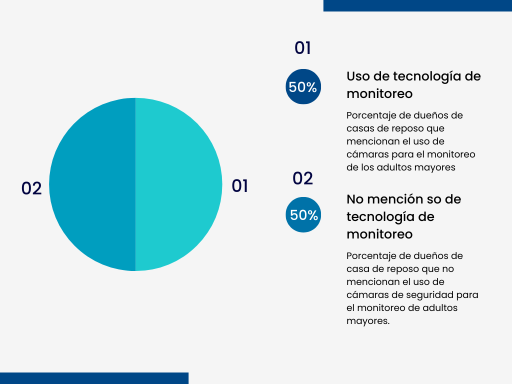

**Universidad Peruana de Ciencias Aplicadas**  
**Ingeniería de Software**  
**Ciclo 2024-2**  

<h4>Desarrollo de Soluciones IoT</h4>

**Sección:** WS71
**Profesor:** Angel Augusto Velasquez Nuñez

<h3>INFORME DEL TRABAJO FINAL</h3>

**Startup:** SocialTech

**Producto:** MIAM (Monitoreo Inteligente para Adultos Mayores)

**Integrantes:**

Achamizo Huamani, Jean Carlos  
Aliaga Trevejo, Lucía Guadalupe  
Raymundo Guevara, Rodrigo Alejandro  
Siancas Reategui, Luis Alberto  
Trujillo Lopez, Luis Alberto  

**Setiembre, 2024**

---

# Registro de Versiones del Informe

| Versión | Fecha | Autor | Descripción de la modificación |
| ------- | ----- | ----- | ------------------------------ |
|   1.0     |   06/09/2024   |  Achamizo Huamani Jean Carlos,  Aliaga Trevejo Lucía Guadalupe, Raymundo Guevara Rodrigo Alejandro, Siancas Reategui Luis Alberto, Trujillo Lopez Luis Alberto  |   Se añadieron los elementos correspondientes al entregable de la TB1 (capítulos 1 al 4)|

---

# Project Report Collaboration Insights

URL del repositorio: https://github.com/IoT-SocialTech/iot-report

---

# Contenido

## Tabla de Contenidos

- [Registro de Versiones del Informe](#registro-de-versiones-del-informe)
- [Project Report Collaboration Insights](#project-report-collaboration-insights)
- [Contenido](#contenido)
  - [Tabla de Contenidos](#tabla-de-contenidos)
- [Student Outcome](#student-outcome)
- [Capítulo I: Introducción](#capítulo-i-introducción)
  - [1.1. Startup Profile](#11-startup-profile)
    - [1.1.1. Descripción de la Startup](#111-descripción-de-la-startup)
    - [1.1.2. Perfiles de integrantes del equipo](#112-perfiles-de-integrantes-del-equipo)
  - [1.2. Solution Profile](#12-solution-profile)
    - [1.2.1 Antecedentes y problemática](#121-antecedentes-y-problemática)
    - [1.2.2 Lean UX Process](#122-lean-ux-process)
      - [1.2.2.1. Lean UX Problem Statements](#1221-lean-ux-problem-statements)
      - [1.2.2.2. Lean UX Assumptions](#1222-lean-ux-assumptions)
      - [1.2.2.3. Lean UX Hypothesis Statements](#1223-lean-ux-hypothesis-statements)
      - [1.2.2.4. Lean UX Canvas](#1224-lean-ux-canvas)
  - [1.3. Segmentos objetivo](#13-segmentos-objetivo)
- [Capítulo II: Requirements Elicitation \& Analysis](#capítulo-ii-requirements-elicitation--analysis)
  - [2.1. Competidores](#21-competidores)
    - [2.1.1. Análisis competitivo](#211-análisis-competitivo)
    - [2.1.2. Estrategias y tácticas frente a competidores](#212-estrategias-y-tácticas-frente-a-competidores)
  - [2.2. Entrevistas](#22-entrevistas)
    - [2.2.1. Diseño de entrevistas](#221-diseño-de-entrevistas)
    - [2.2.2. Registro de entrevistas](#222-registro-de-entrevistas)
    - [2.2.3. Análisis de entrevistas](#223-análisis-de-entrevistas)
  - [2.3. Needfinding](#23-needfinding)
    - [2.3.1. User Personas](#231-user-personas)
    - [2.3.2. User Task Matrix](#232-user-task-matrix)
    - [2.3.3. User Journey Mapping](#233-user-journey-mapping)
    - [2.3.4. Empathy Mapping](#234-empathy-mapping)
    - [2.3.5. As-is Scenario Mapping](#235-as-is-scenario-mapping)
  - [2.4. Ubiquitous Language](#24-ubiquitous-language)
- [Capítulo III: Requirements Specification](#capítulo-iii-requirements-specification)
  - [3.1. To-Be Scenario Mapping](#31-to-be-scenario-mapping)
  - [3.2. User Stories](#32-user-stories)
  - [3.3. Impact Mapping](#33-impact-mapping)
  - [3.4. Product Backlog](#34-product-backlog)
- [Product Backlog](#product-backlog)
  - [Tabla de Product Backlog](#tabla-de-product-backlog)
- [Capítulo IV: Strategic-Level Software Design](#capítulo-iv-strategic-level-software-design)
  - [4.1. Strategic-Level Attribute-Driven Design](#41-strategic-level-attribute-driven-design)
    - [4.1.1. Event Storming](#411-event-storming)
      - [4.1.1.1. Candidate Context Discovery](#4111-candidate-context-discovery)
      - [4.1.1.2 Domain Message Flows Modeling](#4112-domain-message-flows-modeling)
      - [4.1.1.3 Bounded Context Canvases](#4113-bounded-context-canvases)
    - [4.1.2. Context Mapping](#412-context-mapping)
    - [4.1.3. Software Architecture](#413-software-architecture)
      - [4.1.3.1. Software Architecture System Landscape Diagram](#4131-software-architecture-system-landscape-diagram)
      - [4.1.3.2. Software Architecture Context Level Diagrams](#4132-software-architecture-context-level-diagrams)
      - [4.1.3.3. Software Architecture Container Level Diagrams](#4133-software-architecture-container-level-diagrams)
      - [4.1.3..4. Software Architecture Deployment Diagrams](#4134-software-architecture-deployment-diagrams)
  - [4.2. Tactical-Level Domain-Driven Design](#42-tactical-level-domain-driven-design)
      - [4.2.1. Bounded Context: ](#421-bounded-context-)
        - [4.2.1.1. Domain Layer](#4211-domain-layer)
        - [4.2.1.2. Interface Layer](#4212-interface-layer)
        - [4.2.1.3. Application Layer](#4213-application-layer)
        - [4.2.1.4. Infrastructure Layer](#4214-infrastructure-layer)
        - [4.2.1.6. Bounded Context Software Architecture Component Level Diagrams](#4216-bounded-context-software-architecture-component-level-diagrams)
        - [4.2.1.7. Bounded Context Software Architecture Code Level Diagrams](#4217-bounded-context-software-architecture-code-level-diagrams)
          - [4.2.1.7.1. Bounded Context Domain Layer Class Diagrams](#42171-bounded-context-domain-layer-class-diagrams)
          - [4.2.1.7.2. Bounded Context Database Design Diagram](#42172-bounded-context-database-design-diagram)
      - [4.2.2. Bounded Context: ](#422-bounded-context-)
        - [4.2.2.1. Domain Layer](#4221-domain-layer)
        - [4.2.2.2. Interface Layer](#4222-interface-layer)
        - [4.2.2.3. Application Layer](#4223-application-layer)
        - [4.2.2.4. Infrastructure Layer](#4224-infrastructure-layer)
        - [4.2.2.6. Bounded Context Software Architecture Component Level Diagrams](#4226-bounded-context-software-architecture-component-level-diagrams)
        - [4.2.2.7. Bounded Context Software Architecture Code Level Diagrams](#4227-bounded-context-software-architecture-code-level-diagrams)
          - [4.2.2.7.1. Bounded Context Domain Layer Class Diagrams](#42271-bounded-context-domain-layer-class-diagrams)
          - [4.2.2.7.2. Bounded Context Database Design Diagram](#42272-bounded-context-database-design-diagram)
      - [4.2.3. Bounded Context: ](#423-bounded-context-)
        - [4.2.3.1. Domain Layer](#4231-domain-layer)
        - [4.2.3.2. Interface Layer](#4232-interface-layer)
        - [4.2.3.3. Application Layer](#4233-application-layer)
        - [4.2.3.4. Infrastructure Layer](#4234-infrastructure-layer)
        - [4.2.3.6. Bounded Context Software Architecture Component Level Diagrams](#4236-bounded-context-software-architecture-component-level-diagrams)
        - [4.2.3.7. Bounded Context Software Architecture Code Level Diagrams](#4237-bounded-context-software-architecture-code-level-diagrams)
          - [4.2.3.7.1. Bounded Context Domain Layer Class Diagrams](#42371-bounded-context-domain-layer-class-diagrams)
          - [4.2.3.7.2. Bounded Context Database Design Diagram](#42372-bounded-context-database-design-diagram)
      - [4.2.4. Bounded Context: ](#424-bounded-context-)
        - [4.2.4.1. Domain Layer](#4241-domain-layer)
        - [4.2.4.2. Interface Layer](#4242-interface-layer)
        - [4.2.4.3. Application Layer](#4243-application-layer)
        - [4.2.4.4. Infrastructure Layer](#4244-infrastructure-layer)
        - [4.2.4.6. Bounded Context Software Architecture Component Level Diagrams](#4246-bounded-context-software-architecture-component-level-diagrams)
        - [4.2.4.7. Bounded Context Software Architecture Code Level Diagrams](#4247-bounded-context-software-architecture-code-level-diagrams)
          - [4.2.4.7.1. Bounded Context Domain Layer Class Diagrams](#42471-bounded-context-domain-layer-class-diagrams)
          - [4.2.4.7.2. Bounded Context Database Design Diagram](#42472-bounded-context-database-design-diagram)
- [Conclusiones](#conclusiones)
- [Bibliografía](#bibliografía)
- [Anexos](#anexos)

  
---

# Student Outcome

| Criterio específico                                              | Acciones realizadas                                                                 | Conclusiones |
|------------------------------------------------------------------|-------------------------------------------------------------------------------------|--------------|
| Trabaja en equipo para proporcionar liderazgo en forma conjunta | *Achamizo Huamani Jean Carlos*   TB1:   Escribir outcome    *Aliaga Trevejo Lucía Guadalupe*   TB1:   Escribir outcome    *Raymundo Guevara Rodrigo Alejandro*   TB1:   Escribir outcome    *Siancas Reategui Luis Alberto*   TB1:   Escribir outcome    *Trujillo Lopez Luis Alberto*   TB1:   Escribir outcome   |  *TB1*              |
| Crea un entorno colaborativo e inclusivo, establece metas, planifica tareas y cumple objetivos | *Achamizo Huamani Jean Carlos*   TB1:   Escribir outcome    *Aliaga Trevejo Lucía Guadalupe*   TB1:   Escribir outcome    *Raymundo Guevara Rodrigo Alejandro*   TB1:   Escribir outcome    *Siancas Reategui Luis Alberto*   TB1:   Escribir outcome    *Trujillo Lopez Luis Alberto*   TB1:   Escribir outcome   |   *TB1*                 |

---

# Capítulo I: Introducción

## 1.1. Startup Profile

### 1.1.1. Descripción de la Startup

### 1.1.2. Perfiles de integrantes del equipo

<table>
    <tr>
        <td>Perfil</td>
        <td>Foto</td>
    </tr>
    <tr>
        <td><b>Nombre:</b> Achamizo Huamani, Jean Carlos 
            <b>Carrera:</b> Ingenieria de Software  
        <b>Descripcion:</b> Como estudiante de Ingeniería de Software en la Universidad UPC, mi entusiasmo por el aprendizaje constante me impulsa a buscar siempre nuevas maneras de perfeccionar mis habilidades académicas y aplicarlas en situaciones prácticas, también poseo aptitudes en comunicación asertiva y escucha activa. Reconozco la importancia de una comunicación clara y efectiva en cualquier proyecto de software, y cuento con la capacidad de escuchar de manera atenta para comprender las necesidades y expectativas de los clientes y colegas de equipo.  
        <td></td>
    </tr>
    <tr>
        <td><b>Nombre:</b> Aliaga Trevejo, Lucía Guadalupe  
            <b>Carrera:</b> Ingenieria de Software  
        <b>Descripcion:</b> Soy una estudiante de Ingeniería de Software, actualmente interesada en el desarrollo web front y back end. Me gusta crear interfaces intuitivas y llamativas para mejorar la experiencia de usuario. Me considero una persona responsable y centrada. Mis habilidades blandas incluyen comunicación efectiva, trabajo en equipo, liderazgo y adaptabilidad. Aspiro a contribuir de manera significativa en proyectos innovadores para seguir expandiendo mis conocimientos técnicos y capacidades. 
        <td></td>
    </tr>
    <tr>
        <td><b>Nombre:</b> Raymundo Guevara, Rodrigo Alejandro  
            <b>Carrera:</b> Ingenieria de Software  
        <b>Descripcion:</b> Soy estudiante de la carrera de Ingeniería de Software y un apasionado de la tecnología. Me gusta descubrir nuevas formas de solucionar problemas con diversos frameworks y algoritmos. Me considero una persona responsable y empática. Me gusta mucho trabajar en equipo y ayudar a mis compañeros 
        <td></td>
    </tr>
    <tr>
        <td><b>Nombre:</b> Siancas Reategui, Luis Alberto 
            <b>Carrera:</b> Ingenieria de Software  
        <b>Descripcion:</b> Soy estudiante de la carrera de Ingeniería de Software enfocado en el desarrollo backend. Me gusta crear API’s las cuales uso para mis proyectos, por otro lado, me gusta realizar el despliegue de mis aplicaciones así como también usar diferentes diseños de arquitectura para que mi aplicación tenga un funcionamiento estable y tenga alta disponibilidad. En cuanto a mis habilidades blandas, soy empático y tengo escucha activa, esto me ayuda en gran parte a la hora de trabajar en equipos ya que facilita la comunicación y por ende los resultados son mejores. 
        <td></td>
    </tr>
    <tr>
        <td><b>Nombre:</b> Trujillo Lopez, Luis Alberto 
            <b>Carrera:</b> Ingenieria de Software  
        <b>Descripcion:</b> Soy un estudiante de Ingeniería de Software interesado en las tecnologías de aprendizaje autónomo. Me gusta desarrollar en un entorno web páginas que se vean llamativas y que tengan múltiples funcionalidades enfocándome en la experiencia del usuario y en la creación de API’s. Poseo algunas habilidades que me permiten relacionarme en equipo, soy una persona responsable, con un enfoque centrado, comunicación asertiva, liderazgo y adaptabilidad. Mi meta es contribuir en el desarrollo de proyectos que me permitan mejorar y encontrar nuevas habilidades para adquirir mayores conocimientos laboral y profesionalmente.
        <td></td>
    </tr>
   <table>

## 1.2. Solution Profile

### 1.2.1 Antecedentes y problemática

Los adultos mayores representan una población vulnerable no solo a enfermedades relacionadas con el envejecimiento, sino también a lesiones que pueden deteriorar significativamente su calidad de vida (Dorri, Zabolinezhad, & Sattari, 2023). De acuerdo con la Organización Mundial de la Salud, las caídas son la principal causa de lesiones y mortalidad en personas mayores de 75 años (Giulianelli et al., 2017). Ante este panorama, es esencial proporcionarles un entorno seguro que contribuya a prevenir discapacidades y complicaciones en su salud (Dorri, Zabolinezhad, & Sattari, 2023).

A continuación, se presenta un análisis detallado de esta problemática empleando la metodología ‘5W2H’.

**Who**  
Los adultos mayores en Perú, especialmente aquellos que viven en casas de reposo o en sus propios domicilios, representan una población vulnerable debido a las limitaciones propias del envejecimiento, como la pérdida de reflejos y del equilibrio (Suárez et al., 2020). Por otro lado, los cuidadores, tanto formales (como enfermeros y técnicos) como informales (familiares), son los responsables de brindar atención diaria. Estos cuidadores a menudo enfrentan desafíos adicionales como las exigencias de su trabajo y los recursos limitados. Esta situación puede dificultar la supervisión y la atención constante que los adultos mayores necesitan.

**What**  
La principal problemática es la alta incidencia de caídas entre los adultos mayores, que no solo provoca lesiones físicas como fracturas y traumatismos, sino que también tiene consecuencias psicológicas como el miedo a caer de nuevo, lo cual reduce aún más su movilidad e independencia. Para los cuidadores, cada caída significa un aumento significativo en la carga de trabajo, implicando cuidados adicionales.

**Where**  
Las caídas ocurren principalmente en las casas de reposo y domicilios de los adultos mayores. En las casas de reposo, la falta de personal y la infraestructura deficiente pueden contribuir al riesgo de caídas. En los domicilios, los adultos mayores a menudo se enfrentan a condiciones peligrosas como escaleras sin barandas, pisos resbaladizos, y la ausencia de dispositivos de asistencia como andadores o bastones.

**When**  
Las caídas pueden suceder en cualquier momento del día, pero son más comunes durante actividades cotidianas como levantarse de la cama, caminar al baño, o asearse. Las noches y madrugadas son momentos críticos debido a la disminución de la visibilidad y la menor capacidad de reacción tanto de los adultos mayores como de los cuidadores.

**Why**  
Las caídas suelen suceder por una combinación de factores, como la fragilidad del adulto mayor y una supervisión insuficiente. 

**How**  
Los adultos mayores pueden perder el equilibrio al realizar actividades diarias sin la asistencia adecuada. Los cuidadores no son capaces de realizar supervisión constante debido a que tienen varios pacientes a cargo, en especial en las casas de reposo, lo que puede llevar a descuidos involuntarios, aumentando el riesgo de caídas.

**How Much**  
Uno de cada tres adultos mayores de 65 años sufre caídas, de las cuales el 68% resultan en lesiones, incluyendo fracturas. Además, el 60% de las caídas ocurren en el hogar, 30% en sitios públicos y 10% en instituciones de salud, teniendo consecuencias físicas y psicológicas para el adulto mayor (Ministerio de Salud, 2018). 

### 1.2.2 Lean UX Process

#### 1.2.2.1. Lean UX Problem Statements

El estado actual de la seguridad para adultos mayores se ha centrado principalmente en productos como botones de emergencia y sensores de movimiento básicos. Sin embargo, estos productos no logran ofrecer una supervisión continua ni adaptarse a los entornos específicos en los que viven los adultos mayores. Esto deja una brecha crítica en la prevención de caídas, lo que resulta en lesiones físicas y una reducción en la calidad de vida de los adultos mayores. Los cuidadores se enfrentan a la dificultad de supervisar constantemente y gestionar los riesgos sin herramientas adecuadas para ser más proactivos.

Nuestro producto abordará esta brecha mediante el desarrollo de un sistema innovador de monitoreo basado en IoT, diseñado para ofrecer una supervisión continua y alertas en tiempo real adaptadas a los entornos específicos de cada adulto mayor. Nuestro enfoque inicial serán los cuidadores y dueños de casas de reposo, con el objetivo de mejorar la seguridad y la calidad de vida de los adultos mayores.

Sabremos que tenemos éxito cuando veamos una reducción en los incidentes de caídas, una mayor satisfacción de los cuidadores y una mejora significativa en la calidad de vida de los adultos mayores.

#### 1.2.2.2. Lean UX Assumptions
#### Assumptions worksheet

**¿Quién es el usuario?**
El usuario principal son los dueños de casas de reposo y cuidadores de adultos mayores que buscan mejorar la seguridad y bienestar de los residentes.

**¿Qué problemas tiene nuestro producto? ¿Resolver?**
MIAM resuelve la necesidad de un monitoreo constante y efectivo de los adultos mayores, ayudando a prevenir caídas, detectar cambios en signos vitales y garantizar que los residentes estén en áreas seguras y obtengan un mejor cuidado.

**¿Qué características son importantes?**
Monitoreo en tiempo real de movimientos y signos vitales.
Alertas instantáneas en caso de caídas o presencia en zonas riesgosas.
Interfaz fácil de usar en la plataforma web y aplicación móvil.
Botón de alerta para solicitar asistencia

**¿Dónde encaja nuestro producto en su trabajo o vida?**
MIAM se integra en el trabajo diario de los administradores y cuidadores como una herramienta de software esencial para supervisar la salud y en los adultos se presentarán pulseras para su monitoreo de estado, minimizando riesgos y mejorando la calidad del cuidado.
**¿Cuándo y cómo es nuestro producto? ¿Usado?**
El producto es utilizado como una pulsera continuamente a lo largo del día para monitorear en tiempo real la ubicación y salud de los residentes. Los cuidadores y administradores lo  administran tanto desde dispositivos móviles como desde la plataforma web.
**¿Cómo debe verse nuestro producto y cómo comportarse?**
El producto software debe tener una interfaz intuitiva y accesible, con gráficos claros que muestren el estado de los residentes y notificaciones visibles para alertas urgentes. Debe ser confiable, fácil de usar y responder rápidamente a cualquier evento crítico y en los residentes la pulsera debe ser ligera y de un diseño simple que no incomode a los residentes.

**Creo que mis clientes necesitan** un sistema fiable y fácil de usar para monitorear la seguridad y salud de los adultos mayores.
**Estas necesidades se pueden resolver con** una combinación de tecnología de sensores, monitoreo de signos vitales y una plataforma accesible para la gestión de datos y alertas.
**Mis clientes iniciales son (o serán)** dueños de casas de reposo y cuidadores de adultos mayores que valoran la seguridad y calidad de vida de sus residentes.
**El valor #1**que un cliente quiere de mi servicio es la capacidad de prevenir accidentes y responder rápidamente a emergencias, garantizando la seguridad de los residentes.
**El cliente también puede obtener estos beneficios adicionales** como la tranquilidad de los familiares, una mayor eficiencia en la gestión del cuidado y una reducción en los incidentes graves.
**Voy a adquirir la mayoría de mis clientes a través de** estrategias de marketing directo a casas de reposo y promociones en eventos de la industria geriátrica.
**Haré dinero a través de** la venta de los equipos  de pulsera y la suscripción al sistema de monitoreo.
**Mi competencia principal en el mercado serán** otros proveedores de sistemas de monitoreo para adultos mayores, así como dispositivos de salud y seguridad específicos.
Los venceremos debido a nuestra integración completa de sensores de movimiento, monitoreo de signos vitales y una plataforma fácil de usar que ofrece alertas en tiempo real.
**Mi mayor riesgo de producto es** la posibilidad de que los sensores o la plataforma no funcionen correctamente en situaciones críticas.
Resolveremos esto a través de pruebas exhaustivas, mantenimiento regular y la implementación de redundancias en el sistema para asegurar su fiabilidad.
**¿Qué otras suposiciones tenemos? ¿Eso, si se prueba que es falso, causará que nuestro negocio/proyecto no funcione?**
Asumimos que los clientes estarán dispuestos a pagar una suscripción mensual para mantener el servicio. Si no es así, podríamos enfrentar dificultades financieras.

#### 1.2.2.3. Lean UX Hypothesis Statements
#### Features Hypothesis

**Statement 1:**
Creemos que la incorporación de un botón de alerta en la banda de monitoreo que los residentes puedan activar manualmente reducirá el tiempo de reacción en situaciones de emergencia.
Sabremos que hemos tenido éxito cuando el 90% de las alertas manuales se respondan en menos de 2 minutos durante los primeros 6 meses de uso.
**Statement 2:** 											Creemos que el incluir alertas instantáneas en la aplicación móvil para notificar a los cuidadores sobre caídas o cambios anómalos en signos vitales mejorará la respuesta a emergencias.
Sabremos que hemos tenido éxito cuando veamos una reducción del 30% en el tiempo de respuesta ante emergencias registradas en los primeros 3 meses de uso.
**Statement 3:**
Creemos que la integración de un historial de salud y actividad en la plataforma web permitirá a los cuidadores tomar decisiones más informadas sobre el bienestar de los residentes.
Sabremos que hemos tenido éxito cuando el 80% de los usuarios informen que revisan el historial de salud al menos una vez por semana para ajustar el plan de cuidado.

#### Business Hypothesis

**Statement 1:**
Creemos que el alquiler de equipos junto con la suscripción al sistema de monitoreo MIAM será la mejor estrategia para obtener ingresos sostenibles.
Sabremos que esto es cierto cuando el 70% de las casas de reposo que prueben el sistema opten por continuar con la suscripción después del periodo de prueba inicial.
**Statement 2:**
Creemos que ofrecer un periodo de prueba gratuito de 30 días aumentará la tasa de adopción inicial de nuestro sistema entre nuevas casas de reposo.
Sabremos que esto es cierto cuando al menos el 60% de los usuarios que completen el periodo de prueba decidan suscribirse al servicio.
**Statement 3:**
Creemos que al asociarnos con organizaciones de cuidado geriátrico y hospitales locales podremos ampliar nuestro mercado objetivo y generar más leads calificados.
Sabremos que esto es cierto cuando el 50% de las nuevas suscripciones provengan de referencias o asociaciones con estas instituciones dentro de los primeros 6 meses

#### 1.2.2.4. Lean UX Canvas

## 1.3. Segmentos objetivo

---

# Capítulo II: Requirements Elicitation & Analysis

## 2.1. Competidores

| Nombre del Competidor | Descripción |
| :-------------------: | :---------- |
| Life Alert | Life Alert es una de las marcas más reconocidas en sistemas de alerta médica, famosa por su eslogan “¡He caído y no puedo levantarme!”. Ofrece sistemas de emergencia diseñados para ayudar a personas mayores a solicitar asistencia rápidamente. Su principal dispositivo es un botón de emergencia que puede usarse en el hogar o fuera de él, enviando alertas a un centro de monitoreo disponible las 24 horas del día. |
| MobileHelp | MobileHelp es un proveedor líder de sistemas de alerta médica que ofrece dispositivos portátiles y basados en el hogar para personas mayores. Sus dispositivos están diseñados para alertar a los servicios de emergencia en caso de una caída u otro incidente. Además de las soluciones de emergencia en el hogar, MobileHelp destaca por su cobertura fuera de casa gracias a su integración con redes móviles, lo que ofrece a los usuarios mayor independencia y movilidad. |
| CarePredict | CarePredict es una empresa tecnológica que se enfoca en el monitoreo preventivo para adultos mayores. Utiliza dispositivos portátiles equipados con sensores para rastrear patrones de comportamiento y signos vitales. A través de la inteligencia artificial, CarePredict predice posibles problemas de salud antes de que ocurran, como caídas o infecciones, y permite la intervención proactiva de cuidadores y familiares. |

### 2.1.1. Análisis competitivo

<table>
  <tr>
    <th colspan="7" valign="top"><b>Competitive Analysis Landscape</b></th>
  </tr>
  <tr>
    <td colspan="2" rowspan="2">¿Por qué llevar a cabo este análisis?</td>
  </tr>
  <tr>
    <td colspan="5">Comparar las características y funcionalidades clave de nuestra solución con las de la competencia para identificar ventajas competitivas y posibles áreas de mejora.</td>
  </tr>
  <tr>
    <td colspan="3">Competidores</td>
    <td colspan="1" valign="top" style="font-weight: bold;text-align: center">
        MIAM
        

        

    <td colspan="1" valign="top" style="font-weight: bold;text-align: center">
        Life Alert
        

        

    </td>
    <td colspan="1" valign="top" style="font-weight: bold;text-align: center" >
        Carepredict
        

        

      </td>
    <td colspan="1" valign="top" style="font-weight: bold;text-align: center" >
        MobileHelp
        

        

    </td>
  </tr>
  <tr>
    <td colspan="1" rowspan="2">
Perfil
</td>
    <td colspan="2">Overview</td>
    <td colspan="1" valign="top">MIAM ofrece un avanzado sistema de monitoreo inteligente para la prevención de accidentes en adultos mayores, a través del seguimiento de su movimiento y signos vitales de manera rápida y precisa, genera  reportes de los datos del adulto mayor y proporciona un fácil monitoreo por su interfaz.
    </td>
    <td colspan="1" valign="top">Life Alert es un sistema de alerta médica diseñado para proteger a las personas mayores en caso de emergencia sanitaria en el hogar, les permite ser independientes y enviar ayuda rápidamente en caso de una emergencia médica.
    </td>
    <td colspan="1" valign="top">CarePredict es una empresa de tecnología que ofrece soluciones de monitoreo para el cuidado de adultos mayores, usando inteligencia artificial y sensores. Su sistema predice cambios en el comportamiento para prevenir problemas de salud como caídas o infecciones.
    </td>
    <td colspan="1" valign="top">MobileHelp ofrece dispositivos médicos que permiten a los adultos mayores vivir de forma independiente mientras brindan tranquilidad a sus familiares, incluyen sistemas de alerta de emergencia médica que funcionan en el hogar y en exteriores.
    </td>
  </tr>
  <tr>
    <td colspan="2">Ventaja competitiva</td>
    <td colspan="1" valign="top">Ofrece un enfoque detallado e íntegro para el monitoreo completo del adulto mayor evitando posibles accidentes.
    </td>
    <td colspan="1" valign="top">Envía la ayuda que necesita rápidamente, las 24 horas del día, los 7 días de la semana.
    </td>
    <td colspan="1" valign="top">Tecnología avanzada de sensores portátiles y el uso de inteligencia artificial que predice problemas de salud antes de que ocurran.
    </td>
    <td colspan="1" valign="top">Combinación de dispositivos médicos avanzados con opciones de movilidad, es decir, sus sistemas no están limitados al hogar y ofrecen cobertura en cualquier lugar donde haya señal celular.
    </td>
  </tr>
  <tr>
    <td colspan="1" rowspan="2">
Perfil de Marketing
</td>
    <td colspan="2">Mercado objetivo</td>
    <td colspan="1" valign="top"> MIAM ofrece una solución completa para ayudar en el cuidado del adulto mayor, dirigidas a aquellos familiares que poseen familia con una edad avanzada y deseen un cuidado especializado para sus seres queridos.
    </td>
    <td colspan="1" valign="top">Ofrece una solución especializada en la respuesta rápida ante los distintos accidentes que pueda sufrir un adulto mayor que se encuentre solo.
    </td>
    <td colspan="1" valign="top">CarePredict se posiciona como una solución innovadora en el sector de salud para personas mayores, enfocándose en la prevención de problemas de salud a través de tecnología avanzada.
    </td>
    <td colspan="1" valign="top">MobileHelp se posiciona como una solución accesible y fiable en el mercado de dispositivos de seguridad para personas mayores, suelen centrarse en la seguridad y tranquilidad que brindan a los usuarios.
    </td>
  </tr>
  <tr>
    <td colspan="2">Estrategias de marketing</td>
    <td colspan="1" valign="top">Usará el marketing digital, realizará posts, campañas publicitarias y colaboración con influences en internet para atraer a familiares que quieran un aparato que ayude en el cuidado de su adulto mayor.
    </td>
    <td colspan="1" valign="top">Campañas publicitarias en televisión y videos con testimonios de los adultos mayores a los que le ayudó el producto ante una emergencia.
    </td>
    <td colspan="1" valign="top">Utilizan contenido educativo y testimonios de clientes para atraer a los usuarios. Además, aprovechan redes sociales y asociaciones con organizaciones de atención médica para ampliar su alcance.
    </td>
    <td colspan="1" valign="top">Utilizan una estrategia multicanal, que incluye anuncios en televisión, redes sociales y asociaciones con proveedores de atención médica..
    </td>
  </tr>
  <tr>
    <td colspan="1" rowspan="3">
Perfil de Producto
</td>
    <td colspan="2">Productos & Servicios</td>
    <td colspan="1" valign="top">Ofrecemos un plan de suscripción mensual de bajo costo para el plan básico o un plan de suscripción personalizado para el plan empresarial
    </td>
    <td colspan="1" valign="top">Ofrece 3 productos para la respuesta rápida ante una emergencia, "help button", "micro voice pendant system" y "on-the-go + GPS".
    </td>
    <td colspan="1" valign="top">Ofrecen sensores portátiles que monitorean las actividades diarias y detectan cambios en los patrones de comportamiento.
    </td>
    <td colspan="1" valign="top">MobileHelp ofrece sistemas de alerta médica, monitores de salud, y accesorios como sensores de caídas y relojes inteligentes con capacidades de monitoreo.
    </td>
  </tr>
  <tr>
    <td colspan="2">Precios y Costos</td>
    <td colspan="1" valign="top">Ofrecemos un plan de suscripción mensual de bajo costo para el plan básico o un plan de suscripción personalizado para el plan empresarial.
    </td>
    <td colspan="1" valign="top">Entregan el producto después de realizar una llamada al número proporcionado en su página web.
    </td>
    <td colspan="1" valign="top">El modelo de precios se basa en suscripciones mensuales por el uso de los dispositivos y el acceso a la plataforma de monitoreo.
    </td>
    <td colspan="1" valign="top">Sus precios varían según el tipo de dispositivo y plan de servicio, generalmente en formato de suscripción mensual.
    </td>
  </tr>
  <tr>
    <td colspan="2">Canales de distribución</td>
    <td colspan="1" valign="top">Ventas directas a partir de los canales de la aplicación web y móvil.
    </td>
    <td colspan="1" valign="top">Ventas directas y personalizadas para cada llamada al número proporcionado por la página web.
    </td>
    <td colspan="1" valign="top">Acceso a través de una plataforma web y aplicaciones móviles que permiten a los cuidadores y familiares monitorear la salud de los adultos mayores en tiempo real.
    </td>
    <td colspan="1" valign="top">MobileHelp distribuye sus productos principalmente a través de su sitio web y socios minoristas.
    </td>
  </tr>
  <tr>
    <td colspan="1" rowspan="5">
Análisis SWOT
</td>
    
  </tr>
  <tr>
    <td colspan="2">Fortalezas</td>
    <td colspan="1" valign="top">Tecnología IoT avanzada para un monitoreo preciso del adulto mayor, acompañado de aplicativo móvil y web intuitivo con una gran personalización y proporciona información recolectada.
    </td>
    <td colspan="1" valign="top">Enfoque centrado en la respuesta rápida ante los accidentes del adulto mayor, solución sencilla y simple pero eficiente.
    </td>
    <td colspan="1" valign="top">Tecnología avanzada, predicción proactiva de problemas de salud.
    </td>
    <td colspan="1" valign="top">Amplia cobertura fuera del hogar, sistemas fáciles de usar y monitoreo 24/7.
    </td>
  </tr>
  <tr>
    <td colspan="2">Debilidades</td>
    <td colspan="1" valign="top">Posible alta inversión en el área de investigación y desarrollo, necesidad de establecerse en un mercado altamente competitivo.
    </td>
    <td colspan="1" valign="top">Limitación en solo enviar alertas cuando el botón sea presionado, posible dependencia de su reputación.
    </td>
    <td colspan="1" valign="top">Dependencia de la tecnología, lo que puede limitar la adopción por parte de usuarios menos tecnológicos.
    </td>
    <td colspan="1" valign="top">Dependencia de las redes celulares para algunas funciones, lo que puede limitar la cobertura en áreas rurales.
    </td>
  </tr>
  <tr>
    <td colspan="2">Oportunidades</td>
    <td colspan="1" valign="top">Creciente población de adultos mayores en el mundo, promedio de vida en alsa, mejoras en la respuesta de salud, demanda de soluciones tecnológicas en el área y expansión a mercados globales.
    </td>
    <td colspan="1" valign="top">Expansión del área de salud y cuidado de adultos mayores, promedio de vida de las personas más alta, expansión en mercados globales
    </td>
    <td colspan="1" valign="top">Creciente demanda de soluciones de cuidado para personas mayores.
    </td>
    <td colspan="1" valign="top">Creciente demanda de soluciones de salud para la población envejecida.
    </td>
  </tr>
  <tr>
    <td colspan="2">Amenazas</td>
    <td colspan="1" valign="top">Competencia fuerte de empresas ya establecidas y consolidadas en el campo, cambios en las tendencias tecnológicas que puedan cambiar o afectar a la demanda del servicio.
    </td>
    <td colspan="1" valign="top">Competencia de otras soluciones más completas en el mercado, creciente avance de la tecnología puede dejar anticuado el simple sistema.
    </td>
    <td colspan="1" valign="top">Competencia de otros dispositivos de monitoreo y avances en tecnología​.
    </td>
    <td colspan="1" valign="top">Competencia creciente de dispositivos de alerta médica portátiles y cambios en las regulaciones del sector.
    </td>
  </tr>
</table>

### 2.1.2. Estrategias y tácticas frente a competidores

<table>
  <tr>
    <th colspan="3" valign="top"></th>
    <th colspan="4" valign="top"><b>OPORTUNIDADES</b></th>
    <th colspan="4" valign="top"><b>AMENAZAS</b></th>
  </tr>
  <tr>
    <th colspan="3" valign="top"></th>
    <td colspan="4" valign="top">
      <li> Creciente población de adultos mayores a nivel mundial.
      <li> Aumento en la demanda de soluciones tecnológicas para el cuidado de la salud.
      <li> Expansión global hacia mercados con alta demanda de productos de salud y monitoreo.
      <li> Mejoras en la expectativa de vida y respuesta de salud preventiva.
    </td>
    <td colspan="4" valign="top">
      <li> Competencia fuerte de empresas establecidas en el mercado.
      <li> Rápido cambio tecnológico, lo que puede requerir actualizaciones constantes.
      <li> Baja barrera de entrada para nuevos competidores en el sector de monitoreo.
      <li> Cambios en las tendencias de salud y políticas que afecten la demanda del servicio.
    </td>
  </tr>

  <tr>
    <th colspan="3" valign="top"><b>FORTALEZAS</b></th>
    <th colspan="4" valign="top"><b>ESTRATEGIAS FO (Ofensivas)</b></th>
    <th colspan="4" valign="top"><b>ESTRATEGIAS FA (Defensiva)</b></th>
  </tr>
  <tr>
    <td colspan="3" valign="top">
      <li> Tecnología IoT avanzada para el monitoreo preciso de adultos mayores.
      <li> Aplicación web y móvil intuitiva con gran personalización.
      <li> Capacidad de monitoreo en tiempo real de signos vitales y movimiento.
      <li> Generación de reportes detallados para cuidadores y familiares.
    </td>
    <td colspan="4" valign="top">
      <li> F1 + O1/O2: Aprovechar la avanzada tecnología IoT para expandirse en el mercado global de cuidado de adultos mayores, resaltando las capacidades de monitoreo proactivo en campañas dirigidas a mercados en crecimiento.
      <li> F3 + O3: Utilizar el monitoreo en tiempo real y los reportes personalizados para formar alianzas estratégicas con hospitales y centros de salud, ingresando a nuevos mercados internacionales donde la demanda de tecnología de salud está en aumento.
    </td>
    <td colspan="4" valign="top">
      <li> F2 + A1: Usar la ventaja de la interfaz intuitiva para diferenciarse de competidores más tradicionales, enfocando las campañas de marketing en la facilidad de uso y el soporte continuo que MIAM ofrece a las familias.
      <li> F4 + A3: Generar innovaciones en los reportes y análisis de datos para mantenerse a la vanguardia frente a nuevos competidores que puedan entrar al mercado. Añadir funcionalidades basadas en inteligencia artificial para mejorar la calidad del servicio.
    </td>
  </tr>

  <tr>
    <th colspan="3" valign="top"><b>DEBILIDADES</b></th>
    <th colspan="4" valign="top"><b>ESTRATEGIAS DO (Reorientación)</b></th>
    <th colspan="4" valign="top"><b>ESTRATEGIAS DA (Supervivencia)</b></th>
  </tr>
  <tr>
    <td colspan="3" valign="top">
      <li> Alta inversión en I+D para mantenerse competitivos.
      <li> Falta de reconocimiento frente a competidores ya establecidos.
      <li> Necesidad de una estrategia sólida de penetración de mercado.
      <li> Dependencia de la tecnología y conectividad para un monitoreo eficiente.
    </td>
    <td colspan="4" valign="top">
      <li> D1 + O2: Invertir en investigación y desarrollo de manera escalonada, comenzando con mejoras en los productos más demandados, para capitalizar el aumento en la demanda de soluciones tecnológicas para adultos mayores.
      <li> D3 + O3: Desarrollar una estrategia de marketing digital sólida para aumentar la penetración en el mercado, aprovechando la tendencia creciente de la atención a adultos mayores para ganar visibilidad frente a competidores más grandes.
    </td>
    <td colspan="4" valign="top">
      <li> D2 + A1/A2: Trabajar en la mejora del reconocimiento de marca a través de colaboraciones con influencers y campañas publicitarias que resalten las características distintivas de MIAM, mitigando la fuerte competencia y la posible obsolescencia tecnológica.
      <li> D4 + A4: Implementar sistemas de monitoreo basados en la nube que puedan adaptarse fácilmente a cambios tecnológicos y políticas, reduciendo la dependencia de la infraestructura tecnológica y asegurando una respuesta ágil a cualquier cambio en las tendencias de salud.
    </td>

  </tr>

</table>

## 2.2. Entrevistas

### 2.2.1. Diseño de entrevistas

**Segmento 1:** Cuidadores de adultos mayores (Caregivers)

- ¿Cuál es su nombre?
- ¿Cuántos años tiene y cuál es su estado civil?
- ¿En qué distrito vive?
- ¿Cuál es su profesión?
- ¿Qué dispositivos tecnológicos utiliza regularmente? 
- ¿Hay alguna marca de dispositivos que prefiera o utilice más? ¿Por qué?
- ¿Usa alguno para el monitoreo de los adultos mayores? (Ej. pulseras inteligentes, cámaras de vigilancia, etc.)
- ¿Qué medios o redes sociales utiliza para informarse sobre temas relacionados a su trabajo o comunicarse? (Ej. WhatsApp, Facebook, foros especializados, etc.)
- ¿Se considera una persona que se adapta fácilmente a las nuevas tecnologías?
- ¿En su labor, prefiere seguir procedimientos establecidos o es más de buscar soluciones tecnológicas?
- ¿Cuáles son los principales desafíos que enfrenta al monitorear y cuidar a un adulto mayor?
- ¿Qué aspectos de su trabajo le generan más satisfacción o facilitan su labor?
- ¿Podría describir cómo es un día típico cuidando a un adulto mayor, en particular en relación con la prevención de caídas?
- ¿Qué pasos sigue o qué herramientas utiliza para asegurarse de que el adulto mayor esté seguro en todo momento?
- Si pudiera diseñar una herramienta para ayudarle en el monitoreo de adultos mayores, ¿qué características considera que serían imprescindibles?
- ¿Qué funciones adicionales le gustaría que tuviera esta herramienta?

**Segmento 2:** Dueños de casas de reposo (Nursing Home Owners)

- ¿Cuál es su nombre?
- ¿Cuántos años tiene y cuál es su estado civil?
- ¿En qué distrito vive?
- ¿Cuál es su profesión y su rol dentro de la casa de reposo?
- ¿Qué dispositivos tecnológicos utiliza regularmente?
- ¿Hay alguna marca de dispositivos que prefiera o utilice más? ¿Por qué?
- ¿Utiliza actualmente alguna herramienta para el monitoreo de los adultos mayores residentes? (Ej. sistemas de alarma, sensores, cámaras, etc.)
- ¿Qué medios o redes sociales utiliza para estar al tanto de información y comunicarse? (Ej. LinkedIn, WhatsApp , etc.)
- ¿Cómo se describe en cuanto a la adopción de nuevas tecnologías en su establecimiento? 
- ¿Estaría interesado en invertir en tecnología de punta para el monitoreo de los residentes? ¿Por qué?
- ¿Cuáles son los principales desafíos que enfrenta al gestionar la seguridad y bienestar de los residentes?
- ¿Qué mejoras o innovaciones le han resultado más útiles en la gestión de la casa de reposo?
- ¿Podría describir el proceso que sigue en un día típico de trabajo?
- ¿Qué protocolos o herramientas son esenciales en su día a día para garantizar la seguridad y prevenir caídas de los residentes?
- Si pudiera integrar un nuevo sistema de monitoreo en su casa de reposo, ¿qué características serían imprescindibles para usted?
- ¿Qué otras funciones le gustaría que tuviera este sistema para mejorar la seguridad y de los residentes?

### 2.2.2. Registro de entrevistas

**Segmento 1:** Cuidadores de adultos mayores (Caregivers)

<table border=1>
  <tr>
    <td>
      <b>Nombres y  apellidos:</b> Katty Salgado  
      <b>Edad: </b> 29 años  
      <b>Distrito:</b> Los Olivos  
      <b>Timing:</b> 0:00 - 0:00 minutos
      <b>Duración:</b> 10:06 minutos
    </td>
    <td align=center>
      
    </td>
  </tr>
  <tr>
    <td colspan=2>
      <b>Enlace:</b> 
       
      <b>Resumen:</b> Katty es una enfermera que se dedica al cuidado de los adultos mayores. En la entrevista comenta que sus dispositivos más usados son su celular (Xiaomi), su tablet y laptop (Apple), los cuales utiliza para comunicarse y gestionar sus horarios de trabajo. No utiliza dispositivos tecnológicos para el cuidado de los adultos mayores, pero ha identificado que en algunos hogares las familias utilizan cámaras para monitorearlos. Las redes sociales que más usa son Whatsapp, Facebook e Instagram y considera que se adapta a las nuevas tecnologías fácilmente. Dentro de su rutina de trabajo realiza funciones como la toma de signos vitales, aseo del adulto mayor, tendido de cama y apoyo con la alimentación. Katty considera que uno de los desafíos en su trabajo es evitar las caídas de los adultos mayores, por lo cual tiene que ayudarlos constantemente a movilizarse. Por otra parte, lo que le causa más satisfacción es el agradecimiento del paciente y su familia. Considera que un sistema de monitoreo debería ayudarle a monitorear los signos vitales (pulso, temperatura, saturación de oxígeno, etc.) y prevenir las caídas. También considera útil el envío de notificaciones cuando alguno de los signos vitales esté alterado y recordatorios del tratamiento (medicación) del paciente.
    </td>
  </tr>
</table>

<table border=1>
  <tr>
    <td>
      <b>Nombres y  apellidos:</b> Sara Villanueva  
      <b>Edad: </b> 39 años  
      <b>Distrito:</b> Callao  
      <b>Timing:</b> 0:00 - 0:00 minutos
      <b>Duración:</b> 3:36 minutos
    </td>
    <td align=center>
      
    </td>
  </tr>
  <tr>
    <td colspan=2>
      <b>Enlace:</b> 
       
      <b>Resumen:</b> Sara es una enfermera que trabaja cuidando adultos mayores. El dispositivo que más utiliza en su día a día es su celular (Motorola), el cual utiliza para crear alarmas y así dar a tiempo el tratamiento a sus pacientes. Sara considera que se adapta a la tecnología y le gusta incorporar soluciones tecnológicas en su labor. Su medio de comunicación más frecuente es a través de Whatsapp y también utiliza Instagram y TikTok. Uno de los principales desafíos que enfrenta al cuidar a los adultos mayores son las caídas, en especial en aquellos que no son independientes, y algo que le causa satisfacción es el agradecimiento y cariño que le dan sus pacientes. Con el fin de evitar caídas realiza procedimientos como colocar almohadas y ubicarlos en una posición adecuada, además de estar siempre pendiente todo el tiempo de ellos. Ella considera que un sistema de monitoreo del adulto mayor debe incluir cámaras para supervisarlos y el envío de alertas al cuidador.
    </td>
  </tr>
</table>

<table border=1>
  <tr>
    <td>
      <b>Nombres y  apellidos:</b> William Ramos 
      <b>Edad: </b> 22 años  
      <b>Distrito:</b> Jesus Maria  
      <b>Timing:</b> 0:00 - 0:00 minutos
      <b>Duración:</b> 8:21 minutos
    </td>
    <td align=center>
      
    </td>
  </tr>
  <tr>
    <td colspan=2>
      <b>Enlace:</b> 
       
      <b>Resumen:</b> William Ramos es una persona que terminó su carrera profesional y se dedica a trabajar de forma parcial en el cuidado de su vecina que es una adulta mayor. Menciona que es una persona que se relaciona mucho con la tecnología a diferencia del adulto mayor al que se encarga de cuidar. Comenta que es una tarea un tanto complicada el hecho de cuidar al adulto mayor por la constante supervisión que se debe hacer y la preocupación de que pueda pasar algo. Menciona que en ocasiones el adulto mayor que cuida le gusta ser independiente y hacer varias acciones por su cuenta, le parece llamativo una solución que le permita monitorear si la persona que cuida se encuentra en perfecto estado y en qué ubicación está, ya que de esa manera podría darle autonomía sin descuidar el correcto cuidado que debe realizar. Comenta que le interesa una aplicación que permita saber el estado del adulto mayor y que permita al adulto mayor dar mensajes ante cualquier emergencia.
    </td>
  </tr>
</table>

**Segmento 2:** Dueños de casas de reposo (Nursing Home Owners)

<table border="1">
  <tr>
    <td>
      <b>Nombres y  apellidos:</b> Gabriel Hachamizo 
      <b>Edad:</b> 27 años  
      <b>Distrito:</b> Los Aquijes - Ica  
      <b>Timing:</b> 0:00 - 0:00 minutos 
      <b>Duración:</b> minutos
    </td>
    <td align="center">
      
    </td>
  </tr>
  <tr>
    <td colspan="2">
      <b>Enlace:</b> 
       
      <b>Resumen:</b> Gabriel es un licenciado en enfermería que trabaja en una casa de reposo para adultos mayores, desempeñando un rol administrativo. En la entrevista, comentó que los dispositivos más utilizados son celulares y laptops. Para el monitoreo de los pacientes, se utilizan cámaras de seguridad, mientras que la comunicación con los familiares se realiza principalmente a través de WhatsApp. Facebook se emplea para promocionar los servicios de la casa de reposo. Gabriel considera que la adopción de nuevas tecnologías es positiva y puede mejorar el cuidado de los pacientes. Sin embargo, enfrenta desafíos como el manejo de una gran cantidad de pacientes y la insuficiencia del protocolo de atención para garantizar una atención adecuada. También describe su rol en la empresa, incluyendo la priorización de actividades según su importancia. Además, Gabriel sugiere el desarrollo de un software para optimizar la administración y el registro de pacientes, así como para recopilar datos que contribuyan a una mejor atención.
    </td>
  </tr>
</table>

<table border=1>
  <tr>
    <td>
      <b>Nombres y  apellidos:</b> Miriam Guevara 
      <b>Edad: </b> 54  
      <b>Distrito:</b> Trujillo  
      <b>Timing:</b> 0:00 - 0:00 minutos
      <b>Duración:</b>  minutos
    </td>
    <td align=center>
      
    </td>
  </tr>
  <tr>
    <td colspan=2>
      <b>Enlace:</b> 
       
      <b>Resumen:</b> Miriam es una enfermera que ha puesto su casa de reposo para adultos mayores llamdo Divino Amor, utiliza celular y laptop. Considera que la tecnologia es importante pero siempre debe ser facil de usar en caso sea para el uso de los adultos mayores. Considera que lo mas dificil es tratar a todos los adultos mayores al mismo tiempo, sobre todo cuando despiertan. 
    </td>
  </tr>
</table>

### 2.2.3. Análisis de entrevistas

**Segmento Objetivo -> Cuidadores:**

- Características Objetivas: 

- Características Subjetivas: 

**Segmento Objetivo -> Dueños de casas de reposo:**

- Características Objetivas: 

- Características Subjetivas: 

## 2.3. Needfinding

### 2.3.1. User Personas

**Segmento 1:** Cuidadores de adultos mayores (Caregivers)

**Segmento 2:** Dueños de casas de reposo (Nursing Home Owners)

### 2.3.2. User Task Matrix

**Segmento 1:** Cuidadores de adultos mayores (Caregivers)

<table>
  <tr>
    <th>User Task</th>
    <th>Frequency</th>
    <th>Importance</th>
  </tr>
  <tr>
    <td>Monitoreo de signos vitales</td>
    <td>SIEMPRE</td>
    <td>ALTA</td>
  </tr>
  <tr>
    <td>Prevención de caídas</td>
    <td>SIEMPRE</td>
    <td>ALTA</td>
  </tr>
  <tr>
    <td>Comunicación con familias</td>
    <td>USUALMENTE</td>
    <td>MEDIA</td>
  </tr>
  <tr>
    <td>Gestión de medicación del paciente</td>
    <td>USUALMENTE</td>
    <td>ALTA</td>
  </tr>
  <tr>
    <td>Aseo y cuidado del paciente</td>
    <td>SIEMPRE</td>
    <td>ALTA</td>
  </tr>
</table>

**Segmento 2:** Dueños de casas de reposo (Nursing Home Owners)

<table>
  <tr>
    <th>User Task</th>
    <th colspan="2">Gabriel Lopez</th>
  </tr>
  <tr>
    <th></th>
    <th>Frequency</th>
    <th>Importance</th>
  </tr>
  <tr>
    <td>Administrar y coordinar al personal de la casa de reposo</td>
    <td>SIEMPRE</td>
    <td>ALTA</td>
  </tr>
  <tr>
    <td>Revisar y priorizar actividades diarias según su importancia</td>
    <td>SIEMPRE</td>
    <td>ALTA</td>
  </tr>
  <tr>
    <td>Implementar y evaluar protocolos de atención</td>
    <td>A VECES</td>
    <td>MEDIA</td>
  </tr>
  <tr>
    <td>Comunicar información a los familiares</td>
    <td>SIEMPRE</td>
    <td>ALTA</td>
  </tr>
  <tr>
    <td>Monitorear el estado de los pacientes mediante cámaras de seguridad</td>
    <td>SIEMPRE</td>
    <td>ALTA</td>
  </tr>
</table>

### 2.3.3. User Journey Mapping

**Segmento 1:** Cuidadores de adultos mayores (Caregivers)

**Segmento 2:** Dueños de casas de reposo (Nursing Home Owners)

### 2.3.4. Empathy Mapping

**Segmento 1:** Cuidadores de adultos mayores (Caregivers)

**Segmento 2:** Dueños de casas de reposo (Nursing Home Owners)

### 2.3.5. As-is Scenario Mapping

**Segmento 1:** Cuidadores de adultos mayores (Caregivers)

**Áreas Positivas**
- Comunicación con las familias
- Stasifacción por hacer bien su trabajo
- Responsabilidad y compromiso con su labor

**Áreas Negativas**
- Información dispersa en diferentes dispositivos
- El monitoreo constante del adulto mayor es desafiante

**Blank Areas**
- Qué tecnologías se pueden emplear para mejorar su trabajo

**Segmento 2:** Dueños de casas de reposo (Nursing Home Owners)

**Áreas Positivas**
- Apertura a la implementación de tecnología
- Compromiso con el bienestar de los pacientes
- Evaluación de oportunidades de mejora

**Áreas Negativas**
- El monitoreo constante del adulto mayor es desafiante
- Las herramientas actuales no son muy eficientes

**Blank Areas**
- Con qué frecuencia presenta problemas con los dispositivos que usa actualmente

## 2.4. Ubiquitous Language

| **Término**      | **Definición**                                           |
|----------------------------|---------------------------------------------------------------------|
| **Elderly**                | Personas mayores que son el objetivo principal del sistema.         |
| **Vital Signs**            | Indicadores de salud como la frecuencia cardíaca y la temperatura. |
| **Caregiver**              | Persona encargada de cuidar y asistir al adulto mayor.               |
| **Health Data**            | Información sobre el estado de salud del adulto mayor. |
| **Emergency Response**     | Acciones tomadas en caso de una situación urgente, como una caída o un cambio en los signos vitales. |
| **Activity Tracking**      | Seguimiento de las actividades del adulto mayor para detectar patrones inusuales. |
| **Safety Protocol**        | Conjunto de reglas y procedimientos para asegurar la seguridad del adulto mayor. |
| **Wellness**               | Estado general de salud y bienestar del adulto mayor.                |
| **Medication Reminders**   | Notificaciones para recordar al adulto mayor que tome sus medicamentos. |

---

# Capítulo III: Requirements Specification

## 3.1. To-Be Scenario Mapping

**Segmento 1:** Cuidadores de adultos mayores (Caregivers)

**Segmento 2:** Dueños de casas de reposo (Nursing Home Owners)

## 3.2. User Stories

| **Epic / User Story ID** | **Título**                                    | **Descripción**                                                                                                                                                                                                                             | **Criterios de Aceptación**                                                                                                                                                                                                                                                                                                          | **Relacionado con (Epic ID)** |
|---------------------------|-----------------------------------------------|---------------------------------------------------------------------------------------------------------------------------------------------------------------------------------------------------------------------------------------------|----------------------------------------------------------------------------------------------------------------------------------------------------------------------------------------------------------------------------------------------------------------------------------------------------------------|-------------------------------|
| **EP01**                  | **Nombre Epic 01**          | Descripción epic 1                        |                                                                                                                                                                                                                                                                                                                |                               |
| **US01**                  | **Nombre de US01**            | Descripción de US01                                                                                              | - **Scenario 1:** US scenario 1   - **Scenario 2:** US scenario 2             | EP01 |

## 3.3. Impact Mapping

## 3.4. Product Backlog

# Product Backlog

## Tabla de Product Backlog

| **Orden** | **User Story Id** | **Título**                                    | **Descripción**                                                                                                                                                                                                                             | **Story Points** |
|-----------|----------------|-----------------------------------------------|---------------------------------------------------------------------------------------------------------------------------------------------------------------------------------------------------------------------------------------------|------------------|
| 1         | US01| Nombre US01   | Descripción US01                                                                          | Story points              |

# Capítulo IV: Strategic-Level Software Design

## 4.1. Strategic-Level Attribute-Driven Design

### 4.1.1. Event Storming

EventStorming es una técnica colaborativa e iterativa de modelado que permite explorar en profundidad una problemática compleja y de gran escala, facilitando la identificación de la mayor cantidad de detalles y desafíos posibles.

Enlace del Miroo para verlo completo:
https://miro.com/app/board/uXjVKldWbQI=/?share_link_id=811519345320

#### 4.1.1.1. Candidate Context Discovery

**Step 1: Unstructured Exploration**

En el primer paso del EventStorming, se inicia con una sesión de lluvia de ideas enfocada en identificar los eventos del dominio relacionados con el negocio en estudio. Es fundamental formular estos eventos en tiempo pasado, describiendo lo que ha ocurrido en el sistema o proceso.

**Step 2: Timelines**

En este segundo paso, se revisan los eventos de dominio generados y se organizan en el orden en que ocurren dentro del dominio. Primero, se debe construir un happy path, es decir, un escenario en el que todo funciona correctamente y el proceso comercial es exitoso. Una vez que se ha completado este camino ideal, se pueden agregar escenarios alternativos que contemplen variaciones, fallos, o situaciones excepcionales.

**Step 3: Paint Points**

Después de organizar los eventos en una línea de tiempo, aprovechamos esta vista general para identificar puntos de interés a lo largo del proceso. Estos puntos de interés pueden incluir cuellos de botella, pasos manuales que podrían ser automatizados, falta de documentación o carencias de conocimiento del dominio.

**Step 4: Pivotal Points**

Una vez que tenemos nuestra línea de eventos completa, incluyendo los pain points, buscamos eventos comerciales clave que marquen un cambio en el contexto o en la fase del proceso. Estos se denominan eventos principales y los señalamos con una barra vertical que separa los eventos anteriores de los posteriores a dicho evento.

**Step 5: Commands**

En este paso también introducimos los comandos, los cuales describen la causa de un evento o el flujo de eventos. A diferencia de los eventos de dominio, los comandos son expresados en modo imperativo, describiendo las operaciones que deben ejecutarse en el sistema.

**Step 6: Policies**

En este punto, buscamos automation policies (políticas de automatización) que puedan ejecutar estos comandos. Esto significa que un evento específico del dominio desencadena automáticamente la ejecución de un comando. En otras palabras, cuando ocurre un evento determinado, el comando correspondiente se ejecuta de manera automática.

**Step 7: Read Models**

En este paso, introducimos el modelo de lectura, que es la representación de datos del dominio que un agente utiliza para decidir si debe ejecutar o no un comando. Por esta razón, definimos una vista de datos para cada comando, como monitores del sistema, informes, notificaciones, entre otros.

**Step 8: External Systems**

A continuación, completamos el modelo incluyendo los sistemas externos. Un sistema externo es cualquier sistema que no pertenece al dominio en el que estamos trabajando. Estos sistemas pueden ejecutar comandos (entrada) o recibir notificaciones sobre eventos (salida).

**Step 9: Aggregates**

Luego de presentar todos los eventos y comandos, comenzamos a agrupar los conceptos relacionados en agregados, que son las unidades que reciben comandos y generan eventos.

**Step 10: Bounded Contexts**

Finalmente, identificamos los agregados que están relacionados entre sí y que son relevantes por representar funciones estrechamente vinculadas o porque están conectados según ciertas políticas. Estos grupos de agregados sirven como candidatos naturales para definir los Bounded Contexts (contextos delimitados) dentro del sistema.

#### 4.1.1.2 Domain Message Flows Modeling

**Scenario: Detection of Heart Rhythm Abnormality**

**Scenario: Activating the Panic Button**

**Scenario: Setting up an IoT Band**

**Scenario: Daily Health Report Generation**

**Scenario: Subscription and Payment Update**

Enlace del Miroo para verlo completo:
https://miro.com/app/board/uXjVKhkf7G8=/?share_link_id=819060613108 

#### 4.1.1.3 Bounded Context Canvases

Enlace del Miroo para verlo completo:
https://miro.com/app/board/uXjVKhkFAVo=/?share_link_id=337128963652  

### 4.1.2. Context Mapping

### 4.1.3. Software Architecture

#### 4.1.3.1. Software Architecture System Landscape Diagram

#### 4.1.3.2. Software Architecture Context Level Diagrams

#### 4.1.3.3. Software Architecture Container Level Diagrams

#### 4.1.3..4. Software Architecture Deployment Diagrams

## 4.2. Tactical-Level Domain-Driven Design

#### 4.2.1. Bounded Context: <Bounded Context Name>

##### 4.2.1.1. Domain Layer

##### 4.2.1.2. Interface Layer

##### 4.2.1.3. Application Layer

##### 4.2.1.4. Infrastructure Layer

##### 4.2.1.6. Bounded Context Software Architecture Component Level Diagrams

##### 4.2.1.7. Bounded Context Software Architecture Code Level Diagrams

###### 4.2.1.7.1. Bounded Context Domain Layer Class Diagrams

###### 4.2.1.7.2. Bounded Context Database Design Diagram

#### 4.2.2. Bounded Context: <Bounded Context Name>

##### 4.2.2.1. Domain Layer

##### 4.2.2.2. Interface Layer

##### 4.2.2.3. Application Layer

##### 4.2.2.4. Infrastructure Layer

##### 4.2.2.6. Bounded Context Software Architecture Component Level Diagrams

##### 4.2.2.7. Bounded Context Software Architecture Code Level Diagrams

###### 4.2.2.7.1. Bounded Context Domain Layer Class Diagrams

###### 4.2.2.7.2. Bounded Context Database Design Diagram

#### 4.2.3. Bounded Context: <Bounded Context Name>

##### 4.2.3.1. Domain Layer

##### 4.2.3.2. Interface Layer

##### 4.2.3.3. Application Layer

##### 4.2.3.4. Infrastructure Layer

##### 4.2.3.6. Bounded Context Software Architecture Component Level Diagrams

##### 4.2.3.7. Bounded Context Software Architecture Code Level Diagrams

###### 4.2.3.7.1. Bounded Context Domain Layer Class Diagrams

###### 4.2.3.7.2. Bounded Context Database Design Diagram

#### 4.2.4. Bounded Context: <Bounded Context Name>

##### 4.2.4.1. Domain Layer

##### 4.2.4.2. Interface Layer

##### 4.2.4.3. Application Layer

##### 4.2.4.4. Infrastructure Layer

##### 4.2.4.6. Bounded Context Software Architecture Component Level Diagrams

##### 4.2.4.7. Bounded Context Software Architecture Code Level Diagrams

###### 4.2.4.7.1. Bounded Context Domain Layer Class Diagrams

###### 4.2.4.7.2. Bounded Context Database Design Diagram

---

# Conclusiones

--- 

# Bibliografía
 
 Dorri, S., Zabolinezhad, H., & Sattari, M. (2023). *The application of Internet of Things for the elderly health safety: A systematic review*. Advances in Biomedical Research, 12, 109. https://doi.org/10.4103/abr.abr_197_22 

Giulianelli, D., De Luca, G., De Luca, S., García, G., Carnuccio, E., Valiente, W., & Volker, M. (2017). *Diseño de sistema IoT de monitoreo y alarma para personas mayores*. Repositorio institucional de la UNLP, Universidad Nacional de La Plata.  https://sedici.unlp.edu.ar/handle/10915/62406 

Ministerio de Salud. (2018, 13 de diciembre). *Uno de cada tres adultos mayores de 65 años sufre una caída*. https://www.gob.pe/institucion/minsa/noticias/23629-uno-de-cada-tres-adultos-mayores-de-65-anos-sufre-una-caida

Suárez, G., Velasco, V., Limones, M. , Reyes, H., & Delgado, V. (2020). *Caídas en el adulto mayor y factores de riesgo*. European Journal of Child Development, Education and Psychopathology, 8(1), 47–56. https://doi.org/10.30552/ejpad.v8i1.130 

--- 

# Anexos